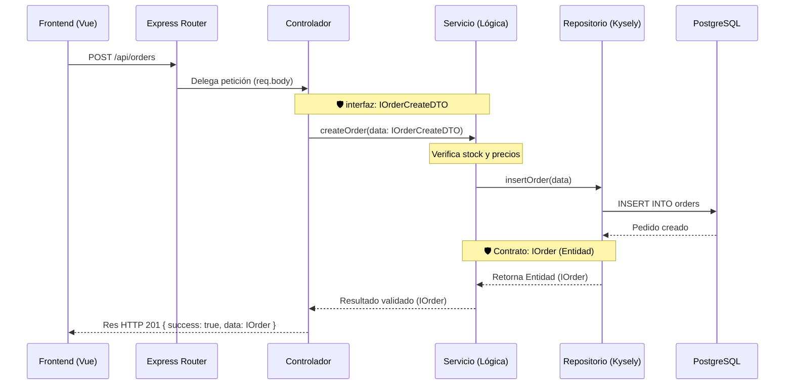

# Arquitectura Backend - Proyecto Pintuclic

Este documento define la arquitectura, convenciones y flujos de datos para el backend de Pintuclic. El proyecto está construido sobre **Node.js, Express, Kysely (Query Builder) y PostgreSQL**, utilizando **TypeScript** de forma estricta.

La arquitectura sigue un enfoque modular (Slicing Vertical) y aplica los principios **SOLID**, garantizando que el sistema escale de manera segura para gestionar procesos clave como el catálogo de productos y el procesamiento de pedidos.

---

## 1. Estructura de Directorios

El código fuente (`src/`) se divide en dos áreas principales: el núcleo (`core`) y los módulos de negocio (`modules`).

```text
backend/src/
 ├── core/                   # 🌍 ZONA GLOBAL (Infraestructura técnica)
 │    ├── db/                # Configuración de conexión a PostgreSQL con Kysely
 │    ├── middlewares/       # Interceptores globales (CORS, Manejo de Errores, Auth JWT)
 │    ├── utils/             # Funciones auxiliares genéricas
 │    └── types/             # Interfaces globales (Respuestas HTTP genéricas)
 │
 ├── modules/                # 📦 ZONA DE NEGOCIO (Lógica de Pintuclic: convención m[xx]-[nombre])
 │    ├── m02-productos/     # Ej: Módulo M02 Catálogo e Inventario
 │    │    ├── interfaces/   # Contratos y schemas Zod
 │    │    ├── repositories/ # Consultas SQL exclusivas de productos (Kysely)
 │    │    ├── services/     # Reglas de negocio (ej. validar stock disponible)
 │    │    ├── controllers/  # Manejo de peticiones HTTP (req, res)
 │    │    └── productos.routes.ts # Ensamblaje e inyección de dependencias
 │    │
 │    └── m04-cuentas/       # Ej: Módulo M04 Cuentas, Autenticación y Perfil (Aislado)
 │
 ├── app.routes.ts           # Enrutador principal que agrupa todas las rutas
 └── index.ts                # Raíz de composición: inicializa Express
```

---

## 2. Principios de Diseño (SOLID) Aplicados

1. **(S) Responsabilidad Única:**

   * `controllers/`: Solo extraen datos de la URL o el body, y devuelven JSON.
   * `services/`: Contienen el "cerebro" (ej. descontar inventario al crear un pedido).
   * `repositories/`: Son los únicos que importan Kysely para hablar con PostgreSQL.
2. **(I) Segregación de Interfaces:**
   Si el módulo de Pedidos necesita información de un Producto, importará una interfaz ligera `IProductReadOnly` del módulo de Productos, manteniendo un acoplamiento bajo.
3. **(D) Inversión de Dependencias:**
   Los controladores reciben los servicios por inyección en el archivo `.routes.ts`, lo que permite que el código sea testeable sin necesidad de conectarse a la base de datos real.

---

## 3. Flujo de Petición HTTP

Ciclo de vida de una petición (Ejemplo: Crear un nuevo pedido):

1. **Cliente Web:** Envía un `POST /api/orders`.
2. **Raíz (`index.ts`):** Express recibe la petición y valida la sesión (Middleware).
3. **Enrutadores:** `app.routes.ts` delega a `order.routes.ts`, llegando al `OrderController`.
4. **Servicio:** El `OrderController` pasa los datos al `OrderService`, el cual verifica el stock y calcula totales.
5. **Base de Datos:** El `OrderRepository` ejecuta el `INSERT` mediante Kysely.
6. **Retorno:** Se devuelve el comprobante del pedido al cliente.

* [ ] Diagrama de Secuencia



# Arquitectura Backend - Proyecto SOFTVAR

Este documento define la arquitectura, convenciones y flujos de datos para el backend de SOFTVAR. El proyecto está construido sobre **Node.js, Express, Kysely (Query Builder) y PostgreSQL**, utilizando **TypeScript** de forma estricta.

La arquitectura sigue un enfoque modular (Slicing Vertical) y aplica los principios **SOLID**, garantizando que el sistema escale de manera segura para gestionar procesos críticos como nóminas y asistencia para PYMES.

---

## 1. Estructura de Directorios

El código fuente (`src/`) se divide en dos áreas principales: el núcleo (`core`) y los módulos de negocio (`modules`).

```text
backend/src/
 ├── core/                   # 🌍 ZONA GLOBAL (Infraestructura técnica)
 │    ├── db/                # Configuración de conexión a PostgreSQL con Kysely
 │    ├── middlewares/       # Interceptores globales (CORS, Manejo de Errores, Auth JWT)
 │    ├── utils/             # Funciones auxiliares genéricas (Formateadores de fechas, loggers)
 │    └── types/             # Interfaces globales (Respuestas HTTP genéricas)
 │
 ├── modules/                # 📦 ZONA DE NEGOCIO (Lógica separada por dominio)
 │    ├── attendance/        # Ej: Módulo de Control de Asistencia
 │    │    ├── interfaces/   # Contratos públicos y privados (Segregación de Interfaces)
 │    │    ├── repositories/ # Consultas SQL exclusivas de asistencia (Responsabilidad Única)
 │    │    ├── services/     # Reglas de negocio (ej. validar horas extras)
 │    │    ├── controllers/  # Manejo de peticiones HTTP (req, res)
 │    │    └── attendance.routes.ts # Ensamblaje del módulo e inyección de dependencias
 │    │
 │    └── payroll/           # Ejemplo: Módulo de Cálculo de Nómina (Aislado del resto)
 │
 ├── app.routes.ts           # Enrutador principal que agrupa todas las rutas de los módulos
 └── index.ts                # Raíz de composición: inicializa Express y carga el entorno
```
