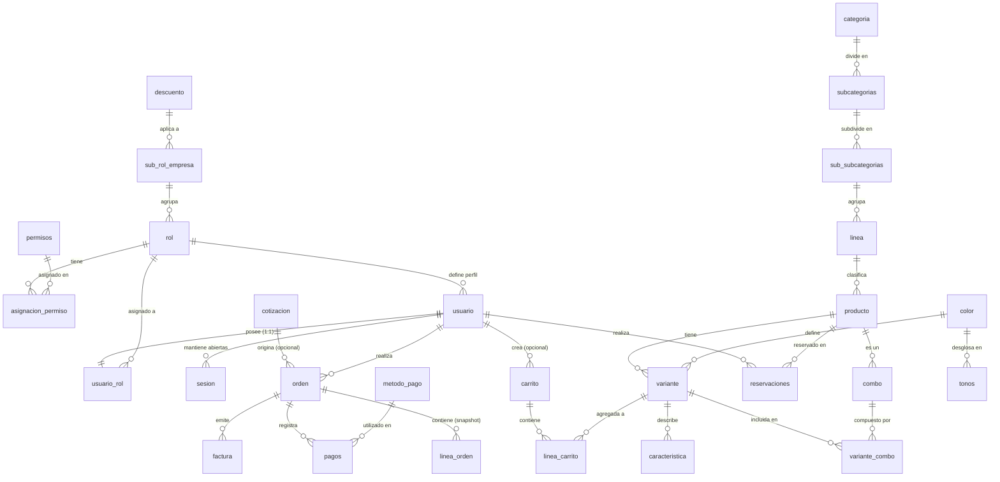

# 📘 Arquitectura y Documentación del Esquema de Base de Datos - PINTUCLIC

> **Versión Actual:** 2.2 (Sesiones de usuario con control de inactividad e invalidación)  
> **Motor de Base de Datos:** PostgreSQL 13+ (`gen_random_uuid()` nativo; compatible con PostgreSQL 18)  
> **Total de Tablas:** 28  
> **Script DDL Oficial:** [`../sql/schema_pintuclic.sql`](../sql/schema_pintuclic.sql)  
> **Walkthrough Detallado de Migraciones:** [`./WALKTHROUGH_DATABASE.md`](./WALKTHROUGH_DATABASE.md)

---

## 📜 Historial Resumido de Versiones (Changelog)

| Versión | Fecha | Tablas Nuevas | Tablas Deprecadas | Cambios Destacados | Detalle Completo |
| :---: | :---: | :--- | :--- | :--- | :---: |
| **v2.2** | 2026-09-05 | `sesion` (1) | Ninguna | Estado de sesión persistido para M20: cierre manual, caducidad por inactividad e invalidación en bloque. PK `UUID` no enumerable y 3 ENUMs nuevos. Cambio puramente aditivo. | [Ver v2.2](./WALKTHROUGH_DATABASE.md#-versión-22-2026-09-05) |
| **v2.1** | 2026-09-04 | `linea_carrito`, `cotizacion`, `orden`, `linea_orden` (4) | `pedido`, `detalle_carrito` (2) | Patrón de órdenes inmutables con snapshot de compra, cotizaciones B2B/B2C, carrito vivo desacoplado con soporte de visitantes anónimos (`token_visitante`) y variantes, y clasificación `enum_tipo_usuario`. | [Ver v2.1](./WALKTHROUGH_DATABASE.md#-versión-21-2026-09-04) |
| **v2.0** | 2026-09-03 | `categoria`, `subcategorias`, `sub_subcategorias`, `linea`, `color`, `tonos`, `variante`, `caracteristica`, `combo`, `variante_combo` (10) | `descripcion`, `nesesidad`, `presentacion`, `producto_descripcion`, `producto_presentacion` (5) | Catálogo multinivel de 4 capas, variantes por color/tono, combos, 8 ENUMs nativos y `UNIQUE(id_usuario)` en `usuario_rol`. | [Ver v2.0](./WALKTHROUGH_DATABASE.md#-versión-20-2026-09-03) |
| **v1.0** | 2026-09-02 | 21 tablas iniciales | Ninguna | Esquema fundacional derivado del diagrama `Pre-Final`. | [Ver v1.0](./WALKTHROUGH_DATABASE.md#-versión-10-2026-09-02) |

---

## 🎯 1. Visión General del Sistema

El esquema de base de datos de **Pintuclic** soporta las operaciones integrales de comercio electrónico B2B y B2C, cotizaciones comerciales, catálogo multinivel, inventario de colores/tonos/variantes, carritos vivos, órdenes inmutables, facturación, pagos y reservación de servicios.

### 🌟 Pilares Arquitectónicos del Modelo:
1. **Reestructuración Completa del Catálogo (v2.0):**  
   Jerarquía precisa de 4 niveles: `categoria` $\rightarrow$ `subcategorias` $\rightarrow$ `sub_subcategorias` $\rightarrow$ `linea` $\rightarrow$ `producto`.
2. **Desglose de Colores, Tonos y Variantes (v2.0):**  
   - `color` $\rightarrow$ `tonos` (con variación de precios por matiz).
   - `producto` $\rightarrow$ `variante` (asociado a un color y precio vigente propio).
   - `variante` $\rightarrow$ `caracteristica` (atributos técnicos de la variante).
3. **Módulo de Combos y Paquetes Promocionales (v2.0):**  
   `producto` $\rightarrow$ `combo` + `variante` $\rightarrow$ `variante_combo` (especifica variantes y cantidades exactas incluidas en cada combo).
4. **Patrón de E-Commerce Inmutable y Cotizaciones (v2.1):**  
   - Desacoplamiento de carrito vivo (`carrito` + `linea_carrito` vinculadas a `variante`) y carritos de visitantes anónimos vía `token_visitante`.
   - Creación de órdenes formales (`orden`) originadas desde el carrito o desde cotizaciones aprobadas (`cotizacion`).
   - Almacenamiento histórico inmutable en `linea_orden` (preservando nombre de producto, copia de variante y precio cobrado en el momento de la transacción).
5. **Blindaje de Integridad:**  
   - 10 tipos `ENUM` nativos de PostgreSQL para evitar estados inconsistentes o errores tipográficos.
   - Restricción `UNIQUE(id_usuario)` en `usuario_rol` para forzar que ningún usuario tenga más de 1 rol simultáneo.
   - Restricción `UNIQUE(id_carrito, id_variante)` en `linea_carrito` para unificar cantidades de un mismo ítem.
   - Restricción `UNIQUE` en `usuario(correo)`, `rol(nombre)`, `permisos(nombre)`, `asignacion_permiso(id_rol, id_permiso)`, `orden(codigo_visible)` y `variante_combo(id_variante, id_combo)`.

---

## 🗺️ 2. Diagrama Entidad-Relación (Mermaid ER)



---

## 🏛️ 3. Módulos del Sistema y Diccionario de Datos (28 Tablas)

### Módulo 1: Seguridad, Roles y Descuentos (5 Tablas)
| Tabla | PK | FKs | Descripción |
| :--- | :--- | :--- | :--- |
| **`descuento`** | `id_descuento` | Ninguna | Define topes monetarios y porcentajes de descuento (0 a 100%). |
| **`sub_rol_empresa`** | `id_sub_rol_empresa` | `id_descuento` $\rightarrow$ `descuento` | Sub-clasificación de perfiles de clientes comerciales asociados a descuentos. |
| **`rol`** | `id_rol` | `id_sub_rol_empresa` $\rightarrow$ `sub_rol_empresa` | Roles base del sistema (`nombre` UNIQUE). |
| **`permisos`** | `id_permiso` | Ninguna | Permisos atómicos del sistema (`nombre` UNIQUE). |
| **`asignacion_permiso`** | `id_asignacion_permiso` | `id_rol`, `id_permiso` | Matriz N:M con restricción `UNIQUE(id_rol, id_permiso)`. |

### Módulo 2: Cuentas de Usuario y Control de Acceso (3 Tablas)
| Tabla | PK | FKs | Descripción |
| :--- | :--- | :--- | :--- |
| **`usuario`** | `id_usuario` | `id_rol` $\rightarrow$ `rol` | Cuentas con `correo` UNIQUE, hash BCrypt en `contrasena`, tipo (`normal`/`empresa`) y estado. |
| **`usuario_rol`** | `id_usuario_rol` | `id_usuario`, `id_rol` | Asignación con restricción `UNIQUE(id_usuario)` (máximo 1 rol por usuario). |
| **`sesion`** | `id_sesion` (**UUID**) | `id_usuario` $
ightarrow$ `usuario` (CASCADE) | Sesiones abiertas por dispositivo (M20 / HU-SEG-02). Guarda último acceso y expiración para aplicar la caducidad por inactividad en servidor, y estado más motivo de cierre para poder revocar un token ya emitido. Admite varias filas activas por usuario (sesiones simultáneas). PK `UUID` por seguridad: el identificador viaja en el JWT y no debe ser enumerable. |

### Módulo 3: Catálogo Multinivel, Colores y Variantes (11 Tablas)
| Tabla | PK | FKs | Descripción |
| :--- | :--- | :--- | :--- |
| **`categoria`** | `id_categoria` | Ninguna | Nivel 1 del catálogo (e.g. Pinturas Arquitectónicas, Esmaltes). |
| **`subcategorias`** | `id_subcategoria` | `id_categoria` $\rightarrow$ `categoria` | Nivel 2 de agrupación. |
| **`sub_subcategorias`** | `id_sub_subcategoria` | `id_subcategoria` $\rightarrow$ `subcategorias` | Nivel 3 de agrupación. |
| **`linea`** | `id_linea` | `id_sub_subcategoria` $\rightarrow$ `sub_subcategorias` | Nivel 4: Línea de marca (e.g. Viniltex, Koraza). |
| **`producto`** | `id_producto` | `id_linea` $\rightarrow$ `linea` | Entidad base del producto. |
| **`color`** | `id_color` | Ninguna | Catálogo maestro de colores base (`nombre` UNIQUE). |
| **`tonos`** | `id_tono` | `id_color` $\rightarrow$ `color` | Tonos/matices derivados de un color con su precio adicional. |
| **`variante`** | `id_variante` | `id_producto`, `id_color` | SKU vendible con `precio_vigente`, `estado` comercial y color opcional. |
| **`caracteristica`** | `id_caracteristica` | `id_variante` $\rightarrow$ `variante` | Ficha técnica o especificaciones de la variante. |
| **`combo`** | `id_combo` | `id_producto` $\rightarrow$ `producto` | Paquete comercial ligado a un producto. |
| **`variante_combo`** | `id_variante_combo` | `id_variante`, `id_combo` | Detalle N:M de las variantes y `cantidad` que componen el combo. |

### Módulo 4: Carrito Vivo de Compras (2 Tablas)
| Tabla | PK | FKs | Descripción |
| :--- | :--- | :--- | :--- |
| **`carrito`** | `id_carrito` | `id_usuario` $\rightarrow$ `usuario` (opcional) | Carrito vivo con `token_visitante` para usuarios anónimos y fecha de actividad. |
| **`linea_carrito`** | `id_linea_carrito` | `id_carrito`, `id_variante` | Ítems agregados vivos vinculados a la variante de producto con `cantidad`. |

### Módulo 5: Cotizaciones y Órdenes Inmutables (3 Tablas)
| Tabla | PK | FKs | Descripción |
| :--- | :--- | :--- | :--- |
| **`cotizacion`** | `id_cotizacion` | Ninguna | Cotización comercial B2B/B2C con ciclo de vida (`enum_estado_cotizacion`). |
| **`orden`** | `id_orden` | `id_usuario`, `id_cotizacion` | Orden de compra confirmada con `codigo_visible`, `origen`, pasarela, montos y estado. |
| **`linea_orden`** | `id_linea_orden` | `id_orden` $\rightarrow$ `orden` | Snapshot congelado inmutable (`nombre_producto`, `variante_copia`, `precio_aplicado`, `cantidad`). |

### Módulo 6: Pagos y Facturación (3 Tablas)
| Tabla | PK | FKs | Descripción |
| :--- | :--- | :--- | :--- |
| **`metodo_pago`** | `id_metodo_pago` | Ninguna | Pasarelas / métodos habilitados (PSE, Tarjeta, Efectivo). |
| **`pagos`** | `id_pago` | `id_orden`, `id_metodo_pago` | Registro de transacciones financieras con estado (`enum_estado_pago`). |
| **`factura`** | `id_factura` | `id_orden` $\rightarrow$ `orden` | Comprobante fiscal con fecha y estado (`enum_estado_factura`). |

### Módulo 7: Servicios y Reservaciones (1 Tabla)
| Tabla | PK | FKs | Descripción |
| :--- | :--- | :--- | :--- |
| **`reservaciones`** | `id_reservacion` | `id_producto`, `id_usuario` | Citas de asesoría técnica o aplicación con fecha, hora y estado. |

---

## 🛡️ 4. Tipos Enumerados (ENUMs)

Para asegurar la máxima robustez en PostgreSQL, el esquema utiliza 13 tipos enumerados nativos:

```sql
enum_estado_general     -- ('activo', 'inactivo')
enum_tipo_usuario       -- ('normal', 'empresa')
enum_estado_usuario     -- ('activo', 'inactivo', 'bloqueado', 'pendiente')
enum_estado_producto    -- ('activo', 'inactivo', 'agotado', 'descontinuado')
enum_origen_orden       -- ('carrito', 'cotizacion')
enum_estado_orden       -- ('pendiente', 'pagado', 'en_preparacion', 'enviado', 'entregado', 'cancelado')
enum_estado_cotizacion  -- ('borrador', 'enviada', 'aprobada', 'rechazada', 'vencida')
enum_estado_pago        -- ('pendiente', 'completado', 'fallido', 'reembolsado')
enum_estado_factura     -- ('emitida', 'pagada', 'anulada')
enum_estado_reservacion -- ('pendiente', 'confirmada', 'cancelada', 'finalizada')

-- Sesiones de usuario (v2.2 - M20)
enum_estado_sesion        -- ('activa', 'cerrada', 'expirada', 'revocada')
enum_tipo_sesion          -- ('admin', 'cliente')
enum_motivo_cierre_sesion -- ('cierre_manual', 'inactividad', 'cambio_contrasena',
                          --  'cuenta_desactivada', 'permisos_retirados')
```

---

## ⚡ 5. Recomendaciones para el Stack de Desarrollo

### Backend (Node.js / Express / TypeScript / Kysely):
1. **Tipado Kysely Centralizado:**  
   Definir todos los tipos de tablas en `src/core/db/types.ts`. Utilizar `Generated<number>` para las columnas `SERIAL PRIMARY KEY`.
2. **Uso de Transacciones en Creación de Órdenes:**  
   - Iniciar transacción `db.transaction().execute(...)` para crear la orden, insertar los snapshots en `linea_orden` leyendo el precio vigente actual de cada variante y vaciar las líneas correspondientes de `linea_carrito`.
3. **Hashing Seguro:**  
   Las contraseñas de `usuario` deben ser hasheadas con **BCrypt** (costo mínimo 12) antes de persistirse.

### Frontend (React / Vue / Next.js):
1. **Gestión de Carrito Anónimo:**  
   Generar y conservar un `token_visitante` (UUID v4) en `localStorage` o cookie para carritos sin sesión iniciada. Al autenticarse el usuario, invocar endpoint de fusión para asociar el carrito a su `id_usuario`.
2. **Navegación de Catálogo en Cascada:**  
   Aprovechar la jerarquía `categoria` $\rightarrow$ `subcategorias` $\rightarrow$ `sub_subcategorias` $\rightarrow$ `linea` para implementar menús desplegables y filtros dinámicos.
3. **Selector de Variantes y Tonos:**  
   Al seleccionar un producto, cargar sus variantes y si el usuario escoge un color, calcular el precio vigente de la variante más el ajuste del tono seleccionado.

