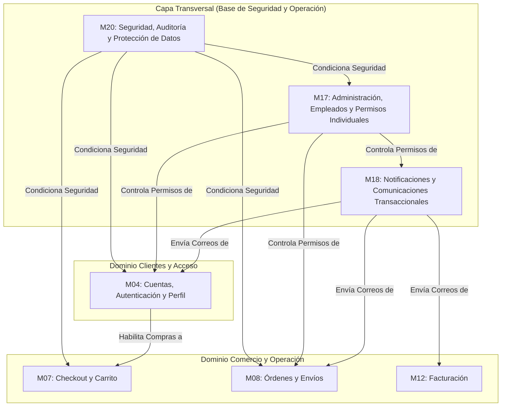

# Arquitectura General y Dominios del Sistema - PINTU CLIC

## 1. Visión del Sistema
**Pintu Clic** es una plataforma de comercio electrónico especializada en la venta de pinturas, revestimientos y suministros relacionados, dirigida tanto a **clientes particulares (B2C)** como a **clientes empresariales (B2B)**, operada mediante un panel de control interno para empleados y administradores.

---

## 2. Mapa de Dominios y Módulos

---

## 3. Actores del Sistema

1. **Visitante (Anónimo):** Usuario no autenticado que explora el catálogo o inicia el registro/login.
2. **Cliente Particular (B2C):** Usuario con cuenta personal verificada por correo o Google Identity.
3. **Cliente Empresa (B2B):** Usuario corporativo sujeto a validación y aprobación administrativa de su NIT/RUT para acceder a precios mayoristas y condiciones comerciales especiales.
4. **Empleado:** Personal interno con un conjunto de **permisos asignados de forma estrictamente individual** (sin roles rígidos preestablecidos).
5. **Administrador:** Usuario con control total del sistema, configuración operativa y gobernanza de cuentas.
6. **Sistema (Procesos Automáticos):** Servicios en background, triggers de auditoría y envío de correos.

---

## 4. Principios Clave de Diseño y Desarrollo

1. **Seguridad por Defecto (Security by Default):** Ningún endpoint asume que el cliente tiene permisos. La autenticación y autorización se comprueban en el backend ante cada petición (`M20`).
2. **Permisos Granulares:** No se deben codificar condicionales basados en "roles" hardcodeados (`if (user.role == 'admin')`). Se debe validar el **permiso atómico específico** (`user.hasPermission('CLIENT_APPROVE')`).
3. **Desacoplamiento de Notificaciones:** Ningún módulo funcional envía correos directamente por SMTP; los módulos emiten eventos que el módulo de notificaciones (`M18`) procesa de manera asíncrona.
4. **Trazabilidad e Inmutabilidad:** Toda acción de impacto administrativo o cambio de estado sensible debe registrarse en la bitácora de auditoría con fecha, actor, IP y valor modificado.
