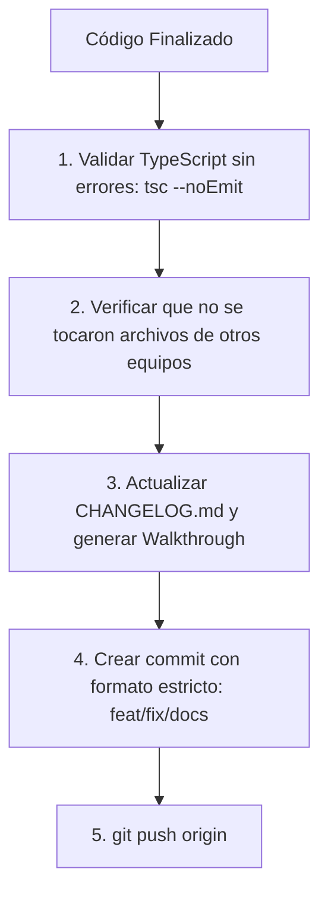

# Guía de Convención de Commits y Flujo de Push - PINTU CLIC

Este documento establece el **estándar obligatorio para la creación de commits y el envío de cambios (push)** al repositorio del proyecto **Pintu Clic**.

Aplica estrictamente tanto a **desarrolladores humanos** como a **Agentes de Inteligencia Artificial (IA)**.

---

## 1. Formato Estándar de Commits (Conventional Commits + Versión)

Cada commit debe seguir la siguiente estructura:

```text
<tipo>(<módulo/alcance>): [vX.X.X] <descripción clara en minúsculas y modo imperativo>

[Cuerpo opcional detallando HUs cubiertas y cambios principales]
```

> 📌 **Regla de la Versión en el Commit:**
> - Si el commit incluye la implementación de una Historia de Usuario, un fix o una entrega funcional que incremente la versión semántica, **debe incluir obligatoriamente el tag `[vX.X.X]`** coincidente con `CHANGELOG.md`.
> - Si es un commit puramente administrativo o de ajuste de documentación interna sin impacto en la versión del software, el tag de versión es opcional.

---

## 2. Tipos de Commits Permitidos

| Tipo | Propósito | ¿Aplica Versión? | Ejemplo |
| :--- | :--- | :---: | :--- |
| **`feat`** | Nueva funcionalidad o Historia de Usuario (HU) implementada | **SÍ (MINOR / MAJOR)** | `feat(M04): [v1.1.0] implementar registro con confirmacion de correo HU-CUE-01` |
| **`fix`** | Corrección de un defecto o bug en el código | **SÍ (PATCH)** | `fix(M04): [v1.1.1] corregir expiracion de tokens de verificacion en backend` |
| **`security`** | Ajuste o refuerzo de políticas de seguridad (M20/M17) | **SÍ (PATCH / MINOR)** | `security(M20): [v1.1.2] aplicar costo 12 en salt de bcrypt para contraseñas` |
| **`docs`** | Creación o actualización de documentación, diagramas o reportes | Opcional | `docs(sistema): actualizar matriz de trazabilidad y guia de versionado` |
| **`refactor`** | Reestructuración de código sin alterar funcionalidad | **SÍ (PATCH)** | `refactor(M04): [v1.1.3] modularizar repositorio kysely de cuentas` |
| **`test`** | Creación o modificación de pruebas automatizadas | Opcional | `test(M04): añadir pruebas de integracion para login HU-CUE-04` |
| **`chore`** | Tareas de mantenimiento, dependencias o configuración | Opcional | `chore(deps): actualizar tipos de express y zod` |

---

## 3. Ejemplos de Mensajes de Commit Correctos

### A. Implementación de una Historia de Usuario (`feat`)
```text
feat(M04): [v1.1.0] implementar registro con confirmacion de correo HU-CUE-01

- Añadido endpoint POST /api/v1/auth/register con validación Zod.
- Integrado hashing seguro BCrypt y emisión de evento SMTP.
- Cumple políticas HU-SEG-01, HU-CUE-08 y Criterios de Aceptación CA-01-01 a CA-01-04.
```

### B. Corrección de Defecto (`fix`)
```text
fix(M04): [v1.1.1] corregir regex de validacion de contraseñas en schema zod

- Ajustada validación de mayúsculas y números en RegisterUserSchema.
- Actualizado Walkthrough de la versión v1.1.1.
```

### C. Documentación y Reporte QA (`docs`)
```text
docs(qa): registrar informe de pruebas qa para modulo M04 cuentas
```

---

## 4. Protocolo Obligatorio antes del `git push`

Antes de ejecutar `git push`, el desarrollador o Agente de IA debe cumplir la siguiente lista de verificación:



1. **Compilación Limpia:** Comprobar que no existan errores de compilación de TypeScript ni errores de lint.
2. **Aislamiento de Módulo:** Verificar mediante `git status` y `git diff` que **únicamente se modificaron archivos del módulo asignado**.
3. **Documentación Sincronizada:** Confirmar que `CHANGELOG.md` y el Walkthrough reflejan exactamente los cambios realizados.
4. **Push a la Rama Correcta:** Realizar push únicamente a la rama asignada para la feature o módulo (`feature/MXX-...` o rama de trabajo del equipo).
5. **Prohibición Estricta:** **PROHIBIDO** realizar `git push --force` sobre ramas compartidas o ramas principales (`main`, `master`, `develop`).
