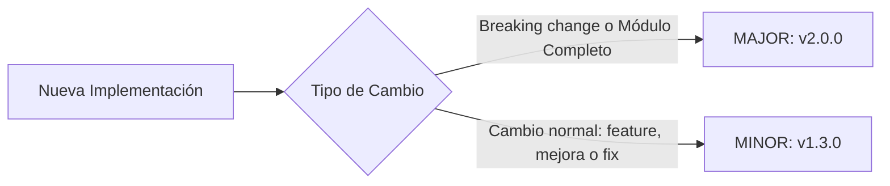

# Guía Estándar de Versionado y Walkthroughs de Implementación - PINTU CLIC

Este documento establece la **normativa obligatoria de control de versiones y documentación post-implementación (Walkthroughs)** para la plataforma **Pintu Clic**.

Aplica de forma estricta tanto a **desarrolladores humanos** como a **Agentes de Inteligencia Artificial (IA)**.

---

## 1. Regla de Oro del Versionado

> 🚨 **DIRECTIVA OBLIGATORIA:**  
> **CADA implementación de código, por pequeña que sea, DEBE generar un incremento de versión, actualizar el archivo central `CHANGELOG.md` y documentar un Walkthrough de Implementación.**  
> Queda terminantemente prohibido dar por concluida una tarea sin registrar la versión y su respectivo Walkthrough.

> ℹ️ **Automatización vigente:** el incremento de versión y la entrada de `docs/CHANGELOG.md` los publica el **bot oficial de versionado** a partir de la marca `[X.Y.Z]` incluida en el mensaje del commit. Ver **Sección 5**.

---

## 2. Esquema de Versionado Semántico (SemVer)

El proyecto utiliza el estándar `MAJOR.MINOR.PATCH` (ejemplo: `v1.2.0`):



### Criterios de Incremento:

| Nivel | Cuándo incrementar | Ejemplos |
| :--- | :--- | :--- |
| **MAJOR (`X.0.0`)** | Cambios estructurales de arquitectura, cierre de un sprint completo, o cambios incompatibles en contratos de API/Base de Datos. | Culminación total del módulo `M04 Cuentas` con login, registro y aprobación empresarial integrados. |
| **MINOR (`0.X.0`)** | Implementación completa de una nueva Historia de Usuario (HU), nueva ruta/controlador funcional o nuevo caso de uso. | Implementación exitosa de `HU-CUE-01` (Registro con verificación de correo). |
| **PATCH (`0.0.X`)** | Reservado (el bot de versionado ya no lo aplica: los fixes se marcan `[0.x.x]` y suben MINOR). | — |

> 🔄 **Regla Obligatoria del Reinicio a Cero (Efecto Odómetro en SemVer):**  
> Cada vez que se incrementa un dígito a la izquierda, **todos los dígitos situados a su derecha se reinician obligatoriamente a `0`**:  
> - **Al subir `PATCH` (reservado):** El bot de versionado no aplica este nivel; se conserva el parche de la versión actual.  
> - **Al subir `MINOR`:** Se suma a `MINOR` y el `PATCH` se reinicia a cero $\rightarrow$ Ej: `1.5.4` pasa a **`1.6.0`** *(nunca `1.6.4` ni `1.6.1`)*.  
> - **Al subir `MAJOR`:** Se suma a `MAJOR` y tanto `MINOR` como `PATCH` se reinician a cero $\rightarrow$ Ej: `1.5.4` pasa a **`2.0.0`**.

> ⚠️ **Regla vigente del bot:** el nivel lo determina la marca `[X.Y.Z]` del commit (ver Sección 5): `[0.x.x]` sube **MINOR** (incluye features y fixes) y `[1.0.0]` o mayor sube **MAJOR**. El nivel `PATCH` ya no se aplica automáticamente.

---

## 3. Registro Central: `CHANGELOG.md` (Principio DRY y Regla de Punteros)

El archivo central `docs/CHANGELOG.md` es el **resumen ejecutivo de producto** para toda la organización (gerencia, tech leads, frontend, backend y QA).

> 🚫 **PROHIBICIÓN DE DUPLICACIÓN (PRINCIPIO DRY):**  
> Queda terminantemente **prohibido transcribir DDL SQL, tablas completas, esquemas extensos o código duplicado** en `CHANGELOG.md`.  
> La **fuente única de la verdad técnica** es el **Walkthrough de Implementación**. El Changelog debe actuar como un **puntero de alto nivel**:
> 1. Resumir en 2 a 4 líneas el alcance funcional y módulos afectados.
> 2. Listar únicamente los hitos clave o cambios breaking.
> 3. Incluir obligatoriamente el **enlace directo (puntero)** hacia el Walkthrough técnico detallado (`docs/walkthroughs/M[XX]/...` o `bd/docs/WALKTHROUGH_DATABASE.md`).

### Formato Estándar Oficial:

```markdown
## [vX.Y.Z] - AAAA-MM-DD
### Módulo: M[XX] [Nombre del Módulo]
- **Alcance:** Resumen conciso de 1 a 2 líneas de la funcionalidad entregada o corregida.
- **Hitos Clave:** Breve lista de 2 a 3 puntos principales (endpoints nuevos, tablas clave o políticas).
- **Estado de Calidad:** Resultado de `tsc --noEmit`, linters y pruebas.
- 🔗 **Walkthrough Técnico Oficial:** [walkthroughs/M[XX]/walkthrough_vX.Y.Z.md](./walkthroughs/M[XX]/walkthrough_vX.Y.Z.md)
```

> 🤖 **Generación automática:** las entradas nuevas las escribe el bot de versionado en la rama `main` respetando este formato. Los desarrolladores ya no editan `CHANGELOG.md` manualmente (ver **Sección 5**).

---

## 4. Estructura y Nomenclatura Obligatoria del Walkthrough de Implementación

Cada implementación debe acompañarse de un archivo de Walkthrough detallado guardado en:
`docs/walkthroughs/M[XX]/walkthrough_v[X.Y.Z]_[MXX]_[descripcion]_[backend|frontend].md`

> 🏷️ **SUFIJO OBLIGATORIO DE CAPA (`_backend` o `_frontend`):**  
> Para evitar colisiones, sobreescrituras y ambigüedades cuando frontend y backend se desarrollan de forma desacoplada dentro del mismo módulo funcional, el nombre de CADA archivo de Walkthrough **DEBE terminar obligatoriamente con el sufijo de su capa técnica al final del nombre**:
> - **Entregas de Backend:** `walkthrough_v[X.Y.Z]_[MXX]_[descripcion]_backend.md`  
>   *(Ejemplo: `docs/walkthroughs/M20/walkthrough_v1.5.0_M20_seguridad_backend.md`)*
> - **Entregas de Frontend:** `walkthrough_v[X.Y.Z]_[MXX]_[descripcion]_frontend.md`  
>   *(Ejemplo: `docs/walkthroughs/M17/walkthrough_v1.6.0_M17_auth_simulation_frontend.md`)*

El Walkthrough debe contener obligatoriamente las siguientes 6 secciones:

### 1. Metadatos de la Implementación
- **Versión:** `vX.X.X`
- **Módulo de Origen:** Código y nombre (ej: `M04 Cuentas, Autenticación y Perfil`).
- **Fecha y Autor:** Fecha exacta y responsable (Developer / Agente IA).

### 2. Historias de Usuario (HUs) Cubiertas
- Lista de IDs y títulos exactos de las HUs implementadas en esta entrega.
- Alcance funcional alcanzado.

### 3. Reglas de Negocio y Políticas de Seguridad Aplicadas
- Reglas específicas del módulo implementadas.
- Políticas transversales validadas:
  - 🔒 `HU-SEG-01` (Hashing seguro).
  - 🛡️ `HU-ADM-03` (Verificación de permisos en servidor).
  - 📧 `HU-NOT-01` (Despacho de eventos SMTP).
  - 🆔 `HU-CUE-08` (Unicidad de cuentas).

### 4. Criterios de Aceptación Cumplidos (Matriz de Verificación)
- Tabla o lista detallando cada Criterio de Aceptación (Gherkin: *Dado / Cuando / Entonces*) y cómo fue probado y superado.

### 5. Resumen Conceptual de Dependencias Externas (¡Crítico!)
- Análisis de dependencias hacia adelante y hacia atrás:
  - **¿Qué necesita este código para operar al 100% en producción?** (Ej: *Requiere que el módulo M18 configure el servidor SMTP real de producción y que Google Identity configure el Client ID en las variables de entorno*).
  - **¿A qué otros módulos habilita?** (Ej: *Habilita al módulo M07 Checkout para autenticar usuarios antes del pago*).

### 6. Registro de Archivos Modificados / Creados
- Lista estricta de archivos creados o modificados, confirmando que **todos pertenecen al módulo asignado** sin haber tocado archivos de otros equipos.

---

## 5. Automatización Oficial del Versionado (Bot de GitHub Actions)

> 🤖 **Vigente:** la versión absoluta del proyecto ya **NO** se edita a mano. El bot oficial ([`.github/workflows/version-bot.yml`](../../../.github/workflows/version-bot.yml)) lee el mensaje del último commit, calcula la versión y actualiza el archivo de versión.

### 5.1 Responsabilidad del Desarrollador

Incluir en el **mensaje del commit** la marca de nivel relativo entre corchetes, según el tipo de cambio:

| Marca | Nivel | Cuándo usarla |
| :--- | :--- | :--- |
| `[0.x.x]` | **MINOR** | Cambio normal: feature, mejora o fix (nueva HU, endpoint, caso de uso, corrección). |
| `[1.0.0]` o mayor | **MAJOR** | Cambio grande / breaking change: cierre de módulo o cambio estructural de arquitectura. |

Ejemplo: `feat(M01): [0.1.0] agregar validación de formulario de login`.

> ⚠️ Los números dentro del corchete indican el **nivel del incremento**, NO la versión destino. `[0.x.x]` sobre `3.12.4` produce `3.13.0`; `[1.0.0]` o mayor sobre `3.13.0` produce `4.0.0`.

### 5.2 Responsabilidad del Bot

1. **Leer:** toma el mensaje del último commit del push a `main` o `release`.
2. **Calcular:** detecta la marca `[X.Y.Z]` y aplica el nivel (`[0.x.x]` = MINOR, `[1.0.0]` o mayor = MAJOR) con efecto odómetro sobre la versión registrada en `docs/CHANGELOG.md`.
3. **Registrar:** actualiza el archivo de versión `docs/CHANGELOG.md` y sube ese cambio con su propio commit (`chore(release): [skip ci] ...`).
4. **Sin marca no hay versión:** si el commit no trae `[X.Y.Z]`, el bot no toca la versión.
5. **Idempotencia:** si la versión ya existe en el CHANGELOG, el bot no duplica la entrada.

