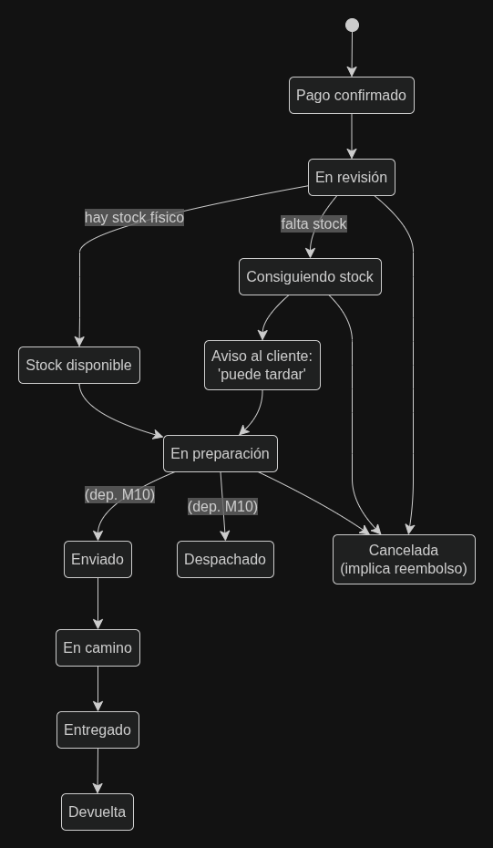

# M08. Orden de venta
**Dominio:** Venta / Logística  
**Prefijo de Historias:** ORD  

---

## 1. Propósito y Alcance
El módulo M08 es el encargado de cristalizar la intención de compra en una transacción legal e inmutable. A diferencia del carrito (que es dinámico), la Orden de Venta es un *snapshot* o copia histórica. Se dispara únicamente tras recibir la confirmación de pago exitoso (M07).

Su alcance incluye la creación de la orden, la conservación de los datos de producto y precio tal como se cobraron en ese instante, el seguimiento de la orden a través de una máquina de estados (Pago confirmado -> En revisión -> En preparación, etc.), y la consulta del historial de pedidos tanto por el cliente como por el personal autorizado.

## 2. Dependencias y Relaciones
- **Depende de:** M05 Carrito de compras (origen de los datos a congelar), M07 Pasarela de pago (disparador del evento de creación), M10 Modelo de entregas (para los estados logísticos finales).
- **Habilita a:** M12 Facturación (cuando se defina), Logística/Despacho.
- **Transversales Aplicables:**
  - 🔒 **M20 Seguridad:** Consulta restringida. Solo el cliente titular puede consultar su orden. Operaciones de avance de estado restringidas a roles de empleado. La orden nunca se elimina físicamente (retención de datos).
  - 🛡️ **M17 Permisos:** Gestión y avance de estados requiere permisos específicos (ej: despachador, atención al cliente).
  - 📧 **M18 Notificaciones:** Transiciones en la máquina de estados pueden disparar correos al cliente (ej: "Aviso: conseguir stock puede tardar").

---

## 3. Tabla Resumen de Historias de Usuario
| ID | Historia de Usuario | Actores | Prioridad | Estado |
| :--- | :--- | :--- | :--- | :--- |
| **HU-ORD-01** | Generación de la orden tras el pago | Sistema | Alta | Definido |
| **HU-ORD-02** | Conservación histórica de la orden | Sistema | Alta | Definido |
| **HU-ORD-03** | Ciclo de estados de la orden | Sistema / Empleado | Alta | Parcial (Dep. M10) |
| **HU-ORD-04** | Consulta e identificación de la orden | Cliente | Alta | Definido |
| **HU-ORD-05** | Gestión de órdenes | Empleado | Alta | Definido |
| **HU-ORD-07** | Listado de pedidos | Cliente | Media | Parcial |

---

## 4. Especificación Detallada por Historia de Usuario

### HU-ORD-01: Generación de la orden tras el pago
> **Como** sistema  
> **Quiero** generar la orden únicamente cuando el cobro sea exitoso  
> **Para** no reservar inventario ni generar trabajo logístico por intentos de pago fallidos.  

#### Requisitos Funcionales y No Funcionales
| ID | Tipo | Categoría | Requisito | Origen | Prioridad |
| :--- | :--- | :--- | :--- | :--- | :--- |
| **RF-ORD-01-01** | RF | Creación | Ninguna orden se genera sin un evento de pago confirmado asociado proveniente de M07. | Formalizado | Alta |
| **RF-ORD-01-05** | RF | Idempotencia| El sistema debe ignorar eventos de pago duplicados; un mismo `transaccion_pago_id` de la pasarela solo puede generar una única orden (ADR-02). | Formalizado | Alta |
| **RF-ORD-01-03** | RF | Trazabilidad| Se debe registrar el origen de la orden: puede provenir del carrito directo o de una cotización (M21). | Formalizado | Media |
| **ADR-03** | ADR | Resiliencia | Ante fallos del sistema entre el cobro y la creación de la orden, se debe utilizar un patrón Outbox / Cola de eventos con reintentos para no perder pedidos pagados. | Decisión Técn. | Alta |

#### Diagramas de Referencia

---

### HU-ORD-02: Conservación histórica de la orden
> **Como** cliente y negocio  
> **Quiero** que los datos de mi pedido no cambien nunca  
> **Para** que la orden refleje exactamente lo que se cobró el día de la compra, independientemente de si el catálogo cambia mañana.  

#### Requisitos Funcionales y No Funcionales
| ID | Tipo | Categoría | Requisito | Origen | Prioridad |
| :--- | :--- | :--- | :--- | :--- | :--- |
| **RF-ORD-02-01** | RF | Inmutabilidad| La Orden debe conservar nombre, variante, precio aplicado y cantidad tal como quedaron el día de la compra. | Formalizado | Alta |
| **RF-ORD-02-04** | RF | Inmutabilidad| Un cambio posterior en el catálogo (M01) no debe alterar los datos ya conservados en una orden existente. | Formalizado | Alta |
| **ADR-05** | ADR | Arquitectura | La `LineaOrden` no referencia dinámicamente al catálogo por clave foránea. Efectúa una copia (snapshot) de los valores en el momento de generación. | Decisión Técn. | Alta |
| **RF-ORD-02-03** | RF | Trazabilidad| Si el origen fue una cotización, se debe copiar el importe acordado en esa cotización (no el del catálogo vivo). | Formalizado | Media |

#### Diagramas de Referencia

---

### HU-ORD-03: Ciclo de estados de la orden
> **Como** empleado de despacho  
> **Quiero** avanzar el pedido a través de diferentes fases  
> **Para** mantener control operativo e informar al cliente del progreso.  

#### Requisitos Funcionales y No Funcionales
| ID | Tipo | Categoría | Requisito | Origen | Prioridad |
| :--- | :--- | :--- | :--- | :--- | :--- |
| **HU-ORD-03** | RF | Máq. Estados| La orden debe transitar por estados controlados: Pago confirmado -> En revisión -> [Consiguiendo stock / Stock disponible] -> En preparación. | Formalizado | Alta |
| **RF-ORD-03-02** | RF | Transparencia| En revisión: El empleado valida stock físico. Si falta stock, el sistema no lo oculta, transita a "Consiguiendo stock" avisando al cliente que puede tardar. | Formalizado | Alta |
| **RF-ORD-03-03** | RF | Cancelaciones| Toda cancelación de una orden de venta pagada implica obligatoriamente un reembolso (impacta diseño de M07). | Formalizado | Alta |
| **RF-ORD-03-0X**| RF | Estados fin. | *PENDIENTE:* Los estados finales (Enviado, En camino, Entregado, Devuelta) dependen enteramente del diseño del módulo de entregas M10. | Pendiente | Alta |

#### Políticas Transversales Vinculadas (M20 / M17 / M18)
- **Notificaciones (M18):** Al entrar en "Consiguiendo stock", se debe notificar al cliente el retraso esperado.

#### Diagramas de Referencia

---

### HU-ORD-04 y 06: Consulta e identificación de la orden
> **Como** cliente  
> **Quiero** poder ver el detalle de mis órdenes usando un código fácil de leer  
> **Para** hacer seguimiento a mis compras o hacer reclamos.  

#### Requisitos Funcionales y No Funcionales
| ID | Tipo | Categoría | Requisito | Origen | Prioridad |
| :--- | :--- | :--- | :--- | :--- | :--- |
| **RF-ORD-04-01** | RF | Consulta | La consulta de una orden está estrictamente restringida a su cliente titular o al personal autorizado. | Formalizado | Alta |
| **RF-ORD-06-01** | RF | Identificador| La orden debe exponer un código visible amigable para el cliente, independiente de la clave primaria de la base de datos (ADR-04). | Formalizado | Alta |
| **RF-ORD-04-03** | RF | Visualización| *PENDIENTE:* Definir cómo se visualiza en la interfaz una línea de orden cuyo producto padre fue eliminado (dado que los datos históricos existen, solo falta regla de UI). | Pendiente | Baja |
| **RF-ORD-06-03** | RF | Identificador| *PENDIENTE:* Formato exacto del código visible de la orden (ej: PC-001, OR-26-005, etc). | Pendiente | Baja |

#### Diagramas de Referencia

