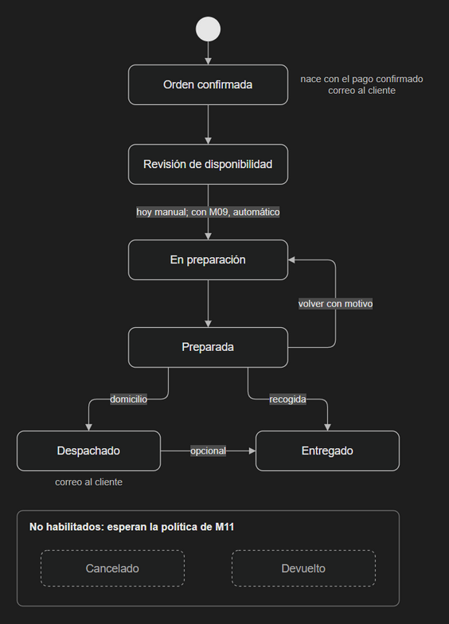

# M08. Orden de venta
**Dominio:** Venta / Logística
**Prefijo de Historias:** ORD
**Fuente de los requisitos:** Tanda 3C del analista (versión 3.0, Drive) e Issues de la épica #28. Requisitos y criterios copiados sin cambios; estado de implementación al 29/09/2026.

---

## 1. Propósito y Alcance
El módulo M08 convierte una solicitud de compra con el pago confirmado en una orden de venta inmutable, la hace avanzar por su ciclo de estados y permite consultarla al cliente titular y al personal autorizado. La orden es una copia histórica: conserva los productos, precios, descuentos, IVA y modo de entrega tal como se cobraron, y ningún cambio posterior del catálogo la altera.

Su alcance incluye la creación de la orden al confirmarse el pago, su identificación con el código `PC-AAAA-NNNNN`, el ciclo de estados con su historial, la sección «Mis pedidos» del cliente y, para el personal, la bandeja, el buscador, el detalle completo, las notas internas, el registro de contactos y el historial de compras del cliente. La cancelación y la devolución están definidas, pero esperan la política de M11.

## 2. Dependencias y Relaciones
- **Depende de:**
  - **M07 Checkout y pago:** administra la solicitud `SOL-AAAA-NNNNN` y confirma el pago, por la pasarela o por un empleado que verifica un pago directo. Al confirmarse, llama al servicio de creación de M08.
  - **M05 Carrito de compras** y **M21 Cotizaciones:** origen de la compra (RF-ORD-01-03).
  - **M06 Precios, promociones y descuentos:** los descuentos llegan congelados en la solicitud (D07).
  - **M09 Cumplimiento y preparación:** verificación de disponibilidad por línea y preparación. El paso automático a preparación al confirmar la última línea (RF-CUM-03-10) espera a M09.
  - **M11 Postventa:** condiciones de cancelación y devolución (RF-POS-04-03), pendientes de la política del negocio.
  - **M10 Entrega y transporte:** el transporte lo gestiona la tienda física; M08 solo registra Despachado y Entregado (RF-ORD-03-06).
- **Habilita a:** M12 Facturación (cuando se defina) y M18 Notificaciones (avisos al cliente).
- **Transversales Aplicables:**
  - 🔒 **M20 Seguridad:** sesión revalidada en el servidor en todas las rutas. Una orden ajena responde igual que una inexistente y el intento queda registrado. La orden nunca se borra (RF-ORD-02-04).
  - 🛡️ **M17 Permisos:** «Revisar órdenes» corresponde a `ventas.ver` (consultar) y «Gestión de pedidos» a `ventas.gestionar` (cambiar estados, notas y contactos).
  - 📧 **M18 Notificaciones:** correo al cliente solo al nacer la orden, al despacharla y al cancelarla. Los demás cambios quedan en el historial sin correo (D05, CA-NOT-02-06).

---

## 3. Tabla Resumen de Historias de Usuario
| ID | Historia de Usuario | Actores | Prioridad | Estado |
| :--- | :--- | :--- | :--- | :--- |
| **HU-ORD-01** | Generación de la orden tras el pago confirmado | Cliente | Alta | Implementada en M08; falta que M07 la invoque |
| **HU-ORD-02** | Conservación histórica de los datos de la orden | Cliente | Alta | Implementada |
| **HU-ORD-03** | Ciclo de vida y estados de la orden | Cliente | Alta | Parcial: cancelación y devolución esperan la política de M11; la disponibilidad por línea, a M09 |
| **HU-ORD-04** | Consulta del detalle de un pedido | Cliente | Alta | Implementada |
| **HU-ORD-05** | Ver qué pedidos hay que atender | Empleado | Alta | Implementada |
| **HU-ORD-06** | Identificación de la orden | Cliente | Alta | Implementada |
| **HU-ORD-07** | Sección de pedidos del cliente | Cliente | Alta | Implementada |
| **HU-ORD-08** | Encontrar un pedido concreto | Empleado | Alta | Implementada |
| **HU-ORD-09** | Abrir un pedido con todo lo necesario para atenderlo | Empleado | Alta | Implementada |
| **HU-ORD-10** | Dejar constancia de lo que pasó con un pedido | Empleado | Media | Implementada |
| **HU-ORD-11** | Ver qué ha comprado antes un cliente | Empleado | Alta | Implementada |

La prioridad de cada historia es la más alta de sus requisitos. El estado se refiere a la implementación del backend.

---

## 4. Especificación Detallada por Historia de Usuario

### HU-ORD-01: Generación de la orden tras el pago confirmado

> **Como** cliente  
> **Quiero** que mi compra se formalice en cuanto se confirma el pago  
> **Para** tener la certeza de que mi pedido quedó registrado.  

#### Requisitos Funcionales y No Funcionales

| ID | Tipo | Categoría | Requisito | Origen | Prioridad |
| :--- | :--- | :--- | :--- | :--- | :--- |
| **RF-ORD-01-01** | RF | Generación | El sistema debe generar la orden únicamente al recibir una confirmación de pago, y no debe existir ninguna orden sin un pago confirmado asociado. La confirmación puede provenir de la pasarela o del registro de un empleado que verifica un pago recibido por otro medio: las dos son equivalentes a estos efectos, conforme a RF-CHK-05-04. | Definido | Alta |
| **RF-ORD-01-03** | RF | Origen | El sistema debe registrar el origen de la orden, distinguiendo si nace de una compra directa desde el carrito o de una cotización aceptada, y en el segundo caso el identificador de la cotización de la que procede. | Definido | Alta |
| **RF-ORD-01-05** | RF | Integridad | El sistema debe evitar generar una orden duplicada cuando el evento de pago confirmado se reciba más de una vez para la misma operación. | Deducido | Alta |
| **RF-ORD-01-06** | RF | Generación | El sistema debe conservar la operación como solicitud de compra mientras no exista confirmación, conforme a RF-CHK-04-06, de modo que un fallo entre el cobro y la creación de la orden no la pierda: la solicitud sigue ahí y su confirmación puede reintentarse o conciliarse después. | Definido | Alta |

#### Criterios de Aceptación (Gherkin)

- **CA-ORD-01-01:**
  - **Dado que** se confirma el pago de una compra
  - **Cuando** el sistema recibe el evento
  - **Entonces** genera la orden con los datos de esa compra.
- **CA-ORD-01-02:**
  - **Dado que** no existe confirmación de pago
  - **Cuando** se consulta el sistema
  - **Entonces** no existe ninguna orden para esa compra.
- **CA-ORD-01-03:**
  - **Dado que** un empleado verifica un pago directo
  - **Cuando** registra la confirmación
  - **Entonces** la orden se genera igual que si la hubiera confirmado la pasarela.
- **CA-ORD-01-04:**
  - **Dado que** la compra proviene de una cotización aceptada
  - **Cuando** se genera la orden
  - **Entonces** queda registrado el identificador de esa cotización como origen.
- **CA-ORD-01-05:**
  - **Dado que** el evento de pago confirmado llega dos veces para la misma operación
  - **Cuando** el sistema procesa el segundo
  - **Entonces** no genera una segunda orden.
- **CA-ORD-01-06:**
  - **Dado que** el sistema falla justo después del cobro
  - **Cuando** se restablece
  - **Entonces** la solicitud de compra sigue existiendo y su confirmación puede procesarse.

#### Implementación

- Servicio `serviciosOrdenes.creacion.crearDesdePagoConfirmado()`: llamada interna de M07, sin ruta HTTP.
- Idempotente por solicitud SOL (`codigo_solicitud` y `transaccion_pago_id` son UNIQUE) y atómico: orden, líneas, descuentos, historial y consecutivo en una sola transacción.
- Rechaza la creación sin confirmación de pago o con un pago inferior al total (D06).

#### Diagramas de Referencia

---

### HU-ORD-02: Conservación histórica de los datos de la orden

> **Como** cliente  
> **Quiero** que mi orden conserve los datos de mi compra tal como quedaron ese día  
> **Para** que un cambio posterior en el catálogo no altere lo que ya compré.  

#### Requisitos Funcionales y No Funcionales

| ID | Tipo | Categoría | Requisito | Origen | Prioridad |
| :--- | :--- | :--- | :--- | :--- | :--- |
| **RF-ORD-02-01** | RF | Conservación | El sistema debe conservar en la orden una copia del nombre del producto, la variante, el color solicitado cuando lo haya, el precio aplicado y la cantidad de cada línea, tal como quedaron en el momento de la compra. | Definido | Alta |
| **RF-ORD-02-02** | RF | Conservación | El sistema debe conservar el desglose de los descuentos aplicados con su origen, su porcentaje y el importe que descontaron, junto con el porcentaje de IVA vigente, de modo que el precio cobrado pueda reconstruirse paso a paso años después. | Deducido | Alta |
| **RF-ORD-02-03** | RF | Conservación | El sistema debe conservar el importe acordado en la cotización como precio aplicado cuando la orden nazca de una, prevaleciendo sobre el precio vigente del catálogo. | Definido | Alta |
| **RF-ORD-02-04** | RF | Independencia | Un cambio posterior en el catálogo, en los precios o en las reglas comerciales no debe alterar los datos ya conservados en una orden existente, y el sistema no debe eliminar físicamente los datos de una orden. | Definido | Alta |

#### Criterios de Aceptación (Gherkin)

- **CA-ORD-02-01:**
  - **Dado que** compro una variante a un precio determinado
  - **Cuando** se genera la orden
  - **Entonces** conserva ese precio con independencia de que después cambie en el catálogo.
- **CA-ORD-02-02:**
  - **Dado que** a mi compra le aplicaron dos descuentos
  - **Cuando** consulto la orden
  - **Entonces** veo cuáles fueron, en qué orden se aplicaron y cuánto descontó cada uno.
- **CA-ORD-02-03:**
  - **Dado que** mi orden proviene de una cotización aceptada
  - **Cuando** la consulto
  - **Entonces** muestra el importe acordado y no el precio vigente del catálogo.
- **CA-ORD-02-04:**
  - **Dado que** un producto de mi orden se desactiva del catálogo después de la compra
  - **Cuando** consulto mi orden
  - **Entonces** sus datos siguen presentes tal como quedaron.
- **CA-ORD-02-05:**
  - **Dado que** el administrador cambia el porcentaje de IVA
  - **Cuando** consulto una orden anterior
  - **Entonces** conserva el porcentaje que se le aplicó.

#### Implementación

- Copia en `orden`, `linea_orden` y `linea_orden_descuento` (esquema 3.9); los importes se copian de la solicitud sin recalcular ni redondear (D07).
- `id_variante_ref` no tiene FK (ADR-05): solo sirve para saber si el producto sigue en el catálogo. Las líneas no se borran en cascada (`ON DELETE RESTRICT`).

---

### HU-ORD-03: Ciclo de vida y estados de la orden

> **Como** cliente  
> **Quiero** que mi pedido avance por estados que reflejen su situación real  
> **Para** saber en qué punto está sin tener que preguntar.  

#### Requisitos Funcionales y No Funcionales

| ID | Tipo | Categoría | Requisito | Origen | Prioridad |
| :--- | :--- | :--- | :--- | :--- | :--- |
| **RF-ORD-03-01** | RF | Estados | El sistema debe hacer avanzar la orden a través de una secuencia de estados que refleje su situación real, y debe reflejar con fidelidad la falta de disponibilidad de alguna de sus líneas sin ocultarla al cliente. | Definido | Alta |
| **RF-ORD-03-02** | RF | Estados | El sistema debe registrar por cada cambio de estado quién lo produjo y cuándo, y debe emitir un evento por cada uno para que M18 pueda notificarlo sin conocer de antemano la lista completa. | Deducido | Alta |
| **RF-ORD-03-06** | RF | Estados | El sistema debe cerrar el ciclo normal de la orden según su modo de entrega: en la recogida en almacén el cierre es el estado Entregado, que el empleado marca al registrar la recogida; en el envío el cierre es el estado Despachado, y Entregado queda como un paso posterior opcional que el empleado marca solo si confirma la llegada. El transporte lo gestiona la tienda física y el sistema no lo sigue, conforme a RF-ENT-04-01 y RF-ENT-04-04. | Definido | Alta |
| **RF-ORD-03-03** | RF | Cancelación | Toda cancelación de una orden implica devolver al cliente el dinero recibido. El sistema no ejecuta esa devolución —reintegrar el dinero es comunicación directa entre el negocio y su cliente, conforme a RF-POS-04-05—, pero sí debe dejar constancia de que quedó pendiente de hacerse, con su motivo, su autor y su momento. | Definido | Alta |
| **RF-ORD-03-04** | RF | Cancelación y devolución | Toda cancelación la registra un empleado autorizado, conforme a RF-POS-04-06; el cliente no cancela su pedido por sí mismo en ningún estado. La devolución no aplica a colores entonados a medida, conforme a RF-POS-04-04. Toda cancelación mueve la orden al estado terminal "Cancelada"; toda devolución aceptada la mueve a "Devuelta"; ambas transiciones activan el reembolso de RF-ORD-03-03. Las condiciones bajo las que se admite cada una —plazos, productos, estado exigido— siguen pendientes de la política de negocio (RF-POS-04-03) y no se fijan aquí. | Definido | Alta |

#### Criterios de Aceptación (Gherkin)

- **CA-ORD-03-01:**
  - **Dado que** una orden avanza por su ciclo normal
  - **Cuando** consulto su estado
  - **Entonces** refleja la situación real en ese momento.
- **CA-ORD-03-02:**
  - **Dado que** una línea de mi orden queda afectada por falta de disponibilidad
  - **Cuando** consulto el estado
  - **Entonces** esa situación se refleja y no queda oculta.
- **CA-ORD-03-03:**
  - **Dado que** recojo mi pedido en el almacén
  - **Cuando** el empleado registra la recogida
  - **Entonces** la orden queda en Entregado con la fecha y quién lo marcó, sin que haya existido despacho alguno.
- **CA-ORD-03-04:**
  - **Dado que** una orden cambia de estado
  - **Cuando** el cambio se produce
  - **Entonces** el sistema emite el evento correspondiente y consta quién lo hizo.
- **CA-ORD-03-05:**
  - **Dado que** una orden se cancela
  - **Cuando** se confirma la cancelación
  - **Entonces** el sistema registra que hay un dinero por devolver, con su importe y su motivo, y no intenta moverlo por sí mismo.
- **CA-ORD-03-06:**
  - **Dado que** mi pedido se envía a domicilio y nadie confirma después su llegada
  - **Cuando** consulto la orden
  - **Entonces** su último estado es Despachado y eso es el cierre normal del envío.
- **CA-ORD-03-07:**
  - **Dado que** mi orden aún no ha sido entregada
  - **Cuando** intento cancelarla por mi cuenta
  - **Entonces** el sistema no me lo permite y me indica que debo gestionarlo con un empleado
- **CA-ORD-03-08:**
  - **Dado que** un empleado autorizado registra la cancelación de una orden
  - **Cuando** la confirma
  - **Entonces** la orden pasa al estado "Cancelada" y se genera el reembolso conforme a RF-ORD-03-03.
- **CA-ORD-03-09:**
  - **Dado que** un empleado acepta la devolución de una orden entregada
  - **Cuando** la confirma
  - **Entonces** la orden pasa al estado "Devuelta" y se genera el reembolso.
- **CA-ORD-03-10:**
  - **Dado que** una orden entregada incluye una línea de color entonado a medida
  - **Cuando** se intenta gestionar su devolución
  - **Entonces** el sistema no la admite.

#### Implementación

- `PATCH /api/ordenes/gestion/:codigo/estado` con `ventas.gestionar`; cada cambio queda en `historial_estado_orden` con autor, motivo y momento.
- Transiciones y reglas en la sección 5. Cancelar y devolver responden 409 `OPERACION_NO_HABILITADA` hasta que exista la política de M11.

#### Diagramas de Referencia

---

### HU-ORD-04: Consulta del detalle de un pedido

> **Como** cliente  
> **Quiero** abrir un pedido concreto y ver qué compré, cuánto pagué y en qué estado está  
> **Para** revisar mi compra cuando lo necesite.  

#### Requisitos Funcionales y No Funcionales

| ID | Tipo | Categoría | Requisito | Origen | Prioridad |
| :--- | :--- | :--- | :--- | :--- | :--- |
| **RF-ORD-04-01** | RF | Consulta | El sistema debe permitir al cliente consultar el detalle completo de una orden: productos, colores solicitados, cantidades, precios aplicados con su desglose de descuentos, total, modo de entrega, estado actual y su historia de estados. | Definido | Alta |
| **RF-ORD-04-02** | RF | Control de acceso | El sistema debe reservar la consulta del detalle de una orden a su cliente titular y al personal autorizado por RF-ORD-05-01 o RF-ORD-05-02. Ningún otro cliente puede acceder a ella. | Definido | Alta |
| **RF-ORD-04-03** | RF | Consulta | El sistema debe presentar la línea de un producto retirado del catálogo con los datos que la orden conserva —nombre, variante, color solicitado, precio aplicado y cantidad—, sin enlace a su ficha y acompañada de una nota que advierta que ese producto ya no está disponible. | Definido | Media |

#### Criterios de Aceptación (Gherkin)

- **CA-ORD-04-01:**
  - **Dado que** soy cliente y tengo una orden
  - **Cuando** abro su detalle
  - **Entonces** veo sus productos, cantidades, precios aplicados, total, modo de entrega y estado.
- **CA-ORD-04-02:**
  - **Dado que** mi orden llevaba un color entonado
  - **Cuando** abro su detalle
  - **Entonces** figura el color que pedí.
- **CA-ORD-04-03:**
  - **Dado que** intento abrir el detalle de una orden que no es mía
  - **Cuando** lo solicito
  - **Entonces** el sistema rechaza el acceso.
- **CA-ORD-04-04:**
  - **Dado que** un producto de mi orden se retiró del catálogo
  - **Cuando** abro el detalle del pedido
  - **Entonces** su línea muestra los mismos datos con que lo compré, sin enlace al producto y con una nota de que ya no está disponible.

#### Implementación

- `GET /api/ordenes/mis-pedidos/:codigo`: solo el titular. Una orden ajena responde 404, igual que una inexistente, y el intento queda registrado (M20).

---

### HU-ORD-05: Ver qué pedidos hay que atender

> **Como** empleado de la tienda  
> **Quiero** ver de un vistazo qué pedidos están esperando y desde cuándo  
> **Para** atender primero los que llevan más tiempo parados.  

#### Requisitos Funcionales y No Funcionales

| ID | Tipo | Categoría | Requisito | Origen | Prioridad |
| :--- | :--- | :--- | :--- | :--- | :--- |
| **RF-ORD-05-01** | RF | Control de acceso | El sistema debe permitir a un empleado con el permiso «Gestión de pedidos» consultar y operar sobre las órdenes y su avance. | Definido | Alta |
| **RF-ORD-05-02** | RF | Control de acceso | El sistema debe permitir a un empleado con el permiso «Revisar órdenes» consultar las órdenes sin capacidad de operar sobre ellas. | Definido | Alta |
| **RF-ORD-05-04** | RF | Bandeja | El sistema debe presentar al personal autorizado una bandeja de pedidos con las órdenes en curso agrupadas por estado, ordenadas de más antigua a más reciente dentro de cada grupo, y debe mostrar en la navegación del panel cuántas órdenes esperan en cada estado. Ese contador es el único aviso: el sistema no envía correo al personal cuando entra un pedido. | Definido | Alta |
| **RF-ORD-05-05** | RF | Bandeja | El sistema debe presentar en cada fila de la bandeja el identificador de la orden, el cliente, la fecha en que se generó, el importe total, el modo de entrega, el estado actual y cuánto tiempo lleva en él, de modo que el empleado pueda decidir qué atender sin abrir cada orden. | Deducido | Alta |
| **RF-ORD-05-06** | RF | Operación | El sistema no debe asignar las órdenes a un empleado concreto: cualquiera con el permiso «Gestión de pedidos» puede operar cualquier orden, y es el registro de quién hizo cada paso, exigido por RF-ORD-03-02, lo que da la trazabilidad. No existe por tanto reparto, reasignación ni bloqueo de una orden por estar siendo atendida. | Definido | Alta |

#### Criterios de Aceptación (Gherkin)

- **CA-ORD-05-01:**
  - **Dado que** soy empleado con el permiso «Gestión de pedidos»
  - **Cuando** abro la bandeja y hago avanzar una orden
  - **Entonces** el sistema acepta la operación.
- **CA-ORD-05-02:**
  - **Dado que** soy empleado con el permiso «Revisar órdenes» únicamente
  - **Cuando** intento hacer avanzar una orden
  - **Entonces** el sistema rechaza la operación.
- **CA-ORD-05-03:**
  - **Dado que** soy empleado sin ninguno de los dos permisos
  - **Cuando** intento consultar una orden
  - **Entonces** el sistema rechaza el acceso.
- **CA-ORD-05-05:**
  - **Dado que** hay cuatro órdenes esperando verificación y dos en preparación
  - **Cuando** abro el panel
  - **Entonces** la navegación me muestra esos números sin que yo entre a la bandeja.
- **CA-ORD-05-06:**
  - **Dado que** entra un pedido nuevo
  - **Cuando** reviso mi correo
  - **Entonces** no he recibido ningún aviso: el pedido aparece en el contador del panel.
- **CA-ORD-05-07:**
  - **Dado que** abro la bandeja
  - **Cuando** la reviso
  - **Entonces** las órdenes de cada estado aparecen con la más antigua primero, y cada fila me dice cuánto lleva esperando.
- **CA-ORD-05-08:**
  - **Dado que** un compañero ya está verificando una orden
  - **Cuando** yo la abro
  - **Entonces** el sistema me permite operarla igual y registra quién hizo cada paso.

#### Implementación

- `GET /api/ordenes/gestion` (filtros, `orden=antiguedad` y `dias_esperando`) y `GET /api/ordenes/gestion/resumen` (contadores por estado), con `ventas.ver`.
- Sin asignación ni bloqueo de órdenes: si otra persona cambió el estado un instante antes, responde 409 `ESTADO_CAMBIADO` en lugar de sobrescribirlo.

---

### HU-ORD-06: Identificación de la orden

> **Como** cliente  
> **Quiero** que mi pedido tenga un número claro y estable  
> **Para** poder referirme a él sin confusión, por ejemplo al escribir a soporte.  

#### Requisitos Funcionales y No Funcionales

| ID | Tipo | Categoría | Requisito | Origen | Prioridad |
| :--- | :--- | :--- | :--- | :--- | :--- |
| **RF-ORD-06-01** | RF | Identificación | Cada orden debe contar con un identificador único, estable y legible por una persona, asignado en el momento de su generación, con el formato que fije el parámetro configurable del anexo B de la Tanda 2. | Definido | Alta |
| **RF-ORD-06-04** | RF | Identificación | El sistema no debe reutilizar el identificador de una orden cancelada: queda reservado permanentemente a esa orden, de modo que un salto en la numeración signifique que allí hubo un pedido que se canceló. Un identificador repetido haría imposible distinguir dos órdenes al atender al cliente, contra lo que exige CA-ORD-06-02. El consecutivo de facturación es una numeración distinta, con reglas propias, y lo define M12. | Definido | Baja |

#### Criterios de Aceptación (Gherkin)

- **CA-ORD-06-01:**
  - **Dado que** se genera una orden
  - **Cuando** se consulta
  - **Entonces** tiene un identificador propio y distinto al de cualquier otra.
- **CA-ORD-06-02:**
  - **Dado que** tengo el identificador de mi orden
  - **Cuando** lo comunico a soporte
  - **Entonces** corresponde de forma inequívoca a esa orden y a ninguna otra.
- **CA-ORD-06-03:**
  - **Dado que** la orden PC-2025-00123 se cancela
  - **Cuando** se genera la siguiente orden
  - **Entonces** recibe el identificador que sigue y nunca el de la cancelada.

#### Implementación

- Código `PC-AAAA-NNNNN` con el año de Colombia y la tabla `consecutivo`, que se incrementa en la misma transacción de la creación: no se reinicia con el año ni deja huecos.

---

### HU-ORD-07: Sección de pedidos del cliente

> **Como** cliente  
> **Quiero** una sección donde ver todos mis pedidos, separando los que están en curso de los que ya terminaron  
> **Para** encontrar lo que busco sin revisarlos uno por uno.  

#### Requisitos Funcionales y No Funcionales

| ID | Tipo | Categoría | Requisito | Origen | Prioridad |
| :--- | :--- | :--- | :--- | :--- | :--- |
| **RF-ORD-07-01** | RF | Listado | El sistema debe presentar al cliente una sección con el listado de sus pedidos, permitiendo buscar y filtrar dentro de él. | Definido | Alta |
| **RF-ORD-07-02** | RF | Listado | El sistema debe separar los pedidos en curso de los finalizados, considerando finalizado el que haya alcanzado el estado Entregado o cualquiera de los estados terminales que M11 defina para la cancelación y la devolución, y en curso todos los demás. | Definido | Alta |
| **RF-ORD-07-05** | RF | Listado | El sistema debe mostrar de cada pedido su identificador, su fecha, su total y su estado actual, y permitir abrir su detalle. | Deducido | Alta |

#### Criterios de Aceptación (Gherkin)

- **CA-ORD-07-01:**
  - **Dado que** tengo varios pedidos
  - **Cuando** abro la sección
  - **Entonces** veo el listado separado entre en curso y finalizados, con identificador, fecha, total y estado.
- **CA-ORD-07-02:**
  - **Dado que** un pedido mío alcanza el estado Entregado
  - **Cuando** abro la sección
  - **Entonces** aparece entre los finalizados.
- **CA-ORD-07-03:**
  - **Dado que** tengo muchos pedidos
  - **Cuando** uso el buscador de la sección
  - **Entonces** el listado se filtra según lo que escribo.

#### Implementación

- `GET /api/ordenes/mis-pedidos?q=`: en curso y finalizados, con buscador por código y producto.

---

### HU-ORD-08: Encontrar un pedido concreto

> **Como** empleado que está atendiendo a un cliente  
> **Quiero** encontrar su pedido por el dato que él me dé  
> **Para** responderle en el momento sin hacerle buscar su número.  

#### Requisitos Funcionales y No Funcionales

| ID | Tipo | Categoría | Requisito | Origen | Prioridad |
| :--- | :--- | :--- | :--- | :--- | :--- |
| **RF-ORD-08-01** | RF | Búsqueda | El sistema debe permitir al personal autorizado buscar y filtrar órdenes por estado, por periodo, por cliente y por su identificador, y debe admitir también el correo y el teléfono del cliente como criterio, porque son los datos que un cliente da por teléfono cuando no recuerda su número de pedido. | Definido | Alta |
| **RF-ORD-08-02** | RF | Búsqueda | El sistema debe aplicar a los resultados de la búsqueda el mismo control de acceso que a la consulta directa, de modo que un empleado sin permiso no descubra por esta vía órdenes que no puede ver. | Deducido | Alta |

#### Criterios de Aceptación (Gherkin)

- **CA-ORD-08-01:**
  - **Dado que** un cliente me da el número de su pedido
  - **Cuando** lo busco por ese identificador
  - **Entonces** llego a la orden correcta.
- **CA-ORD-08-02:**
  - **Dado que** un cliente no recuerda su número pero me da su correo
  - **Cuando** lo busco por ese dato
  - **Entonces** encuentro sus pedidos.
- **CA-ORD-08-03:**
  - **Dado que** soy empleado sin permiso sobre pedidos
  - **Cuando** uso el buscador
  - **Entonces** no aparece ninguna orden en los resultados.

#### Implementación

- `GET /api/ordenes/gestion` con los filtros `codigo`, `estado`, `desde`, `hasta`, `cliente`, `correo` y `telefono`, bajo `ventas.ver`.

---

### HU-ORD-09: Abrir un pedido con todo lo necesario para atenderlo

> **Como** empleado que va a preparar o resolver un pedido  
> **Quiero** ver en un solo sitio todo lo que necesito de él  
> **Para** no tener que buscarlo en otra pantalla ni preguntarle a nadie.  

#### Requisitos Funcionales y No Funcionales

| ID | Tipo | Categoría | Requisito | Origen | Prioridad |
| :--- | :--- | :--- | :--- | :--- | :--- |
| **RF-ORD-09-01** | RF | Detalle | El sistema debe presentar al personal autorizado, además de cuanto ve el cliente en RF-ORD-04-01, los datos de contacto del cliente, la dirección de entrega cuando el modo sea envío, el historial completo de estados con su autor y su momento, y la base que consume cada línea entonada conforme a RF-CUM-01-09. El empleado necesita para operar más de lo que el cliente necesita para consultar. | Definido | Alta |
| **RF-ORD-09-02** | RF | Contacto | El sistema debe permitir al personal autorizado iniciar desde el propio pedido el contacto con el cliente por los medios que la orden conserva —correo y teléfono—, y debe registrar que ese contacto se inició, con su autor y su momento. Es lo que hará el empleado cuando falte mercancía o no cuadre un pago, y hoy tendría que copiar los datos a otra parte. | Deducido | Media |

#### Criterios de Aceptación (Gherkin)

- **CA-ORD-09-01:**
  - **Dado que** abro el detalle de una orden como empleado
  - **Cuando** lo reviso
  - **Entonces** veo el contacto del cliente, su dirección si el pedido se envía, y la base que consume cada línea entonada.
- **CA-ORD-09-02:**
  - **Dado que** abro el detalle de una orden como empleado
  - **Cuando** reviso su historial
  - **Entonces** cada cambio de estado muestra quién lo hizo y cuándo.
- **CA-ORD-09-03:**
  - **Dado que** necesito avisar al cliente de un problema con su pedido
  - **Cuando** inicio el contacto desde la orden
  - **Entonces** el sistema registra que lo hice y cuándo.

#### Implementación

- `GET /api/ordenes/gestion/:codigo`: contacto del cliente, dirección, historial con autor, notas, contactos y base consumida de las líneas entonadas.
- `POST /api/ordenes/gestion/:codigo/contactos` con `ventas.gestionar`; medios `correo` y `telefono`.

---

### HU-ORD-10: Dejar constancia de lo que pasó con un pedido

> **Como** empleado que atendió un pedido con complicaciones  
> **Quiero** anotar lo que ocurrió en el propio pedido  
> **Para** que quien lo tome después sepa en qué punto va sin tener que preguntarme.  

#### Requisitos Funcionales y No Funcionales

| ID | Tipo | Categoría | Requisito | Origen | Prioridad |
| :--- | :--- | :--- | :--- | :--- | :--- |
| **RF-ORD-10-01** | RF | Notas | El sistema debe permitir al personal autorizado registrar notas internas sobre una orden, con su autor y su momento, visibles únicamente para el personal y nunca para el cliente. | Deducido | Media |
| **RF-ORD-10-02** | RF | Notas | El sistema no debe permitir borrar ni modificar una nota interna ya registrada. Una nota que se puede reescribir no sirve para explicar después qué se hizo y por qué. | Deducido | Media |

#### Criterios de Aceptación (Gherkin)

- **CA-ORD-10-01:**
  - **Dado que** registro una nota interna sobre una orden
  - **Cuando** el cliente consulta ese pedido
  - **Entonces** la nota no aparece.
- **CA-ORD-10-02:**
  - **Dado que** un compañero dejó una nota en un pedido
  - **Cuando** lo abro
  - **Entonces** la veo con su nombre y el momento en que la escribió.
- **CA-ORD-10-03:**
  - **Dado que** registré una nota por error
  - **Cuando** intento borrarla
  - **Entonces** el sistema lo impide y solo me deja añadir otra.

#### Implementación

- `POST /api/ordenes/gestion/:codigo/notas` con `ventas.gestionar`. Editar o borrar una nota responde 405 `NOTA_INMUTABLE`.

---

### HU-ORD-11: Ver qué ha comprado antes un cliente

> **Como** empleado que atiende a un cliente  
> **Quiero** ver sus pedidos anteriores  
> **Para** entender su caso sin pedirle que me recite número por número.  

#### Requisitos Funcionales y No Funcionales

| ID | Tipo | Categoría | Requisito | Origen | Prioridad |
| :--- | :--- | :--- | :--- | :--- | :--- |
| **RF-ORD-11-01** | RF | Historial | El sistema debe permitir al personal autorizado consultar todos los pedidos de un cliente desde cualquiera de ellos y desde su ficha, ordenados del más reciente al más antiguo, con su identificador, su fecha, su importe y su estado. | Deducido | Media |
| **RF-ORD-11-02** | RF | Control de acceso | El sistema debe reservar esta consulta a quien tenga «Gestión de pedidos» o «Revisar órdenes», y no debe permitir a un cliente acceder al historial de otro por ninguna vía, conforme a RF-ORD-04-02. | Deducido | Alta |

#### Criterios de Aceptación (Gherkin)

- **CA-ORD-11-01:**
  - **Dado que** atiendo a un cliente que ya compró antes
  - **Cuando** abro su historial desde el pedido actual
  - **Entonces** veo sus compras anteriores con su fecha, su importe y su estado.
- **CA-ORD-11-02:**
  - **Dado que** soy cliente
  - **Cuando** intento acceder al historial de otro cliente
  - **Entonces** el sistema me lo impide.

#### Implementación

- `GET /api/ordenes/gestion/:codigo/historial-cliente` (desde un pedido) y `GET /api/ordenes/gestion?cliente=<id>` (desde la ficha), con `ventas.ver`.

---

## 5. Definiciones Aplicadas

### Ciclo de estados
| Desde | Hacia | Regla |
| :--- | :--- | :--- |
| — | Orden confirmada | La orden nace en este estado al confirmarse el pago (RF-ORD-01-01). |
| Orden confirmada | Revisión de disponibilidad | — |
| Revisión de disponibilidad | En preparación | Hoy lo registra el personal. Con M09 será automático al confirmar la última línea (RF-CUM-03-10). |
| En preparación | Preparada | — |
| Preparada | En preparación | Exige motivo; no se retrocede a la revisión de disponibilidad (RF-CUM-05-05). |
| Preparada | Despachado | Solo envío a domicilio: es su cierre normal (RF-ORD-03-06). |
| Preparada | Entregado | Solo recogida en almacén: es su cierre (RF-ORD-03-06). |
| Despachado | Entregado | Opcional, si el personal confirma la llegada (RF-ORD-03-06). |
| Según la política de M11 | Cancelado | La registra un empleado; el cliente no cancela por sí mismo (RF-ORD-03-04). No habilitado hasta la política de M11 (RF-POS-04-03). |
| Entregado | Devuelto | Devolución aceptada; no aplica a colores entonados a medida (RF-ORD-03-04, CA-ORD-03-09). No habilitado hasta la política de M11. |

Todos los pasos exigen «Gestión de pedidos» (RF-ORD-05-01, RF-CUM-01-10). Una orden sin modo de entrega, anterior a la copia histórica, admite desde Preparada tanto Despachado como Entregado.

### Otras definiciones
- **Identificador:** `PC-AAAA-NNNNN`, con el año de Colombia y un consecutivo corrido que no se reinicia con el año ni reutiliza números (anexo B de la Tanda 2, RF-ORD-06-04, D04). La solicitud de M07 usa `SOL-AAAA-NNNNN` y la orden conserva su relación.
- **Importes:** la orden copia los importes y el IVA congelados en la solicitud, sin recalcular ni redondear (D07).
- **Reembolso:** M08 registra el dinero pendiente de devolver, con su motivo, autor y momento; no lo mueve (RF-ORD-03-03).
- **Mis pedidos:** Despachado también cuenta como finalizado, porque es el cierre normal del envío (CA-ORD-03-06).

### Decisiones técnicas (ADR)
| ID | Decisión | Aplicación en M08 |
| :--- | :--- | :--- |
| **ADR-02** | Un pago confirmado genera una sola orden | `codigo_solicitud` y `transaccion_pago_id` son UNIQUE; una confirmación repetida devuelve la orden existente. |
| **ADR-03** | Outbox o cola de eventos con reintentos entre el cobro y la orden | La cola es de M07. La creación de M08 es atómica e idempotente para que la cola pueda reintentarla sin duplicar. |
| **ADR-04** | Código visible desacoplado de la clave primaria | La API solo expone `codigo`; la clave primaria nunca sale del servidor. |
| **ADR-05** | La línea copia los datos, sin FK al catálogo | `id_variante_ref` no tiene FK: solo indica si el producto sigue disponible. |

---

## 6. Pendientes del Análisis
- **P3:** qué hacer con un pago que llega después de descartar la solicitud (M07).
- **P5:** si el cliente ve el estado Devuelto.
- **Política de M11 (RF-POS-04-03):** plazos, productos y estado exigido para cancelar y devolver.
- **Redondeo:** RF-PRE-05-04 dice «al peso superior» y D07 dice «mitad hacia arriba». M08 no redondea.

---

## 7. Estado de Implementación
El backend de M08 cumple 41 de los 49 criterios; 3 son parciales y 5 están bloqueados por otros módulos o por el análisis. Tres de los cumplidos (CA-ORD-04-03, 10-01 y 11-02) dependen además de que el rol de cliente empresa no tenga permisos del personal, algo que hoy le da el seed y que decide el líder técnico. La matriz completa y el dictamen de cierre están en `docs/walkthroughs/M08/`, junto con el walkthrough de cada entrega.
