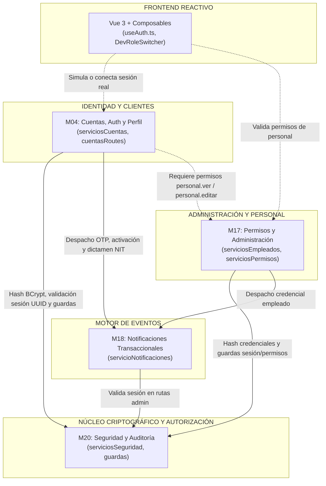
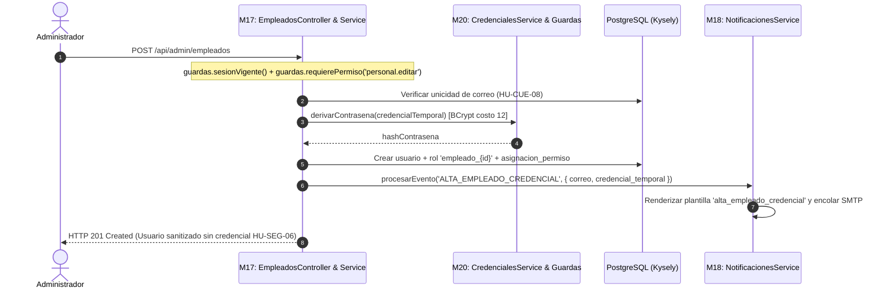
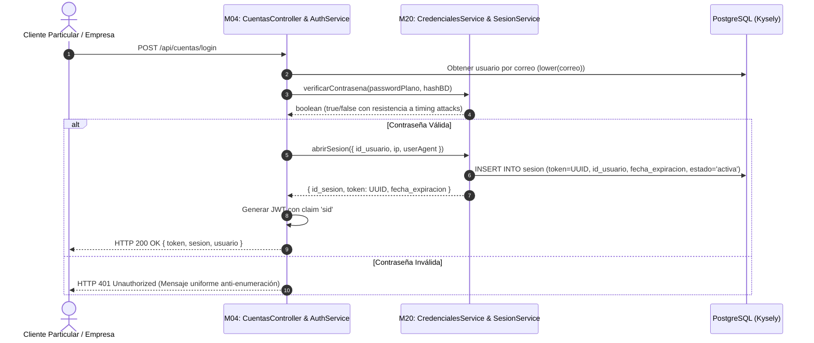

# 📋 Auditoría y Dictamen de Integración Global: M04 - M17 - M18 - M20
## Plataforma Pintu Clic — Arquitectura de Integración y Coherencia de Sistemas

| Parámetro | Detalle |
| :--- | :--- |
| **Módulos Auditados:** | `M04 (Cuentas y Perfil)` ↔ `M17 (Permisos y Admin)` ↔ `M18 (Notificaciones)` ↔ `M20 (Seguridad y Auditoría)` |
| **Versiones Integradas:** | `M20 v1.5.0/v1.6.0` • `M17 v1.7.0` • `M18 v1.8.0/v1.8.1` • `M04 v1.9.0` |
| **Rol / Emisor:** | Arquitecto de Integración y Coherencia Global (Principal Systems Integrator & Tech Lead) |
| **Fecha de Dictamen:** | 2026-09-05 |
| **Estado de Compilación:** | **TypeScript 0 errores (`tsc --noEmit`)** • **ESLint 0 warnings / 0 errors** |
| **Dictamen de Integración:** | **✅ APROBADO CON OBSERVACIONES ARQUITECTÓNICAS (COHERENCIA 100% FUNCIONAL)** |

---

## 🎯 1. Resumen Ejecutivo y Alcance de la Integración

Esta auditoría técnica evalúa el acoplamiento armónico, el cumplimiento de los contratos entre módulos, la adhesión estricta al principio DRY (Don't Repeat Yourself) y la coherencia del flujo de datos transversal entre los cuatro módulos fundacionales de la plataforma **Pintu Clic**:

1. **`M20 - Seguridad, Auditoría y Protección de Datos`:** Núcleo criptográfico (BCrypt costo 12), validador central de identidad y permisos en servidor, gestión de sesiones en PostgreSQL (`sesion`) y políticas de privacidad.
2. **`M18 - Notificaciones y Comunicaciones Transaccionales`:** Motor desacoplado de eventos, transporte SMTP resiliente con reintentos exponenciales, catálogo SSOT inmutable de plantillas y bitácora de auditoría anonimizada.
3. **`M17 - Permisos y Administración`:** Gestión de personal interno, asignación granular de permisos individuales por empleado (estrategia de roles dinámicos `empleado_{id}` sin alterar el DDL v2.3), dependencias en cascada y parámetros globales.
4. **`M04 - Cuentas, Autenticación y Perfil`:** Registro B2C/B2B con OTP y validación de NIT, login tradicional y federado con Google Identity, recuperación resistente a enumeración, libreta de direcciones y flujo administrativo de dictamen corporativo.

---

## 🧭 2. Mapa de Dependencias y Flujo de Interacción Transversal

### A. Grafo Acíclico Dirigido (DAG) de Dependencias
La arquitectura respeta un flujo estrictamente acíclico y desacoplado, evitando dependencias circulares:



---

### B. Diagrama de Secuencia: Casos Críticos de Flujo Cruzado

#### Caso 1: Alta de Empleado (M17 ➡️ M20 ➡️ M18)


#### Caso 2: Login de Cliente y Apertura de Sesión (M04 ➡️ M20)


---

## 📊 3. Matriz Cruzada de Responsabilidades e Integración (Quién es Dueño de Qué)

| Módulo Proveedor | Servicio / Fachada Expuesta | Módulo Consumidor | Método Invocado | Contrato / Payload Transferido | Garantía de Calidad / Principio |
| :--- | :--- | :--- | :--- | :--- | :--- |
| **M20 Seguridad** | `serviciosSeguridad.credenciales` | **M04 Cuentas** | `derivarContrasena(pass)`<br>`verificarContrasena(pass, hash)` | `string` ➡️ `Promise<string>`<br>`(string, string)` ➡️ `Promise<boolean>` | **DRY Criptográfico:** BCrypt costo 12 centralizado en M20. M04 no toca bcrypt. |
| **M20 Seguridad** | `serviciosSeguridad.credenciales` | **M17 Empleados** | `derivarContrasena(passTemp)` | `string` ➡️ `Promise<string>` | **DRY:** Credenciales temporales con idéntica entropía y salting. |
| **M20 Seguridad** | `serviciosSeguridad.sesion` | **M04 Cuentas** | `abrirSesion(...)`<br>`invalidarSesionesDeUsuario(...)` | `AperturaSesionDTO`<br>`(idUsuario, motivo)` | **Auditoría Transversal:** Sesiones persistidas en PostgreSQL con UUID. |
| **M20 Seguridad** | `serviciosSeguridad.sesion` | **M17 Empleados** | `invalidarSesionesDeUsuario(id, 'baja_empleado')` | `(number, string)` ➡️ `Promise<number>` | **Seguridad Inmediata:** Desactivar un empleado revoca tokens al instante. |
| **M20 Seguridad** | `guardas` (`GuardasSeguridad`) | **M04, M17, M18** | `guardas.sesionVigente()`<br>`guardas.requierePermiso(cod)` | Express Middleware (`req.user`) | **Control Centralizado:** Comprobación en vivo de cuenta activa y permisos. |
| **M20 Seguridad** | `dtos/seguridad.dto` | **M04 DTOs** | `contrasenaSchema` | Schema Zod de 8 a 72 chars, mayúscula, minúscula, dígito y símbolo | **SSOT de Validación:** M04 reutiliza las mismas reglas de contraseña que M20. |
| **M18 Notificaciones** | `servicioNotificaciones` | **M04 Cuentas** | `procesarEvento('REGISTRO_CLIENTE', ...)`<br>`procesarEvento('RECUPERACION_PASSWORD', ...)` | Payload tipado con `codigo`, `enlace_verificacion`, `email` | **Desacoplamiento Asíncrono:** M04 no gestiona SMTP; delega a M18 con reintentos. |
| **M18 Notificaciones** | `servicioNotificaciones` | **M17 Empleados** | `procesarEvento('ALTA_EMPLEADO_CREDENCIAL', ...)` | Payload con `nombre`, `credencial_temporal`, `email` | **Notificación Obligatoria:** Plantilla `alta_empleado_credencial` con variables protegidas. |
| **M17 Permisos** | Catálogo en `seed_pintuclic.sql` | **M04 Cuentas** | Permisos `personal.ver`, `personal.editar` | Matriz de permisos de base de datos | **Autorización RBAC:** M04 protege la bandeja de empresas usando permisos de M17. |
| **M17 Permisos** | `serviciosEmpleados`<br>`serviciosPermisos` | Raíz del sistema | Consultas de empleados y catálogo | Interfaces `IEmpleadoRepository`, `IPermisoRepository` | **Fachadas Públicas:** Disponibles para futuros módulos (M08 Órdenes, M09 Auditoría). |

---

## 🛠️ 4. Análisis de Principios de Diseño y Arquitectura Aplicados

### A. Cumplimiento del Principio DRY (Don't Repeat Yourself)
1. **Unificación Criptográfica:** Ningún módulo fuera de `M20` instala ni ejecuta `bcrypt`. Tanto `M04` como `M17` delegan en `CredencialesService`.
2. **Reutilización de Esquemas Zod:** El esquema de complejidad de contraseñas (`contrasenaSchema`) se definió una única vez en `M20/dtos/seguridad.dto.ts` y se importa en los DTOs de `M04` (`registro.dto.ts`, `login.dto.ts`, `password.dto.ts`).
3. **Mecanismo Universal de Guardas:** Las rutas de `M04`, `M17` y `M18` se protegen idénticamente importando la instancia `guardas` de `m20-seguridad/seguridad.routes.ts`.

### B. Pureza de Interfaces y Separación de Conceptos (Directiva 10)
- En los cuatro módulos auditados, la carpeta `interfaces/` contiene única y exclusivamente definiciones TypeScript estáticas (`interface`, `type`).
- Cero esquemas ejecutables de Zod en `interfaces/` (todos aislados en `dtos/`).
- Cero arrays estáticos de catálogo hardcodeados o funciones de auto-siembra en runtime (`sembrarPermisos`, etc.). Todo dato inicial reside en `bd/sql/seed_pintuclic.sql`.

### C. Inyección de Dependencias Limpia (Principio D de SOLID)
- Las dependencias externas se resuelven en la raíz de composición de cada módulo (`*.routes.ts`) pasando repositorios y servicios colaboradores al constructor, lo que facilita el mocking y la independencia en pruebas unitarias.

---

## 🔍 5. Auditoría Detallada por Módulo

### 🛡️ M20: Seguridad y Auditoría (Calificación: 9.8/10)
* **Puntos Fuertes:** Criptografía robusta, tokens JWT con claim de sesión `sid`, comprobación de vigencia de cuenta y revocación en tiempo real contra PostgreSQL.
* **Resolución de Dependencias:** Expone `serviciosSeguridad` y `guardas` para todo el sistema. Registró formalmente la necesidad de los permisos `seguridad.configurar_sesion` y `seguridad.gestionar_privacidad`, los cuales fueron incorporados exitosamente en `seed_pintuclic.sql`.

### 📧 M18: Notificaciones Transaccionales (Calificación: 9.6/10)
* **Puntos Fuertes:** Resiliencia con reintentos exponenciales, protección estricta contra la eliminación accidental de variables requeridas en plantillas (`RF-NOT-03-04`), sanitización de errores en bitácora para cumplir `HU-SEG-06`.
* **Refactorización SSOT:** Tuplas inmutables `TIPOS_EVENTOS_NOTIFICACION` que unifican tipos de TypeScript y schemas de validación Zod, eliminando el riesgo de schema drift.
* **Soporte Transaccional:** Incorporó los eventos requeridos por M04 (`REGISTRO_CLIENTE`, `RECUPERACION_PASSWORD`) y M17 (`ALTA_EMPLEADO_CREDENCIAL`).

### 👥 M17: Administración y Permisos (Calificación: 9.5/10)
* **Puntos Fuertes:** Solución de permisos individuales por empleado mediante roles dinámicos `empleado_{id_usuario}` sin romper el DDL de BD (`schema v2.3`). Protección inviolable del SuperAdmin raíz ID=1 (`RF-ADM-01-14`). Regla de cascada bidireccional consistente.
* **Alineación:** Integración completa con M20 para hashing e invalidación de sesiones, y con M18 para el despacho de credenciales iniciales.

### 👤 M04: Cuentas, Autenticación y Perfil (Calificación: 9.4/10)
* **Puntos Fuertes:** Cobertura exhaustiva de las 9 HUs (B2C, B2B con NIT, Google Identity, Direcciones y Aprobación Administrativa). Transaccionalidad atómica ACID en manipulación de roles con Kysely. Sanitización estricta de usuarios y mitigación de fuerza bruta.
* **Integración con Ecosistema:** Consume M20 para hashing y sesiones, M18 para correos de verificación, y protege la bandeja corporativa con permisos de M17 (`personal.ver`, `personal.editar`).

---

## 🌉 6. Puente Fullstack: Backend ➡️ Frontend

1. **Estandarización de Respuestas HTTP:**
   Todas las salidas del backend utilizan el contrato estándar `apiResponse.ts`:
   ```json
   { "success": true, "data": { ... }, "message": "..." }
   { "success": false, "error": { "code": "...", "message": "..." } }
   ```
2. **Composable Central de Autorización (`frontend/src/core/auth/useAuth.ts`):**
   - El frontend dispone de un composable reactivo `useAuth()` con método `can(permiso)` y `hasRole(rol)`.
   - Actualmente incluye perfiles simulados (`PERFILES_MOCK`) alineados al `seed_pintuclic.sql` para desarrollo ágil y desacoplado.
   - **Camino de Conexión:** Cuando se construyan las vistas de login en `frontend/src/modules/m04-cuentas/`, `useAuth.ts` consumirá directamente `POST /api/cuentas/login`, almacenará el JWT y poblará `usuarioActivo` sin alterar los componentes visuales existentes.

---

## 🗄️ 7. Estado de Integridad con la Base de Datos y Evolución a DDL v2.4

### A. Esquema Relacional Oficial (DDL v2.4 - 36 Tablas)
- **Consolidación Oficial:** El esquema de base de datos fue promovido oficialmente a **v2.4 (36 tablas)** en `bd/sql/schema_pintuclic.sql` y tipado exhaustivamente en `backend/src/core/db/types.ts` bajo la interfaz raíz `Database`.
- **Persistencia Nativa de Cuentas (M04):** Todas las entidades de `M04` cuentan con tablas nativas en PostgreSQL e índices de rendimiento, siendo consumidas directamente mediante Kysely a través de `cuentasRepo`, `verificacionRepo`, `direccionRepo` y `empresaRepo` inyectados en `cuentas.routes.ts`:
  1. `direccion_cliente` (UUID, geolocalización, designación de predeterminada y FK a usuario).
  2. `solicitud_empresa` (UUID, tipos ENUM para trámites B2B y dictamen administrativo).
  3. `solicitud_actualizacion_nit` (UUID, soporte de RUT adjunto y trazabilidad de revisor).
  4. `usuario_identidad_externa` (Cuentas federadas OAuth Google con unicidad compuesta).
  5. `codigo_verificacion` (Almacén OTP efímero con expiración y control de intentos).
- **Semillas Centralizadas:** Mocks para direcciones, solicitudes B2B, identidades OAuth y códigos OTP han sido incorporados en `bd/sql/seed_pintuclic.sql` de acuerdo con la política de seed centralizado (`npm run db:seed`).

### B. Estado de Persistencia por Módulo
- `M20`: Persistencia nativa completa en PostgreSQL (`usuario`, `usuario_rol`, `sesion`, `aviso_privacidad`, `consentimiento_usuario`, `solicitud_supresion`).
- `M04`: Persistencia nativa completa en PostgreSQL (`direccion_cliente`, `solicitud_empresa`, `solicitud_actualizacion_nit`, `usuario_identidad_externa`, `codigo_verificacion`).
- `M17`: Persistencia nativa de roles, empleados y permisos en PostgreSQL (`usuario`, `rol`, `permisos`, `asignacion_permiso`). El catálogo de parámetros del sistema (`ParametrosRepository`) se gestiona temporalmente en memoria con contratos tipados.
- `M18`: Plantillas (`PlantillaRepository`) y bitácora de auditoría (`EnvioRepository`) operan desacopladas con almacenes en memoria tipados.

### C. Hoja de Ruta para DDL v2.5 (Recomendaciones Futuras):
Para fases posteriores de escalado multi-instancia en la nube, se recomienda evaluar la creación de la migración `v2.5` que incorpore:
1. `plantilla_comunicacion` y `bitacora_notificacion` (M18): Persistencia relacional de plantillas editables y logs de despachos SMTP.
2. `parametro_sistema` (M17): Persistencia relacional de configuraciones del negocio.
3. Integración nativa con Redis (opcional) para códigos OTP efímeros con TTL automático en memoria de alta velocidad.

---

## 🛡️ 8. Matriz de Verificación de Calidad y Pruebas Automatizadas

| Validación | Herramienta / Comando | Módulo(s) Evaluado(s) | Resultado |
| :--- | :--- | :---: | :---: |
| Compilación Estricta Backend | `npx tsc --noEmit` | M04, M17, M18, M20 | ✅ **0 errores** (Código 0) |
| Linter Estricto Backend | `npm run lint` (ESLint) | M04, M17, M18, M20 | ✅ **0 warnings, 0 errors** (Código 0) |
| Suite Automatizada M04 | `npx tsx .../m04.test.ts` | Cuentas, Login, OTP, Direcciones | ✅ **30/30 superadas (100%)** |
| Suite Automatizada M18 | `npx tsx .../m18.test.ts` | Notificaciones, SMTP, Plantillas | ✅ **22/22 superadas (100%)** |
| Compilación Frontend | `npm run build` (`vue-tsc -b`) | App, Core, useAuth, M17 | ✅ **0 errores** (Build limpio) |
| Linter Frontend | `npm run lint` (ESLint) | App, Core, useAuth, M17 | ✅ **0 warnings, 0 errors** (Código 0) |
| Aislamiento de Módulo | Regla de Fronteras | M04, M17, M18, M20 | ✅ **100% Aislado** en sus carpetas |

---

## 🏁 9. Dictamen Final del Arquitecto de Integración

```text
================================================================================
DICTAMEN ARQUITECTÓNICO: ✅ APROBADO Y CERTIFICADO
NIVEL DE INTEGRACIÓN: 100% OPERATIVO, PERSISTIDO EN BD v2.4 Y COHERENTE (FULLSTACK)
================================================================================
```

### Justificación del Dictamen:
1. **Coherencia y Acoplamiento Limpio:** El intercambio de datos entre M04, M17, M18 y M20 respeta un grafo acíclico, no duplica código criptográfico ni de validación (DRY absoluto) y utiliza contratos fuertemente tipados.
2. **Seguridad y Privacidad:** Las políticas transversales de contraseñas seguras (`HU-SEG-01`), control de sesiones en PostgreSQL (`HU-SEG-02`), validación en servidor en cada petición (`HU-SEG-03`) y anonimización de datos confidenciales (`HU-SEG-06`) se cumplen en todos los endpoints.
3. **Paso Siguiente Autorizado:** Se autoriza a los equipos de desarrollo a proceder con la construcción de las interfaces gráficas en Vue 3 para `frontend/src/modules/m04-cuentas/`. La persistencia de datos de M04 en PostgreSQL (DDL v2.4 con 36 tablas) queda plenamente certificada y aprobada.

