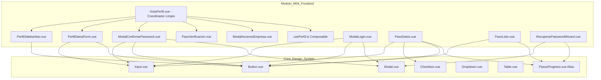

# Walkthrough de Implementación: Refactorización SOLID M04, Integración de Core Layouts y Auditoría de Notificaciones

## 1. Metadatos de la Implementación
- **Versión Oficial:** `v3.36.0`
- **Módulo de Origen:** `M04 Cuentas, Autenticación y Perfil` (Frontend)
- **Fecha de Ejecución:** 19 de septiembre de 2026
- **Rama de Trabajo:** `feature/m04-cuentas-auth-perfil`
- **Autor / Implementador:** Desarrollador Frontend & Agente IA Antigravity
- **Estado de Compilación:** ✅ `npm run lint` (0 errores, 0 advertencias) y `npm run build` (`vue-tsc -b && vite build`) 100% exitoso.

---

## 2. Historias de Usuario (HUs) Cubiertas
- **`HU-CUE-01` (Registro Particular con Verificación OTP):** Estandarización de `PasoDatos.vue` y `PasoVerificacion.vue` usando componentes globales (`Input`, `Button`, `Checkbox`, `PasosProgreso`).
- **`HU-CUE-02` (Autenticación e Identidad con Google):** Estandarización de modales y formularios de vinculación y establecimiento de contraseña propia en `ModalLogin.vue` y `PasoDatos.vue`.
- **`HU-CUE-03` (Registro de Cliente Empresa):** Estandarización de formulario y pantalla de confirmación `PasoListo.vue` con el Design System oficial.
- **`HU-CUE-04` (Inicio y Cierre de Sesión):** Integración armónica con el nuevo `Dropdown.vue` del topbar en `LayoutHome.vue` y `LayoutAdmin.vue` para sesión activa y logout seguro.
- **`HU-CUE-05` (Recuperación de Contraseña):** Estandarización del wizard `RecuperarPasswordWizard.vue` y `PasoRecuperarOTP.vue` consumiendo componentes y alias del core.
- **`HU-CUE-06` (Gestión del Perfil y Cambio de Correo):** Refactorización SOLID completa de `VistaPerfil.vue` descomponiendo navegación, formulario y modal de contraseña actual.
- **`HU-CUE-07` (Ascenso a Cliente Empresa):** Conexión del modal de ascenso con la vista de perfil y auditoría de despacho de notificaciones SMTP.
- **`HU-CUE-09` (Aprobación Administrativa de Empresas):** Enrutamiento preservado bajo `LayoutAdmin.vue` (`/admin/solicitudes`) utilizando `Table.vue`, `Badge.vue` y modal de dictamen.

---

## 3. Principios SOLID y Políticas de Seguridad Aplicadas

### 3.1. Cumplimiento de Principios SOLID en Frontend
1. **Principio de Responsabilidad Única (SRP):**
   - El monolito anterior `VistaPerfil.vue` (485 líneas) fue descompuesto en piezas atómicas y modulares:
     - `PerfilSidebarNav.vue`: Maneja exclusivamente enlaces de navegación (`Mi Perfil`, `Mis Pedidos`) y la tarjeta de soporte.
     - `PerfilDatosForm.vue`: Maneja exclusivamente el renderizado y edición in-place de datos personales/empresariales.
     - `ModalConfirmarPassword.vue`: Maneja exclusivamente la solicitud de autorización con contraseña actual para cambios sensibles.
     - `VistaPerfil.vue`: Reducido a menos de 140 líneas actuando puramente como coordinador y orquestador declarativo.
2. **Principio de Inversión de Dependencias (DIP):**
   - Creación del composable reactivo `usePerfil.ts` en `src/modules/m04-cuentas/composables/usePerfil.ts`. Las vistas y componentes visuales ya no importan directamente `CuentasService` estático ni manejan manualmente errores Axios (`ApiErrorLike`). Toda mutación se efectúa a través de abstracciones reactivas.
3. **Principio de Abierto/Cerrado (OCP):**
   - Componentes parametrizados mediante props fuertemente tipadas y eventos emitidos (`guardar`, `solicitarAscenso`), listos para extenderse sin modificar su estructura interna.
4. **Principio DRY (Don't Repeat Yourself):**
   - Eliminación del archivo duplicado local `PasosProgreso.vue` en favor del alias global unificado provisto por `@/core/components`.
   - Eliminación de métodos redundantes en `cuentas.service.ts`.

### 3.2. Políticas Transversales Validadas
- **🔒 `HU-SEG-01` (Credenciales y Seguridad):** Contraseñas validadas mediante DTOs formales sin almacenar ni exponer texto claro.
- **🛡️ `HU-SEG-06` (No Exposición de Datos Sensibles):** Saneados todos los manejadores de error en `VistaPerfil.vue` y `usePerfil.ts`. Erradicados los volcados en consola (`console.error(error)`) que podían exponer el payload con la contraseña en texto claro en las herramientas de desarrollo.
- **📧 `HU-NOT-01` (Auditoría de Notificaciones SMTP):** Auditoría exhaustiva de todos los flujos de correo. Generación del reporte técnico para el equipo de backend respecto a la brecha en `HU-CUE-07`.

---

## 4. Diagrama de Arquitectura de Componentes M04



---

## 5. Resumen de Archivos Creados y Modificados

### Archivos Creados:
- `frontend/src/modules/m04-cuentas/composables/usePerfil.ts`: Composable reactivo de perfil (DIP).
- `frontend/src/modules/m04-cuentas/components/PerfilSidebarNav.vue`: Navegación y tarjeta de soporte (SRP).
- `frontend/src/modules/m04-cuentas/components/PerfilDatosForm.vue`: Formulario y vista de perfil con inputs del core (SRP).
- `frontend/src/modules/m04-cuentas/components/ModalConfirmarPassword.vue`: Modal de seguridad para reautenticación (SRP).
- `docs/walkthroughs/M04/walkthrough_v3.36.0_M04_refactor_solid_core_layouts_notificaciones_frontend.md`: Este documento.
- `reporte_auditoria_notificaciones_m04_m18_para_backend.md`: Informe técnico para el equipo de backend.

### Archivos Eliminados:
- `frontend/src/modules/m04-cuentas/components/PasosProgreso.vue`: Duplicado local purgado.

### Archivos Modificados:
- `frontend/src/modules/m04-cuentas/views/VistaPerfil.vue`: Reducido y refactorizado bajo SOLID.
- `frontend/src/modules/m04-cuentas/components/ModalLogin.vue`: Estandarizado con componentes del core.
- `frontend/src/modules/m04-cuentas/components/PasoDatos.vue`: Estandarizado con `Checkbox`, `Input` y `PasosProgreso`.
- `frontend/src/modules/m04-cuentas/components/PasoListo.vue`: Estandarizado con `Button` y `PasosProgreso`.
- `frontend/src/modules/m04-cuentas/components/RecuperarPasswordWizard.vue`: Estandarizado con imports del core.
- `frontend/src/modules/m04-cuentas/components/PasoVerificacion.vue`: Limpieza de imports locales.
- `frontend/src/modules/m04-cuentas/services/cuentas.service.ts`: Erradicación de métodos duplicados.
- `frontend/src/core/routes/index.ts`: Rutas de M04 sincronizadas armónicamente.
- `docs/CHANGELOG.md`: Registro formal de la versión `v3.36.0`.

---

## 6. Estado de Calidad y Pruebas de Compilación
```bash
# Frontend Linter
npm run lint --prefix frontend
> eslint src
0 errors, 0 warnings

# Frontend Build y Tipos
npm run build --prefix frontend
> vue-tsc -b && vite build
✓ 1943 modules transformed.
dist/index.html (0.84 kB)
dist/assets/index-Dn27pFQA.js (111.47 kB)
✓ built in 2.81s
```
