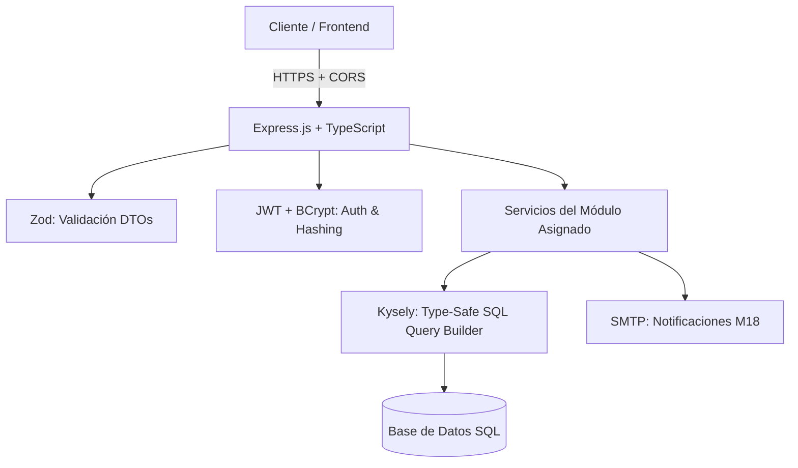
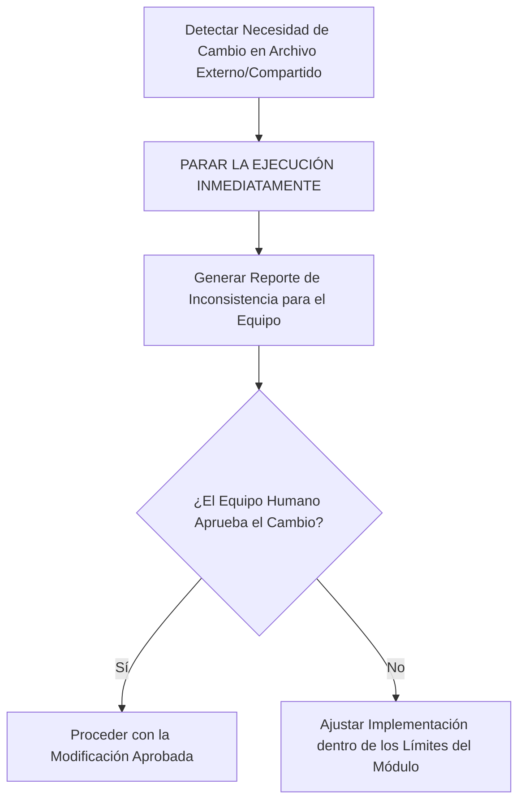

# Arquitectura Backend y Stack Tecnológico - PINTU CLIC

Este documento define el **stack tecnológico oficial y las reglas de seguridad e implementación** para el desarrollo de módulos en **Pintu Clic**.

---

## 1. Stack Tecnológico Oficial



### Herramientas y Responsabilidades

| Tecnología | Rol en el Sistema | Regla de Uso |
| :--- | :--- | :--- |
| **TypeScript** | Lenguaje principal (Backend & DTOs) | Tipado estricto (`strict: true`). Prohibido el uso de `any`; tipar todas las entradas, salidas y entidades. |
| **Express.js** | Framework HTTP / Enrutamiento | Exponer únicamente las rutas y controladores correspondientes al módulo asignado. |
| **Kysely** | Type-Safe SQL Query Builder | Construcción de consultas SQL tipadas. Prohibido concatenar strings para SQL. Previene inyecciones SQL. |
| **Zod** | Validación de Entradas y DTOs | Validar en tiempo de ejecución todos los `req.body`, `req.query` y `req.params`. Inferir tipos directamente (`z.infer<typeof Schema>`). |
| **JWT (jsonwebtoken)** | Gestión de Sesión y Tokens | Emisión y verificación de tokens de acceso y refresco (`HU-SEG-02`). No incluir datos sensibles en el payload (`HU-SEG-06`). |
| **BCrypt** | Hashing de Contraseñas | Hashing con salt dinámico (costo mínimo: 12) para contraseñas (`HU-SEG-01`). |
| **SMTP (Nodemailer / Transport)** | Correos Transaccionales | Envío asíncrono de códigos de verificación y notificaciones (`M18` / `HU-NOT-01`). |
| **CORS** | Seguridad HTTP | Configuración restrictiva de orígenes y cabeceras permitidas. |

---

## 2. Aislamiento de Módulo y Límites de Trabajo (Scope Boundaries)

> ⛔ **DIRECTIVA DEL PRODUCT OWNER:**  
> La estructura de carpetas global del proyecto ya está establecida para toda la organización.  
> **NO se debe reconstruir el backend desde cero ni modificar archivos, rutas o controladores que pertenecen a otros equipos.**

1. **Enfoque 100% en Historias de Usuario:** El trabajo del equipo y del Agente de IA debe centrarse exclusivamente en cumplir los Criterios de Aceptación (CA) y Requisitos Funcionales (RF) del módulo asignado.
2. **Encapsulamiento:** Todo controlador, servicio, repositorio, esquema Zod o ruta nueva debe vivir estrictamente dentro del espacio del módulo asignado.

---

## 3. Protocolo de Parada Obligatoria e Inconsistencias (Stop & Report)

Si durante el desarrollo de una Historia de Usuario, el Agente de IA detecta que:
- Requiere modificar un archivo existente que pertenezca a otro equipo o módulo compartido.
- Requiere alterar una tabla, ruta o controlador fuera de su alcance asignado.
- Encuentra una contradicción entre la especificación del módulo y el código existente en el repositorio.

El Agente **TIENE PROHIBIDO** aplicar cambios automáticos. Debe seguir este protocolo:



1. **Detener la ejecución inmediatamente:** No realizar escrituras ni modificaciones sobre archivos externos.
2. **Informar al equipo:** Describir con precisión qué archivo externo se requiere tocar, por qué la HU lo demanda y qué impacto tendría.
3. **Esperar confirmación:** Solo continuar si el equipo o el Product Owner aprueba explícitamente la acción.

---

## 4. Patrones de Código Aprobados

### A. Validación de Entradas con Zod (`schemas.ts`)
```typescript
import { z } from 'zod';

export const RegisterUserSchema = z.object({
  body: z.object({
    email: z.string().email('Formato de correo inválido'),
    password: z.string().min(8, 'Mínimo 8 caracteres')
      .regex(/[A-Z]/, 'Debe incluir mayúscula')
      .regex(/[0-9]/, 'Debe incluir número'),
    fullName: z.string().min(2, 'Nombre requerido'),
    phone: z.string().optional()
  })
});

export type RegisterUserDTO = z.infer<typeof RegisterUserSchema>['body'];
```

### B. Consultas SQL Type-Safe con Kysely (`repository.ts`)
```typescript
import { Kysely } from 'kysely';
import { Database } from '../../database/types';

export class AccountsRepository {
  constructor(private db: Kysely<Database>) {}

  async findByEmail(email: string) {
    return await this.db
      .selectFrom('users')
      .selectAll()
      .where('email', '=', email)
      .executeTakeFirst();
  }

  async createUser(data: NewUser) {
    return await this.db
      .insertInto('users')
      .values(data)
      .returning(['id', 'email', 'full_name', 'created_at'])
      .executeTakeFirstOrThrow();
  }
}
```

### C. Hashing de Contraseñas con BCrypt (`security.ts`)
```typescript
import bcrypt from 'bcrypt';

const SALT_ROUNDS = 12; // M20 - HU-SEG-01

export async function hashPassword(plainText: string): Promise<string> {
  return await bcrypt.hash(plainText, SALT_ROUNDS);
}

export async function comparePassword(plainText: string, hash: string): Promise<boolean> {
  return await bcrypt.compare(plainText, hash);
}
```

### D. Verificación de Permisos Individuales M17 en Servidor
```typescript
// Comprobación en backend ante cada petición (HU-ADM-03 / HU-SEG-03)
export function requirePermission(permissionCode: string) {
  return async (req: Request, res: Response, next: NextFunction) => {
    const userId = req.user?.id;
    const hasPermission = await permissionService.checkUserPermission(userId, permissionCode);
    
    if (!hasPermission) {
      return res.status(403).json({ error: 'Acceso denegado: permiso insuficiente' });
    }
    next();
  };
}
```
