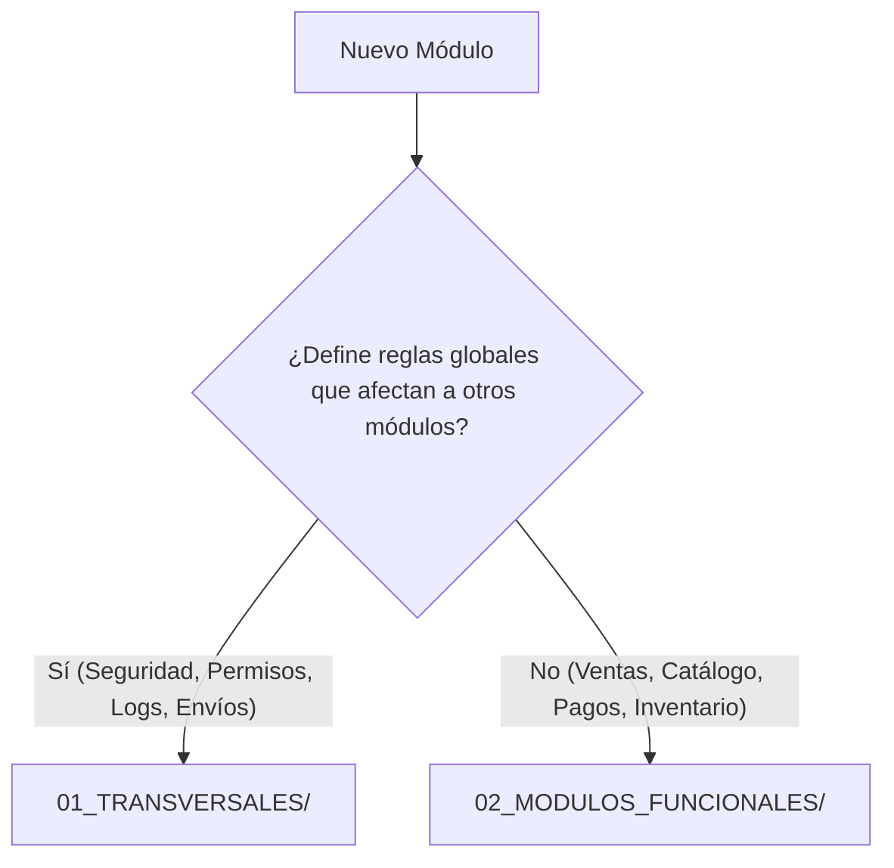
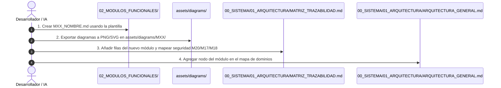

# Guía Estándar para Incorporación y Refactorización de Módulos - PINTU CLIC

Este documento establece la **normativa y el procedimiento estándar** para integrar nuevos módulos de negocio (o refactorizar los existentes) en la carpeta `equipo-2-doc/`. 

Su propósito es garantizar que la documentación crezca de forma ordenada, modular y directamente interpretable por **Agentes de Inteligencia Artificial (IA)** y desarrolladores del equipo.

---

## 1. Clasificación del Nuevo Módulo

Antes de crear cualquier archivo, determina la naturaleza del módulo:



1. **Módulo Transversal (`01_TRANSVERSALES/`):** Define políticas, middleware, contratos de servicios compartidos o seguridad aplicables a todo el sistema (ej: `M20 Seguridad`, `M17 Permisos`, `M18 Notificaciones`).
2. **Módulo Funcional (`02_MODULOS_FUNCIONALES/`):** Representa un dominio de negocio específico (ej: `M07 Checkout`, `M08 Órdenes`, `M12 Facturación`, `M02 Catálogo`).

---

## 2. Convenciones de Nomenclatura

| Elemento | Formato / Regla | Ejemplo |
| :--- | :--- | :--- |
| **Archivo de Módulo** | `M[XX]_[NOMBRE_EN_MAYUSCULAS].md` | `M07_CHECKOUT_Y_CARRITO.md` |
| **Directorio de Diagramas** | `assets/diagrams/M[XX]/` | `assets/diagrams/M07/` |
| **Imágenes de Diagramas** | `[prefijo_o_hu]_[descripcion_corta].png` | `HU-CHK-01_flujo_pago.png` |
| **Archivos Editables** | `assets/raw_drawio/[Nombre_Original].drawio` | `assets/raw_drawio/Diagrama_M07.drawio` |
| **Carpetas de Código (Backend y Frontend)** | `m[xx]-[nombre-modulo]` (minúsculas, kebab-case) | `backend/src/modules/m04-cuentas/`<br>`frontend/src/modules/m04-cuentas/` |

> ⚠️ **Regla de Oro:** **NUNCA crear subcarpetas por Historia de Usuario individual** (evitar `HU-01/`, `HU-02/`). Toda la especificación del módulo reside en un único archivo `.md` consolidado, y todo el código del módulo vive dentro de su carpeta `m[xx]-[nombre-modulo]/`.

---

## 3. Plantilla Estándar para Archivos de Módulo (`.md`)

Todo nuevo archivo dentro de `02_MODULOS_FUNCIONALES/` debe respetar la siguiente estructura:

```markdown
# M[XX]. [Nombre del Módulo]

**Dominio:** [Ej: Comercio / Logística / Clientes]  
**Prefijo de Historias:** [Ej: CHK / ORD / FAC]  

---

## 1. Propósito y Alcance
[Descripción clara en 1 o 2 párrafos del valor de negocio que aporta este módulo y sus límites.]

## 2. Dependencias y Relaciones
- **Depende de:** [Ej: M04 Cuentas para identificar al cliente, M02 Catálogo para stock].
- **Habilita a:** [Ej: M08 Órdenes para despacho, M12 Facturación].
- **Transversales Aplicables:**
  - 🔒 **M20 Seguridad:** [Políticas aplicables, ej: cifrado en tránsito, tokens de checkout].
  - 🛡️ **M17 Permisos:** [Permisos administrativos necesarios para operar este módulo].
  - 📧 **M18 Notificaciones:** [Eventos que disparan correos o alertas].

---

## 3. Tabla Resumen de Historias de Usuario

| ID | Historia de Usuario | Actores | Prioridad | Estado |
| :--- | :--- | :--- | :--- | :--- |
| **HU-[PRE]-01** | [Título corto] | [Actor] | Must / Should | Especificable |

---

## 4. Especificación Detallada por Historia de Usuario

### HU-[PRE]-01: [Título de la Historia]

> **Como** [Actor]  
> **Quiero** [Acción / Funcionalidad]  
> **Para** [Beneficio de negocio]  

#### Requisitos Funcionales y No Funcionales
| ID | Tipo | Categoría | Requisito | Origen | Prioridad |
| :--- | :--- | :--- | :--- | :--- | :--- |
| **RF-[PRE]-01-01** | RF | Validación | El sistema debe validar... | Definido | Alta |

#### Políticas Transversales Vinculadas (M20 / M17 / M18)
- **Seguridad (M20):** Cumplir con `[HU-SEG-03]` (validación estricta en servidor).
- **Notificaciones (M18):** Disparar evento `EVENT_ORDER_CREATED`.

#### Criterios de Aceptación (Gherkin)
- **CA-[PRE]-01-01:**
  - **Dado que** el cliente tiene productos en el carrito...
  - **Cuando** presiona "Confirmar pedido"...
  - **Entonces** el sistema valida el stock y genera la orden.

#### Diagramas de Referencia

```

---

## 4. Procedimiento de 4 Pasos para Incorporar un Módulo



### Paso 1: Redactar el archivo del módulo
Crear `02_MODULOS_FUNCIONALES/M[XX]_[NOMBRE].md` asegurando que no queden dependencias ambiguas.

### Paso 2: Centralizar los Diagramas
- Exportar desde Diagrams.net / Draw.io a formato `.png` o `.svg`.
- Guardar las imágenes en `assets/diagrams/M[XX]/`.
- Guardar el archivo fuente `.drawio` en `assets/raw_drawio/`.

### Paso 3: Registrar en la Matriz de Trazabilidad
Abrir `00_SISTEMA/01_ARQUITECTURA/MATRIZ_TRAZABILIDAD.md` y agregar la sección correspondiente al nuevo módulo, indicando explícitamente:
- Qué historias de `M20` (Seguridad) aplican.
- Qué permisos de `M17` se requieren.
- Qué eventos de `M18` (Notificaciones) se consumen o emiten.
- Las rutas relativas a sus diagramas.

### Paso 4: Actualizar el Diagrama de Arquitectura
Abrir `00_SISTEMA/01_ARQUITECTURA/ARQUITECTURA_GENERAL.md` y registrar las conexiones del nuevo módulo con los dominios existentes.

---

## 5. Lista de Chequeo de Calidad (Checklist de Validación)

Antes de dar por integrado un módulo nuevo o refactorizado, verifica:

- [ ] **Formato Markdown estándar:** Sin tablas rotas ni caracteres corruptos.
- [ ] **Sin micro-carpetas huérfanas:** Todas las HUs del módulo están en su respectivo archivo consolidado.
- [ ] **Rutas relativas válidas:** Todas las imágenes `` y enlaces `[M20](../01_TRANSVERSALES/...)` cargan correctamente.
- [ ] **Matriz de Trazabilidad actualizada:** Toda HU que maneje datos, permisos o emails referencia su transversal.
- [ ] **Criterios de Aceptación comprobables:** Cada HU cuenta con criterios en formato Dado/Cuando/Entonces para que el agente pueda generar tests automatizados.
