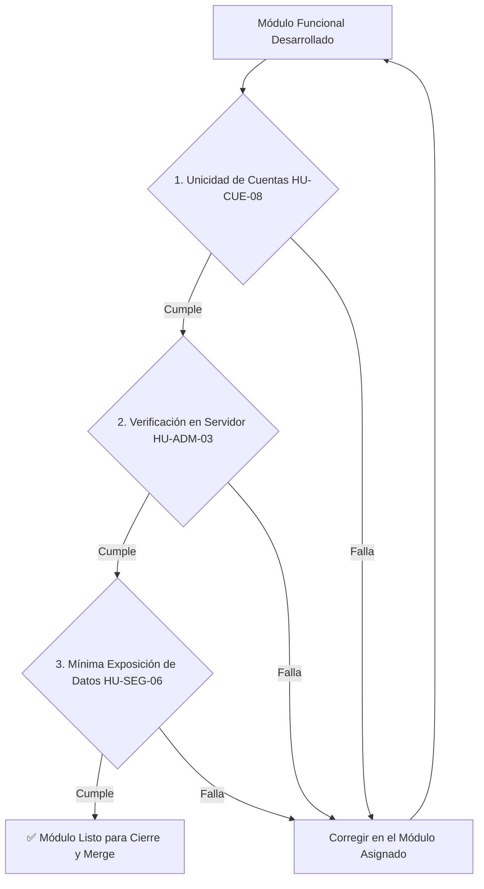

# Checklist de Cierre y Políticas Globales de Módulo (Definition of Done) - PINTU CLIC

Este documento establece la **puerta de calidad y validación obligatoria** que todo desarrollador o Agente de IA debe comprobar antes de dar por finalizada la implementación de **cualquier módulo** (presente o futuro) en Pintu Clic.

---

## 🎯 Las 3 Políticas Globales de Integridad

Al finalizar el desarrollo de las Historias de Usuario de un módulo, se debe verificar el cumplimiento de las siguientes 3 políticas transversales:

---

### 1. Política de Unicidad de Cuentas (`HU-CUE-08`)
📄 **Documento de Referencia:** [politica_HU-CUE-08_unicidad_cuentas.md](../01_TRANSVERSALES/POLITICAS/politica_HU-CUE-08_unicidad_cuentas.md)

- [ ] **Identificador Único:** Cada cuenta (particular, empresa o empleado) está identificada de forma inequívoca por su correo electrónico.
- [ ] **No Solapamiento:** Un mismo correo no puede existir simultáneamente como cliente y como empleado/administrador.
- [ ] **Consultas de Validación:** Cualquier flujo de registro o actualización de datos valida la unicidad en los registros correspondientes antes de confirmar la operación.

---

### 2. Política de Control de Acceso y Verificación en Servidor (`HU-ADM-03`)
📄 **Documento de Referencia:** [politica_HU-ADM-03_control_acceso_servidor.md](../01_TRANSVERSALES/POLITICAS/politica_HU-ADM-03_control_acceso_servidor.md)

- [ ] **Validación en Backend:** La seguridad no depende del frontend. Cada endpoint REST o query comprueba la sesión y los permisos atómicos del usuario en el servidor.
- [ ] **Protección de Consultas y Modificaciones:** Las rutas `GET` que devuelven datos protegidos tienen la misma verificación de autorización que las rutas `POST`, `PUT` o `DELETE`.
- [ ] **Permisos Evaluados en Tiempo Real:** Los permisos individuales de empleado se resuelven en el momento de la petición (no fijados en un valor estático al login).
- [ ] **Respuestas Genéricas en Fallos:** Si un usuario intenta acceder a una operación no permitida, se retorna `403 Forbidden` genérico sin revelar detalles internos ni existencia previa de registros.

---

### 3. Política de No Exposición de Datos Sensibles (`HU-SEG-06`)
📄 **Documento de Referencia:** [politica_HU-SEG-06_no_exposicion_datos_sensibles.md](../01_TRANSVERSALES/POLITICAS/politica_HU-SEG-06_no_exposicion_datos_sensibles.md)

- [ ] **Payloads Mínimos:** Las respuestas JSON solo entregan al cliente los atributos necesarios para la vista actual.
- [ ] **Cero Contraseñas / Hashes en Respuestas:** Ningún objeto de usuario serializado en la API contiene el campo `password_hash` o `salt`.
- [ ] **Cero Datos de Pago:** El sistema no almacena ni procesa en texto plano números de tarjetas o CVV (custodia exclusiva de la pasarela).
- [ ] **Protección B2B:** Los precios y descuentos empresariales no se exponen a visitantes anónimos ni a clientes particulares que no cuenten con cuenta empresa aprobada.
- [ ] **Manejo Seguro de Errores:** Los mensajes de error al cliente no exponen trazas de stack trace, sentencias SQL ni versiones de librerías.

---

## 📋 Lista de Chequeo Final de Entrega

Antes de dar el módulo por 100% completado:

- [ ] Se implementaron todos los Criterios de Aceptación (Gherkin) de cada HU del módulo.
- [ ] Se respetaron todos los árboles de decisión y casos de error de los **Diagramas de Flujo** asociados.
- [ ] Las 3 Políticas Globales (`HU-CUE-08`, `HU-ADM-03`, `HU-SEG-06`) fueron validadas y aprobadas.
- [ ] Todo el código nuevo reside estrictamente en el módulo asignado (sin tocar código de otros equipos).
