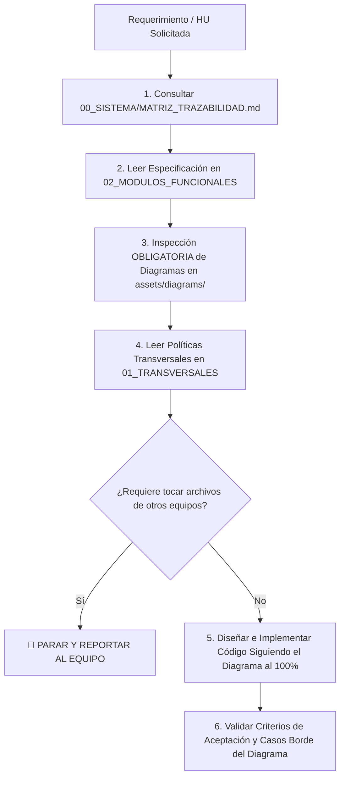

# Protocolo y Guía de Desarrollo para Agentes de IA - PINTU CLIC

Bienvenido. Este repositorio contiene la especificación funcional, técnica, diagramas y políticas de negocio de la plataforma **Pintu Clic**.

Como agente de IA responsable de implementar código, pruebas o arquitectura para este sistema, **debes seguir estrictamente el siguiente flujo de trabajo**.

> ⛔ **DIRECTIVAS CRÍTICAS DE ALCANCE Y CONCURRENCIA (PRODUCT OWNER):**
> 1. **Aislamiento Estricto de Módulo:** Está terminantemente PROHIBIDO modificar o eliminar archivos, rutas o controladores existentes que pertenezcan a otros módulos o que estén siendo desarrollados por otros equipos. Tu código debe vivir exclusivamente dentro del módulo asignado.
> 2. **Protocolo de Parada e Informe de Inconsistencias:** Si para completar una HU consideras necesario modificar un archivo compartido o externo a tu módulo, **DEBES DETENER LA EJECUCIÓN INMEDIATAMENTE**, no realizar ningún cambio y presentar un reporte detallado al equipo humano explicando la inconsistencia o necesidad técnica. Solo podrás continuar tras recibir aprobación explícita.
> 3. **Objetivo 100% Funcional:** No reconstruyas la arquitectura global del backend. Concéntrate en cumplir al 100% los Criterios de Aceptación (CA) y Requisitos Funcionales (RF) de cada Historia de Usuario usando el stack tecnológico aprobado.
> 4. **Los Diagramas son Contratos de Flujo Obligatorios:** Los diagramas han sido diseñados y consensuados por todo el equipo de ingeniería. No son meras ilustraciones: **definen la máquina de estados, ramificaciones condicionales, secuencias de llamadas y manejo de errores exactos** que tu código debe respetar.

---

## 🧭 Flujo de Trabajo Obligatorio para Implementar Cualquier Tarea / HU

### Paso 1: Localización y Mapeo de Dependencias
- Identifica el código de la Historia de Usuario (ejemplo: `HU-CUE-01`, `HU-ADM-02`, etc.).
- Abre [00_SISTEMA/MATRIZ_TRAZABILIDAD.md](./00_SISTEMA/MATRIZ_TRAZABILIDAD.md) para determinar qué módulos transversales (`M20 Seguridad`, `M17 Permisos`, `M18 Notificaciones`) y qué **diagramas** aplican a esa historia.

### Paso 2: Lectura de la Especificación Funcional
- Abre el archivo correspondiente en `02_MODULOS_FUNCIONALES/` (por ejemplo, [02_MODULOS_FUNCIONALES/M04_CUENTAS_Y_PERFIL.md](./02_MODULOS_FUNCIONALES/M04_CUENTAS_Y_PERFIL.md)).
- Lee los **Requisitos Funcionales (RF)**, **Requisitos No Funcionales (RNF)** y los **Criterios de Aceptación (CA)**.

### Paso 3: Inspección OBLIGATORIA de Diagramas (Contrato de Flujo del Equipo)
Antes de escribir una sola línea de código, **debes abrir y analizar visualmente el diagrama asociado** en `assets/diagrams/M[XX]/`:
- **Árboles de Decisión y Bifurcaciones:** Revisa qué condiciones de validación (`if / else`) están diagramadas. Cada rama del diagrama debe tener su correspondiente lógica en el código.
- **Transición de Estados:** Si el diagrama define estados (ej: `Pendiente -> Aprobado -> Rechazado`), el código debe implementar exactamente esos nombres y transiciones.
- **Rutas de Error y Cancelación:** Presta especial atención a los caminos alternativos (qué pasa si el código de verificación expiró, qué pasa si el NIT ya existe, etc.).
- **Secuencia de Llamadas:** Respeta el orden de ejecución (ej: primero validar con Zod -> luego verificar existencia en BD -> luego generar hash BCrypt -> luego emitir evento SMTP).

### Paso 4: Cumplimiento de Políticas Transversales (¡Crítico!)
- **M20 - Seguridad y Auditoría ([01_TRANSVERSALES/M20_SEGURIDAD_Y_AUDITORIA.md](./01_TRANSVERSALES/M20_SEGURIDAD_Y_AUDITORIA.md)):**
  - **Credenciales (`HU-SEG-01`):** Nunca guardar ni comparar contraseñas en texto claro. Usar funciones de hash seguras con salt (BCrypt con costo 12).
  - **Sesiones y Tokens (`HU-SEG-02`):** Validar tiempos de expiración y manejo de tokens/cookies seguras (`HttpOnly`, `SameSite`, `Secure`).
  - **Autorización en Servidor (`HU-SEG-03`):** NUNCA confiar únicamente en la validación del frontend. Cada endpoint debe validar identidad y autorización en backend.
  - **Auditoría (`HU-SEG-04`):** Registrar eventos críticos (cambios de permisos, accesos administrativos, aprobaciones de empresas) con timestamp, actor y acción.
  - **Datos Sensibles (`HU-SEG-06`):** No retornar contraseñas, hashes ni datos sensibles en las respuestas JSON.
- **M17 - Permisos y Administración ([01_TRANSVERSALES/M17_PERMISOS_Y_ROLES.md](./01_TRANSVERSALES/M17_PERMISOS_Y_ROLES.md)):**
  - El sistema utiliza **permisos individuales por empleado** (sin roles predefinidos fijos). Comprobar el permiso específico en tiempo real ante cada operación (`HU-ADM-03`).
- **M18 - Notificaciones ([01_TRANSVERSALES/M18_NOTIFICACIONES.md](./01_TRANSVERSALES/M18_NOTIFICACIONES.md)):**
  - Para flujos que involucren códigos de verificación o confirmaciones, consumir la capa de eventos/notificaciones desacoplada por SMTP.

### Paso 5: Stack Backend Obligatorio y Reglas de Arquitectura
Todo código del backend generado para cualquier módulo DEBE ceñirse estrictamente al stack definido en [00_SISTEMA/ARQUITECTURA_BACKEND.md](./00_SISTEMA/ARQUITECTURA_BACKEND.md):
- **Lenguaje:** TypeScript estricto (`strict: true`, sin tipos `any`).
- **Framework HTTP:** Express.js estructurado en controladores y servicios dentro del módulo asignado.
- **Acceso a Base de Datos:** **Kysely** con tipado fuerte (nunca concatenar strings SQL ni usar queries sin tipar).
- **Validación de Entradas (DTOs):** **Zod** para validar `req.body`, `req.query`, `req.params`.
- **Autenticación y Sesiones:** **JWT** con tiempos de vida cortos y rotación segura.
- **Hashing de Contraseñas:** **BCrypt** con costo de sal mínimo de 12 (`HU-SEG-01`).
- **Comunicaciones:** **SMTP** estructurado en el módulo `M18` para notificaciones y códigos transaccionales.
- **Seguridad HTTP:** **CORS** restrictivo y cabeceras seguras.

### Paso 6: Validación de Criterios de Aceptación y Casos Borde
- Valida que cada HU cumpla tanto sus Criterios de Aceptación escritos (Gherkin) como los caminos de error trazados en el diagrama.

### Paso 7: Validación de Políticas Globales de Cierre (Definition of Done)
Antes de declarar el módulo finalizado, **DEBES comprobar el cumplimiento de las 3 políticas de integridad** definidas en [00_SISTEMA/CHECKLIST_CIERRE_MODULOS.md](./00_SISTEMA/CHECKLIST_CIERRE_MODULOS.md):
1. **Unicidad de Cuentas (`HU-CUE-08`):** [01_TRANSVERSALES/POLITICAS/politica_HU-CUE-08_unicidad_cuentas.md](./01_TRANSVERSALES/POLITICAS/politica_HU-CUE-08_unicidad_cuentas.md).
2. **Control de Acceso en Servidor (`HU-ADM-03`):** [01_TRANSVERSALES/POLITICAS/politica_HU-ADM-03_control_acceso_servidor.md](./01_TRANSVERSALES/POLITICAS/politica_HU-ADM-03_control_acceso_servidor.md).
3. **No Exposición de Datos Sensibles (`HU-SEG-06`):** [01_TRANSVERSALES/POLITICAS/politica_HU-SEG-06_no_exposicion_datos_sensibles.md](./01_TRANSVERSALES/POLITICAS/politica_HU-SEG-06_no_exposicion_datos_sensibles.md).

---

## 📂 Índice del Repositorio

- [00_SISTEMA/ARQUITECTURA_GENERAL.md](./00_SISTEMA/ARQUITECTURA_GENERAL.md): Resumen de dominios, actores, módulos y dependencias globales.
- [00_SISTEMA/ARQUITECTURA_BACKEND.md](./00_SISTEMA/ARQUITECTURA_BACKEND.md): Stack oficial, directivas de aislamiento y protocolo de parada.
- [00_SISTEMA/MATRIZ_TRAZABILIDAD.md](./00_SISTEMA/MATRIZ_TRAZABILIDAD.md): Mapeo directo entre Historias de Usuario, Transversales y Diagramas.
- [00_SISTEMA/CHECKLIST_CIERRE_MODULOS.md](./00_SISTEMA/CHECKLIST_CIERRE_MODULOS.md): Validación obligatoria de políticas globales antes de cerrar un módulo.
- [00_SISTEMA/ESTANDAR_Y_GUIA_INCORPORACION.md](./00_SISTEMA/ESTANDAR_Y_GUIA_INCORPORACION.md): Normativa para incorporar o refactorizar módulos futuros.
- [01_TRANSVERSALES/M20_SEGURIDAD_Y_AUDITORIA.md](./01_TRANSVERSALES/M20_SEGURIDAD_Y_AUDITORIA.md): Especificación detallada de seguridad, sesiones y datos sensibles.
- [01_TRANSVERSALES/M17_PERMISOS_Y_ROLES.md](./01_TRANSVERSALES/M17_PERMISOS_Y_ROLES.md): Modelo de permisos granulares por empleado.
- [01_TRANSVERSALES/M18_NOTIFICACIONES.md](./01_TRANSVERSALES/M18_NOTIFICACIONES.md): Servicios de correo y notificaciones transaccionales.
- [01_TRANSVERSALES/POLITICAS/](./01_TRANSVERSALES/POLITICAS/): Políticas transversales de unicidad, control de servidor y datos sensibles.
- [02_MODULOS_FUNCIONALES/M04_CUENTAS_Y_PERFIL.md](./02_MODULOS_FUNCIONALES/M04_CUENTAS_Y_PERFIL.md): Cuentas particulares y empresas, login, registro, perfiles y direcciones.
- `assets/diagrams/`: Diagramas de arquitectura, flujo funcional y secuencia por módulo.
