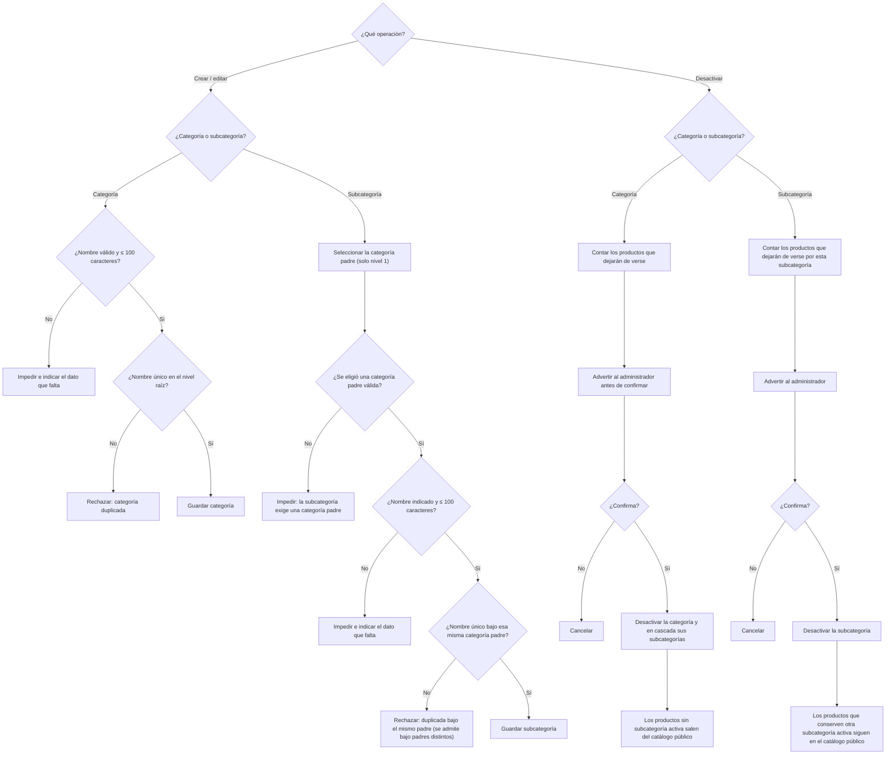
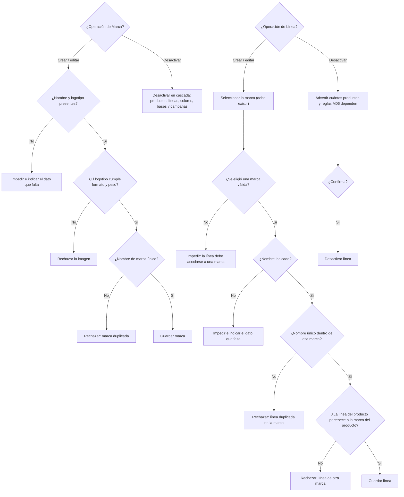
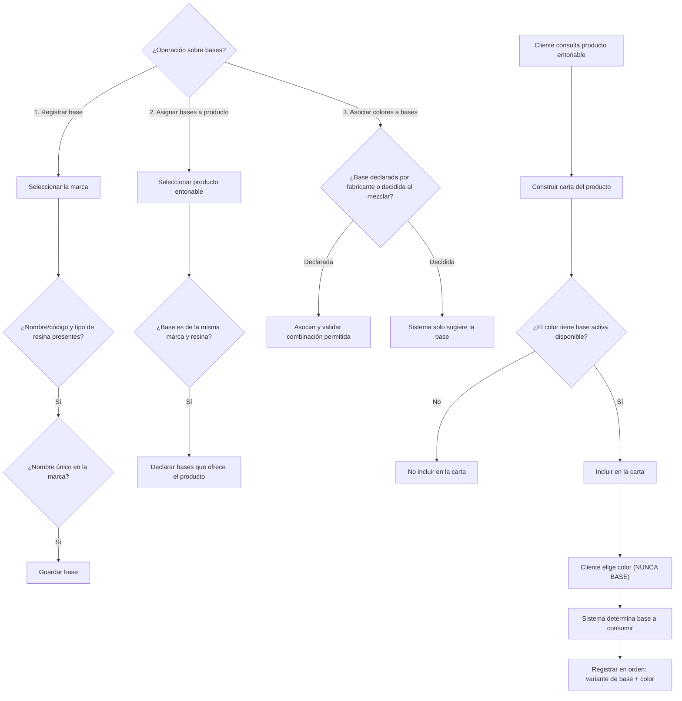
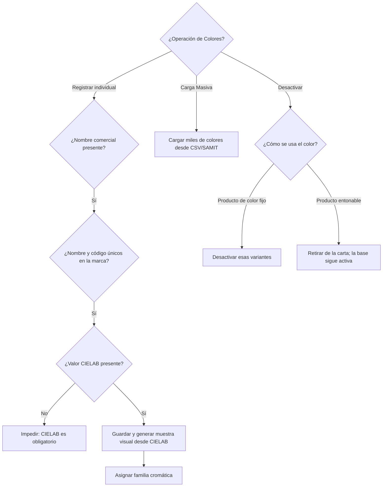
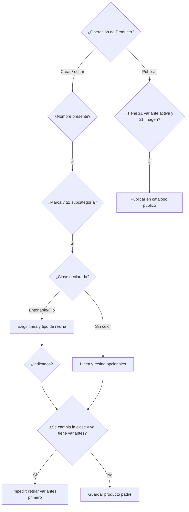
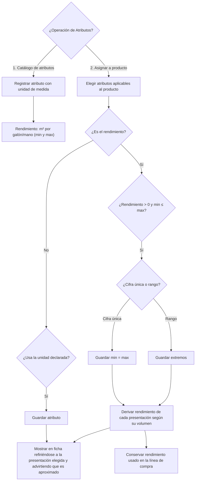

# PINTU CLIC
## Documento de Flujo y Arquitectura
### Módulo M01 — Catálogo de productos

**Versión:** 8.0  
**Basado en:** Análisis de Requisitos — Tanda 1 (v8.0) y Diagramas Funcionales (Draw.io)  
**Estado:** Documento que consolida los flujos de gestión de catálogo, marcas, líneas, productos, colores, bases y atributos técnicos.

---

## 1. Propósito y alcance
Este documento define el flujo funcional del módulo **M01 (Catálogo de productos)** de Pintu Clic, integrando los diagramas de comportamiento para el registro y validación de categorías, marcas, líneas, colores, bases, productos y sus atributos técnicos.

### 1.1. Alcance (Específico M01)
**Incluye:**
*   HU-CAT-01: Gestión de categorías y subcategorías (máximo 2 niveles).
*   HU-CAT-11: Gestión de líneas (asociadas a una marca).
*   HU-CAT-04: Gestión de marcas.
*   HU-CAT-12: Gestión de bases y su relación con el entonado de colores.
*   HU-CAT-05: Gestión de colores (CIELAB) y carga masiva.
*   HU-CAT-02: Gestión de productos y sus tipos de resina.
*   HU-CAT-10: Atributos técnicos del producto (ej. rendimiento, rangos).
*   HU-CAT-03: Gestión de variantes (producto + presentación + [base/color]).

**No incluye (Bloqueado/Fuera de alcance):**
*   HU-CAT-09: Eliminación física de entidades (se manejan con baja lógica/desactivación).
*   Definición exacta de número de bases por fabricante (pendiente).
*   Definición exacta del origen del valor CIELAB (pendiente).

---

## 2. Flujo Funcional: Categorías y Subcategorías (HU-CAT-01)

El sistema soporta únicamente dos niveles (Categoría raíz y Subcategoría). La eliminación física está prohibida; se maneja mediante desactivación en cascada.

---

## 3. Flujo Funcional: Marcas y Líneas (HU-CAT-04 y HU-CAT-11)

Las líneas comerciales pertenecen siempre a una marca. Al desactivar una marca, todo lo que dependa de ella se desactiva en cascada.

---

## 4. Flujo Funcional: Bases, Entonado y Colores (HU-CAT-12 y HU-CAT-05)

El sistema maneja los colores a través del valor cromático CIELAB. En productos entonables, la base no la elige el cliente, se deriva del color deseado.

### 4.1 Administración de Bases y Entonado

### 4.2 Administración de Colores

---

## 5. Flujo Funcional: Productos y Atributos Técnicos (HU-CAT-02 y HU-CAT-10)

Los productos tienen una clase (`entonable`, `colores fijos`, `sin color`) que dicta qué atributos se les exigen. Además, pueden tener atributos técnicos independientes como el rendimiento.

### 5.1 Creación de Productos

### 5.2 Atributos Técnicos (Rendimiento)

