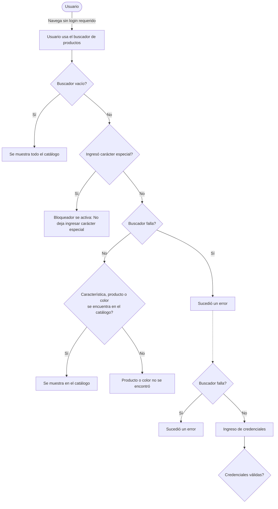
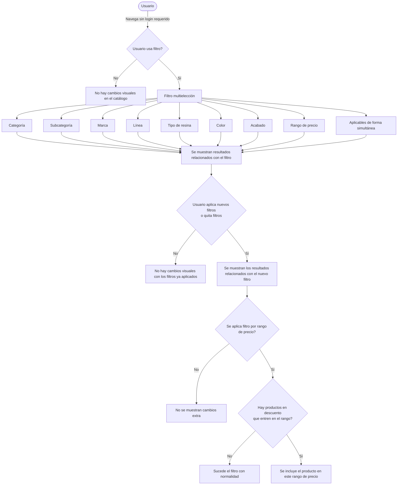
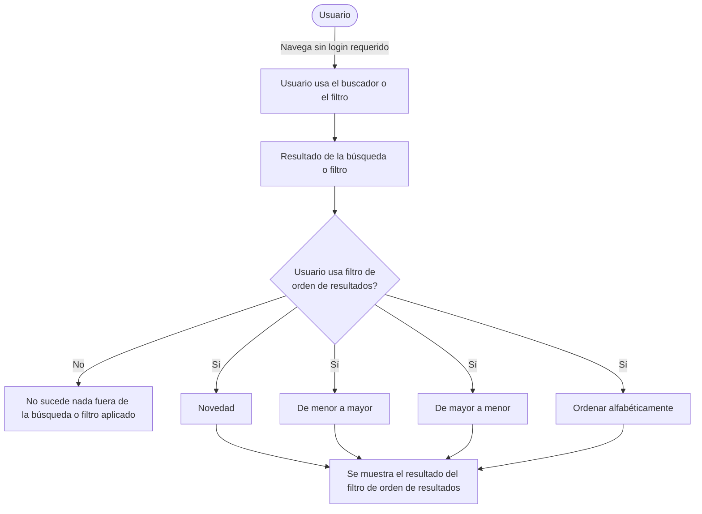
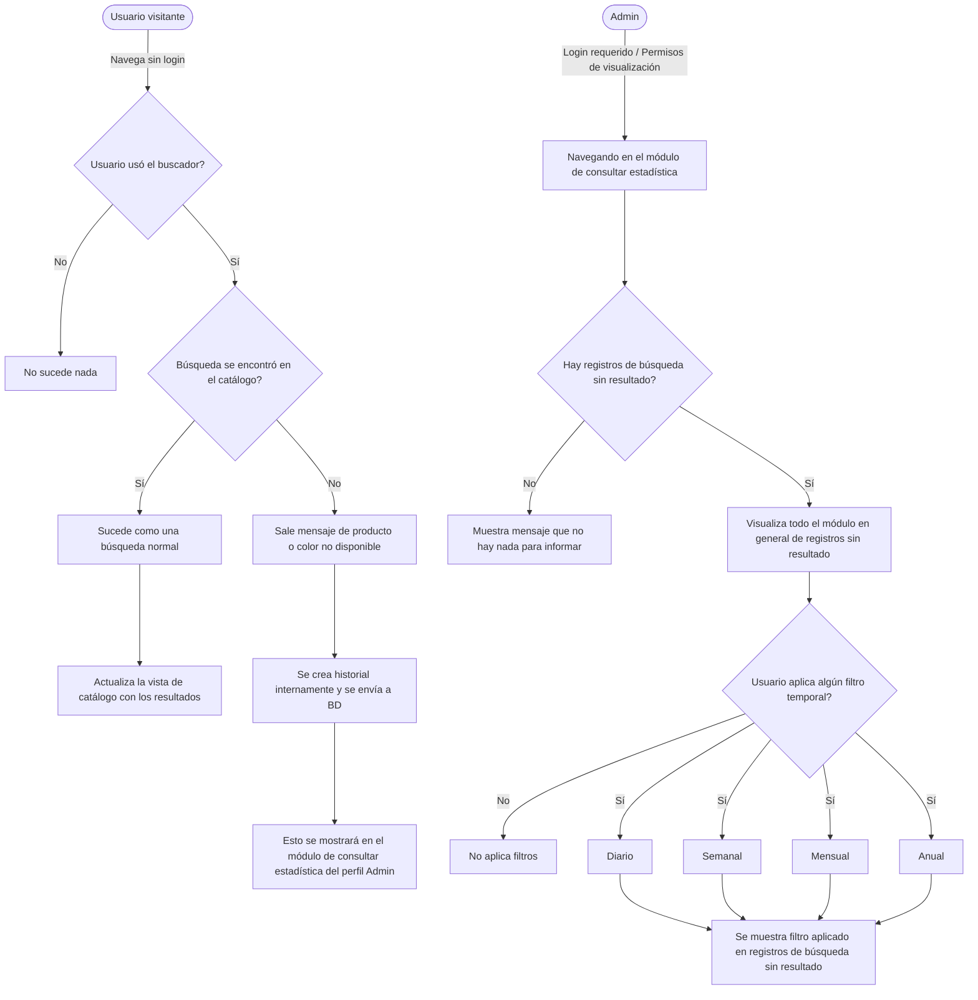

# PINTU CLIC
## Documento de Flujo y Arquitectura
### Módulo M02 — Búsqueda y navegación

**Versión:** 8.0  
**Basado en:** Análisis de Requisitos — Tanda 1 (v8.0) y Diagramas Funcionales (Draw.io)  
**Estado:** Documento que consolida los flujos de búsqueda, filtros y ordenamiento del catálogo según reglas de negocio definidas.

---

## 1. Propósito y alcance
Este documento define el flujo funcional y comportamiento del módulo **M02 (Búsqueda y navegación)** de Pintu Clic, integrando los diagramas de comportamiento del usuario al interactuar con el buscador, los filtros multielección y el ordenamiento de resultados.

### 1.1. Alcance (Específico M02)
**Incluye:**
*   Búsqueda de productos por texto libre sin autenticación (HU-BUS-01).
*   Manejo de errores, bloqueos de caracteres especiales y resiliencia del buscador (HU-BUS-01, HU-BUS-06).
*   Filtros del catálogo multielección (HU-BUS-02).
*   Ordenamiento de resultados (HU-BUS-03).
*   Paginación (HU-BUS-05 - mencionado en análisis).
*   Registro de búsquedas sin resultado y su consulta por administradores (HU-BUS-06).

**No incluye (Bloqueado/Fuera de alcance):**
*   Prioridad de patrocinio en resultados (HU-BUS-04 - bloqueado por M14).

---

## 2. Flujo Funcional: Búsqueda de Productos

El siguiente diagrama detalla la interacción principal de un usuario (logueado o no logueado) con el buscador de productos de Pintu Clic.

### 2.1 Reglas de Búsqueda (HU-BUS-01)
*   **Acceso Público:** Se permite la búsqueda sin autenticación previa (RF-BUS-01-01).
*   **Búsqueda Vacía:** Si el término está vacío, se muestra el catálogo completo (RF-BUS-01-01).
*   **Procesamiento:** La búsqueda y el filtrado se resuelven en el servidor, no en el navegador (RF-BUS-01-02).
*   **Alcance:** Busca en nombre, marca, línea, color y descripción, ignorando mayúsculas y acentos (RF-BUS-01-03).
*   **Prevención de Errores Técnicos:** Si el servicio falla, se debe redirigir al inicio e informar sin exponer códigos de error técnicos, manteniendo el sitio operativo (RF-BUS-01-06).

---

## 3. Flujo Funcional: Filtro de Productos

El siguiente diagrama muestra el proceso cuando un usuario aplica filtros al catálogo.

### 3.1 Reglas de Filtros (HU-BUS-02)
*   **Multifiltro:** Se pueden combinar filtros por categoría, marca, línea, resina, color y rango de precio simultáneamente (RF-BUS-02-01).
*   **Opciones Válidas:** Los filtros solo muestran valores que produzcan resultados en la vista actual (RF-BUS-02-02).
*   **Resultados por Producto:** Los filtros devuelven productos padre, no variantes individuales (RF-BUS-02-03).
*   **Descuentos y Precios:** El rango de precios aplica sobre el *precio final con descuentos* para el usuario actual y con IVA incluido (RF-BUS-02-04). El diagrama confirma que si hay productos en descuento que entren en el rango, deben incluirse.

---

## 4. Flujo Funcional: Orden de Resultados

El diagrama ilustra el flujo de ordenamiento de los resultados obtenidos tras una búsqueda o filtrado.

### 4.1 Reglas de Ordenamiento (HU-BUS-03)
*   **Criterios Base:** El usuario puede cambiar el orden entre relevancia, precio ascendente (menor a mayor), precio descendente (mayor a menor) y novedad (RF-BUS-03-01). *Nota: El diagrama también contempla un ordenamiento alfabético.*
*   **Cálculo de Relevancia:** Orden por coincidencia exacta vs aproximada priorizando: nombre, marca, línea, color y descripción (RF-BUS-03-02).
*   **Desempate:** En caso de igual relevancia, se desempatan por nombre del producto para evitar saltos (RF-BUS-03-03).

---

## 5. Flujo Funcional: Consultar Estadísticas (Búsquedas sin resultado)

Este flujo pertenece a un panel administrativo donde se registran y auditan las búsquedas fallidas de los usuarios, útil para detectar carencias en el catálogo.

### 5.1 Reglas de Búsquedas sin Resultado (HU-BUS-06)
*   **Registro Anónimo:** Se guardan los términos que no arrojan resultados, agrupados por repetición y fecha, **sin identificar a quien buscó** (RF-BUS-06-01).
*   **Acceso Restringido:** El reporte y filtrado por periodos (diario, semanal, mensual, anual) se reserva para usuarios con el permiso administrativo *«Consultar estadísticas»* (RF-BUS-06-02).
