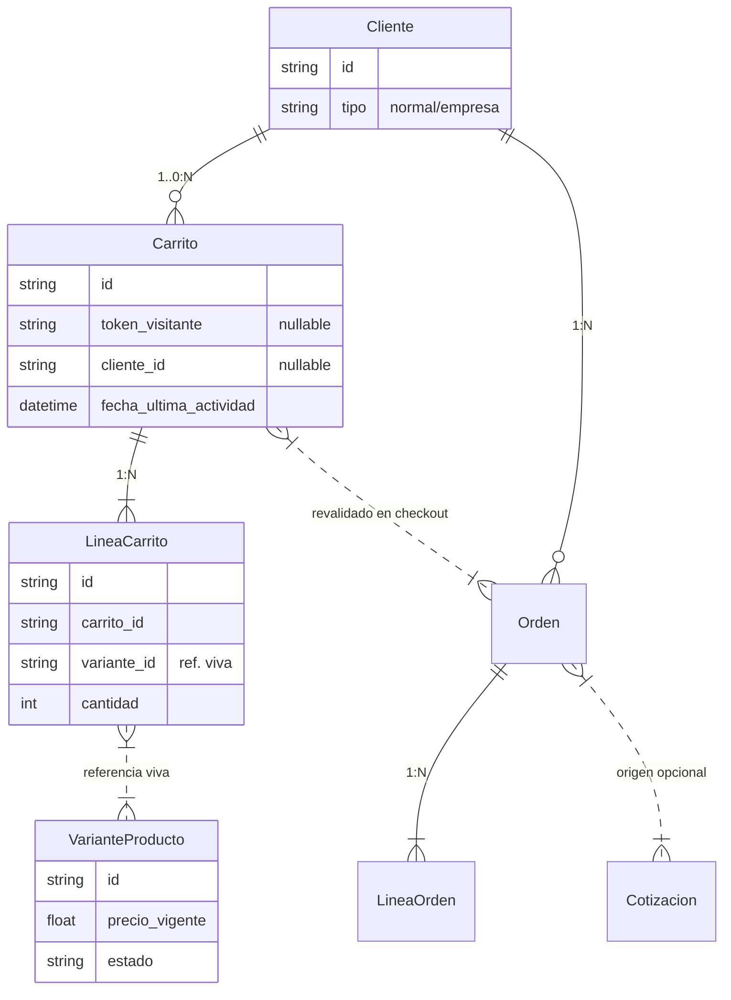
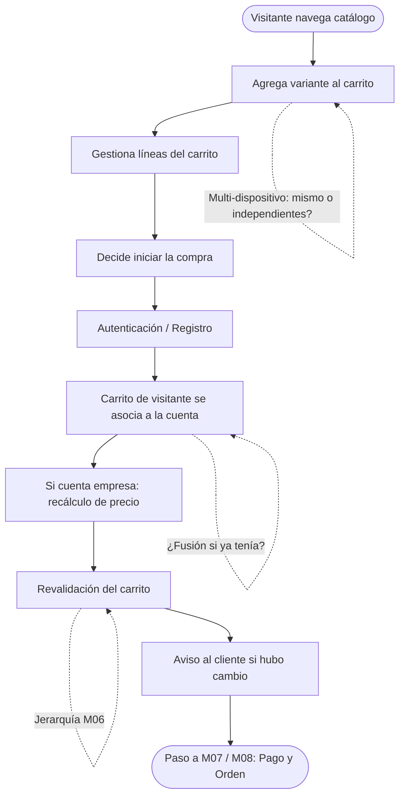
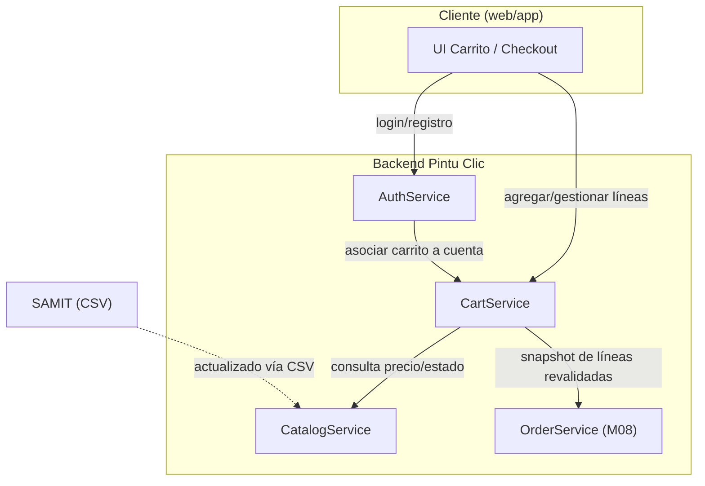

# PINTU CLIC
## Documento de Flujo y Arquitectura
### Módulo M05 — Carrito de compras

**Versión:** 1.0  
**Basado en:** Análisis de Requisitos — Tanda 3C, Carril C (v1.0) e Idea de Negocio y Definición del Negocio  
**Estado:** Borrador para validación del equipo — contiene decisiones técnicas propuestas y puntos pendientes de negocio

---

## 1. Propósito y alcance
Este documento define el flujo funcional y la arquitectura técnica del módulo **M05 (Carrito de compras)** de Pintu Clic, tomando como base el Análisis de Requisitos y la Idea de Negocio. El objetivo es traducir las historias de usuario en un diseño técnico concreto.

### 1.1. Alcance (Específico M05)
**Incluye:**
* Carrito de visitante y de cliente (HU-CAR-01, 02, 04, 05)
* Gestión de líneas del carrito
* Revalidación previa a la compra

**No incluye / Fuera de alcance:**
* Cálculo y jerarquía de descuentos (M06 — no analizado aún)
* Procesamiento del pago en sí (M07 — aplazado)

### 1.2. Convenciones
* **Confirmado por el negocio:** Decisión ya validada.
* **Formalizado en el análisis:** Requisito ya redactado en la Tanda 3C.
* **Decisión técnica (ADR):** Elección de arquitectura tomada en este documento.
* **Pendiente de definición:** Depende de respuesta del cliente.

---

## 2. Modelo conceptual de datos
El modelo separa explícitamente el Carrito (referencia viva al catálogo) de la Orden (copia histórica). A continuación, se presenta el modelo que integra M05 y M08 para evidenciar su relación:

### 2.1. Entidades y trazabilidad (M05)
| Entidad | Descripción y decisión de diseño | Origen |
| :--- | :--- | :--- |
| **Carrito** | Identificado por token de dispositivo/navegador cuando no hay cuenta (cliente_id nulo). Es una referencia viva: no copia datos del catálogo. | *Formalizado* |
| **LineaCarrito** | Referencia a la variante (no copia su precio). Cantidad debe ser > 0. Variante duplicada suma cantidad en vez de crear línea nueva. | *Formalizado* |
| **VarianteProducto** | Pertenece al catálogo (fuera de alcance). Se referencia únicamente para leer precio vigente y disponibilidad. | *Fuera de alcance* |

---

## 3. Diagrama de flujo funcional
El siguiente diagrama recorre la parte inicial del flujo correspondiente al Carrito de Compras (M05) hasta que se inicia la compra.

### 3.1. Narrativa del flujo (M05)
1. El visitante navega el catálogo y agrega variantes al carrito sin autenticarse (RF-CAR-01-01, 02).
2. El carrito se identifica mediante un mecanismo persistente en el dispositivo, sin datos personales (RF-CAR-01-03).
3. El visitante gestiona las líneas: agregar, cambiar cantidad, eliminar (HU-CAR-02).
4. La autenticación se exige únicamente al iniciar la compra.
5. Al autenticarse, el carrito de visitante se asocia a la cuenta (RF-CAR-04-01).
6. Si la cuenta es empresa, los precios se recalculan (RF-CAR-04-02).
7. Antes del pago, el sistema revalida el carrito: precio vigente y disponibilidad (RF-CAR-05-01, 02, 04). Las líneas de cotización aceptada se excluyen (RF-CAR-05-06).
8. Si hubo cambios, se avisa al cliente.

---

## 4. Arquitectura de componentes

### 4.1. Responsabilidades (M05)
| Componente | Responsabilidad | Origen |
| :--- | :--- | :--- |
| **CartService** | Alta/baja/modificación de líneas, identificación de visitante, asociación a cuenta, revalidación. | *Decisión técnica* |
| **AuthService** | Autenticación diferida; notifica a CartService el login para disparar asociación. | *Fuera de alcance* |
| **CatalogService** | Fuente de precio y disponibilidad para revalidación. | *Fuera de alcance* |

---

## 5. Decisiones de arquitectura (ADR) - M05

### ADR-01 — Mecanismo de identificación del carrito de visitante
* **Contexto:** El carrito sin cuenta debe conservarse sin exigir datos personales. No está definido si dos dispositivos del visitante comparten carrito (RF-CAR-01-06).
* **Decisión:** Usar un token opaco almacenado en cookie o local storage, sin datos identificables. Cada dispositivo mantiene un carrito independiente.
* **Consecuencias:** Si se define unificar carritos, requerirá un mecanismo adicional de identificación cruzada.

---

## 6. Requisitos no funcionales relevantes (M05)
| Requisito | Descripción | Origen |
| :--- | :--- | :--- |
| **Privacidad del ID** | El identificador del carrito de visitante no debe almacenar datos personales. | *Formalizado* |
| **Concurrencia** | (Recomendación) Definir política si dos sesiones modifican el mismo carrito a la vez (ej. última escritura gana). | *Recomendación* |

---

## 7. Dependencias y supuestos abiertos (M05)
| Referencia | Pendiente | Impacto en arquitectura |
| :--- | :--- | :--- |
| **RF-CAR-01-06** | Carrito en 2 dispositivos: ¿mismo o independientes? | Afecta ADR-01 y lógica de cruce. |
| **RF-CAR-02-07** | Cantidad mínima y máxima por línea. | Regla de validación en CartService. |
| **RG-CAR-04** | Qué ocurre si la cuenta ya tenía un carrito propio al autenticarse (fusión, reemplazo). | Cambia la lógica en CartService. |
| **M06** | HU-CAR-03 bloqueada: jerarquía de descuentos. | Afecta cálculo de subtotales. |
