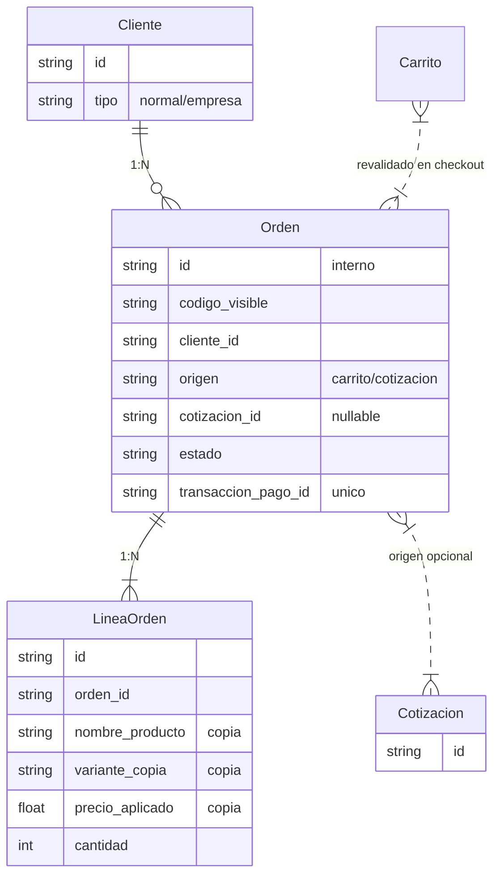
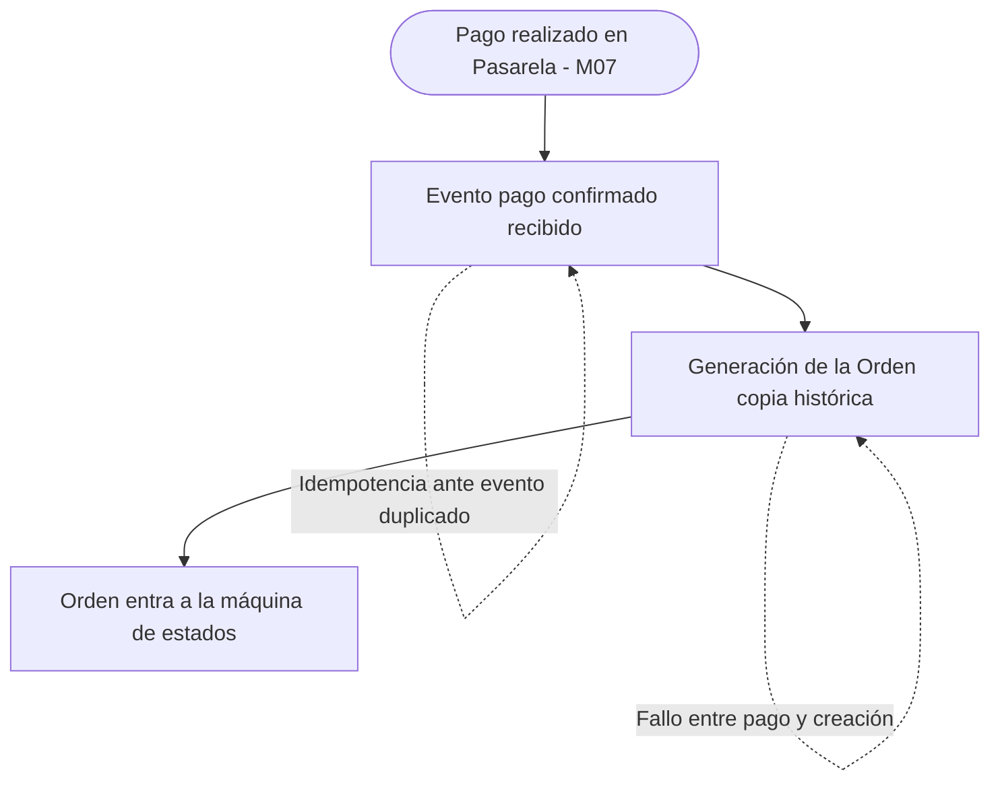
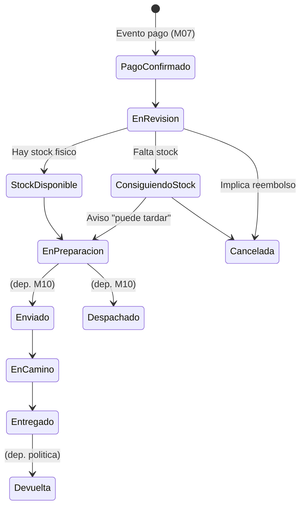
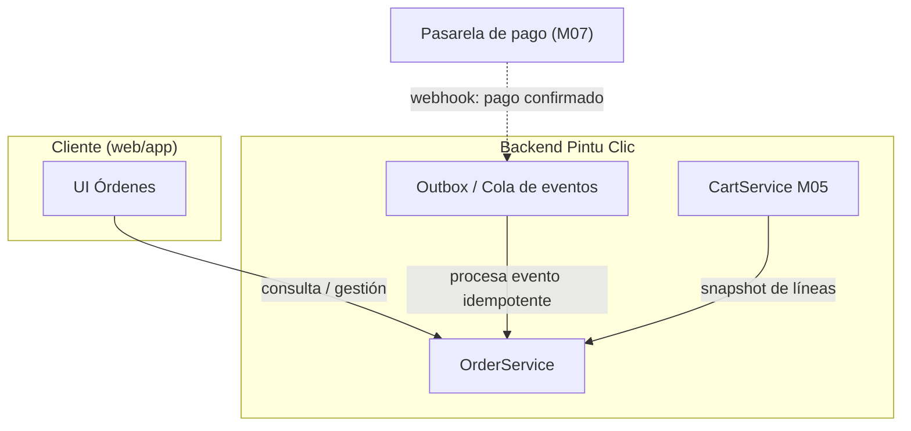

# PINTU CLIC
## Documento de Flujo y Arquitectura
### Módulo M08 — Orden de venta

**Versión:** 1.0  
**Basado en:** Análisis de Requisitos — Tanda 3C, Carril C (v1.0) e Idea de Negocio y Definición del Negocio  
**Estado:** Borrador para validación del equipo — contiene decisiones técnicas propuestas y puntos pendientes de negocio

---

## 1. Propósito y alcance
Este documento define el flujo funcional y la arquitectura técnica del módulo **M08 (Orden de venta)** de Pintu Clic.

### 1.1. Alcance (Específico M08)
**Incluye:**
* Generación de la orden tras el pago confirmado (HU-ORD-01)
* Conservación histórica de la orden (HU-ORD-02)
* Ciclo de estados de la orden (HU-ORD-03)
* Consulta e identificación de la orden (HU-ORD-04, 06)
* Gestión de órdenes por personal autorizado (HU-ORD-05)
* Listado de pedidos del cliente (HU-ORD-07)

**No incluye / Fuera de alcance:**
* Modelo de entrega/domicilios (M10 — no analizado)
* Cotización (M21 — referencia como origen)
* Devoluciones y facturación (sin reglas definidas)

---

## 2. Modelo conceptual de datos
La Orden se considera una copia histórica inmutable que se genera a partir del Carrito.

### 2.1. Entidades y trazabilidad (M08)
| Entidad | Descripción y decisión de diseño | Origen |
| :--- | :--- | :--- |
| **Orden** | Se genera solo ante pago confirmado. Incluye `transaccion_pago_id` único. `codigo_visible` desacoplado del id interno (ADR-04). | *Formalizado / ADR* |
| **LineaOrden** | Copia histórica de nombre, variante, precio y cantidad. No referencia al catálogo dinámicamente para no alterar el historial. | *Formalizado* |
| **Cotización** | Pertenece a M21. Se referencia como posible origen. | *Fuera de alcance* |

### 2.2. Nota de diseño (LineaOrden)
RF-ORD-02-04 exige que un cambio posterior en catálogo no altere la orden. La decisión de diseño es que `LineaOrden` copie los valores en el momento de generación (snapshot), en lugar de tener clave foránea hacia la variante de producto viva.

---

## 3. Diagrama de flujo funcional
El flujo de M08 inicia justo después de la confirmación del pago.

### 3.1. Narrativa del flujo (M08)
1. Al recibir el evento de pago confirmado, el sistema genera la orden de forma idempotente (RF-ORD-01-01, 02, 05).
2. Se registra el origen de la orden (carrito directo o cotización).
3. Se realiza el snapshot de las líneas hacia `LineaOrden`.
4. La orden entra a su ciclo de máquina de estados.

---

## 4. Máquina de estados de la orden
Secuencia según documento de negocio (§22) y HU-ORD-03 (parcial, depende de M10).

| Estado | Descripción / Regla | Estado del requisito |
| :--- | :--- | :--- |
| **Pago confirmado** | Inicial; disparado solo por evento de pago. | *Confirmado* |
| **En revisión** | Empleado valida disponibilidad física. | *Confirmado* |
| **Consiguiendo stock** | Camino alterno por falta de stock. | *Confirmado* |
| **En preparación / etc.** | Secuencia final condicionada a M10. | *Pendiente* |
| **Cancelada** | Toda cancelación implica reembolso (RF-ORD-03-03). | *Parcial / Pendiente* |

---

## 5. Arquitectura de componentes

### 5.1. Responsabilidades (M08)
| Componente | Responsabilidad | Origen |
| :--- | :--- | :--- |
| **OrderService** | Generación idempotente de orden, snapshot, avance de estados, control de acceso. | *Decisión técnica* |
| **Outbox / Cola** | Recibe webhook, garantiza procesamiento exacto (exactly-once) y reintentos. | *Decisión técnica* |

---

## 6. Decisiones de arquitectura (ADR) - M08

### ADR-02 — Idempotencia del evento de pago
* **Decisión:** El `transaccion_pago_id` se almacena con unicidad en BD. Un evento duplicado se ignora.

### ADR-03 — Patrón outbox para el fallo entre pago y creación
* **Decisión:** Se propone una cola con reintentos para el evento de pago, asegurando que un fallo del sistema no pierda la orden del cliente.

### ADR-04 — ID interno desacoplado del código visible
* **Decisión:** Usar UUID interno y un `codigo_visible` generado con formato configurable, permitiendo que negocio decida el formato más adelante.

### ADR-05 — Snapshot de datos en LineaOrden
* **Decisión:** Copiar valores en el momento de generación. No referenciar a la variante para garantizar inmutabilidad histórica.

---

## 7. Requisitos no funcionales relevantes (M08)
| Requisito | Descripción | Origen |
| :--- | :--- | :--- |
| **Control acceso** | Consulta restringida al cliente; operaciones restringidas por rol de empleado. | *Formalizado* |
| **Persistencia** | Los datos de orden no se eliminan físicamente (soft delete / retención). | *Formalizado* |
| **Consistencia** | Ninguna orden se genera sin pago confirmado; eventos duplicados no generan órdenes. | *Formalizado* |

---

## 8. Dependencias y supuestos abiertos (M08)
| Referencia | Pendiente | Impacto en arquitectura |
| :--- | :--- | :--- |
| **RF-ORD-01-06** | Fallo entre pago y orden. | Cubierto por ADR-03. |
| **RF-ORD-03-04 / 06** | Cancelación, devolución, y entrega (M10). | Máquina de estados incompleta. |
| **RF-ORD-04-03** | Presentación de línea cuyo producto ya no existe. | Datos conservados; solo afecta UI. |
| **RF-ORD-06-03** | Formato de código visible. | Aislado gracias a ADR-04. |
| **RF-ORD-07-04** | Estados "en curso" vs "finalizados". | Depende de cierre de máquina de estados. |
| **§30 / RF-ORD-03** | Política general de reembolsos no definida. | Condiciona diseño de M07 y estado Cancelada. |
