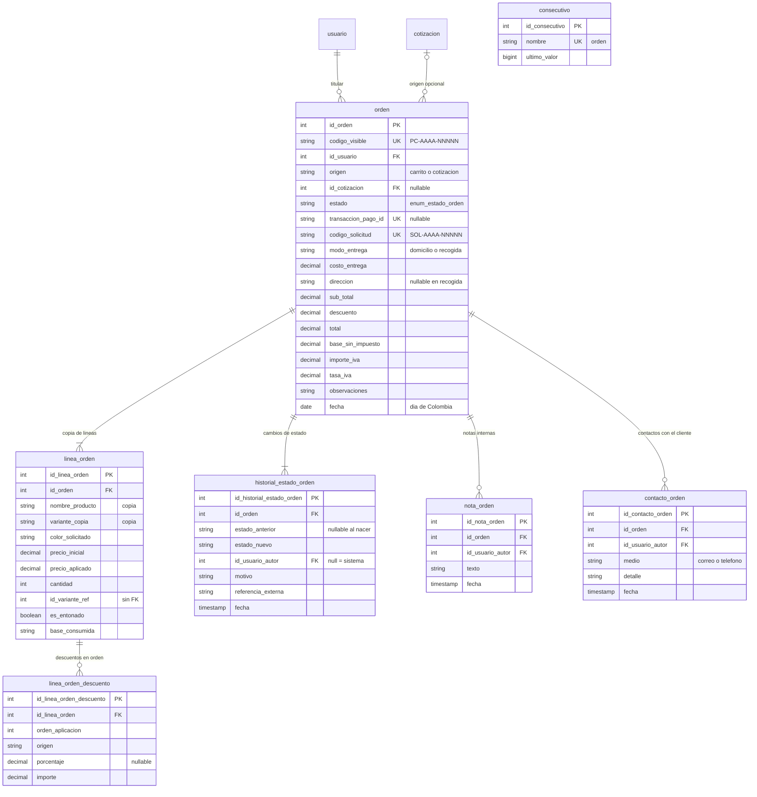
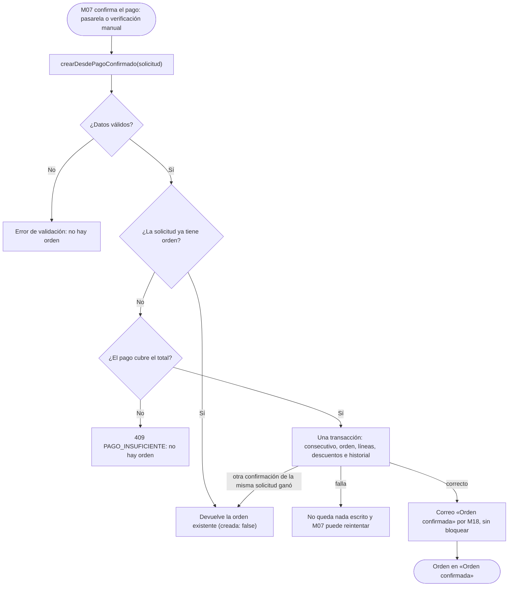
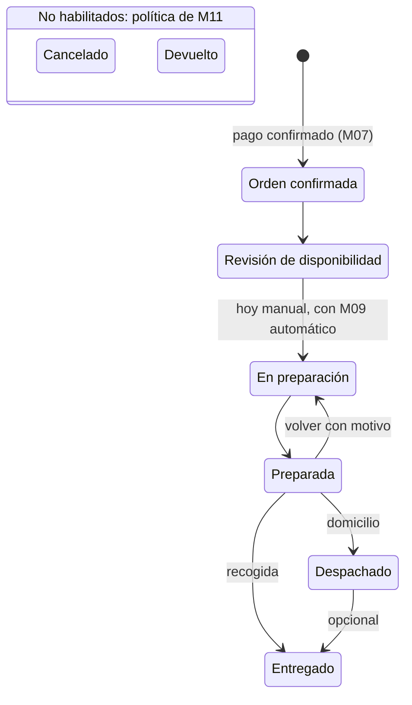
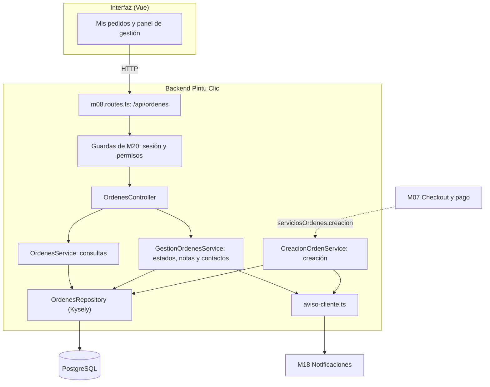

# PINTU CLIC
## Documento de Flujo y Arquitectura
### Módulo M08 — Orden de venta

**Versión:** 2.0  
**Basado en:** Tanda 3C del analista (v3.0), definiciones D01–D08 de la épica #28 y la implementación del backend hasta la v0.3.38.0  
**Estado:** Refleja lo implementado al 29/09/2026. Lo que falta decidir o depende de otros módulos está en la sección 8.

---

## 1. Propósito y alcance
Este documento define el flujo funcional y la arquitectura técnica del módulo **M08 (Orden de venta)** de Pintu Clic.

### 1.1. Alcance (Específico M08)
**Incluye:**
* Generación de la orden tras el pago confirmado (HU-ORD-01)
* Conservación histórica de la orden (HU-ORD-02)
* Ciclo de vida y estados de la orden (HU-ORD-03)
* Consulta del detalle de un pedido e identificación (HU-ORD-04, 06)
* Bandeja del personal, búsqueda, detalle completo, notas internas e historial del cliente (HU-ORD-05, 08, 09, 10, 11)
* Sección de pedidos del cliente (HU-ORD-07)

**No incluye / Fuera de alcance:**
* La solicitud de compra y la confirmación del pago (M07 Checkout y pago)
* La verificación de disponibilidad por línea y la preparación (M09 Cumplimiento y preparación)
* Las condiciones de cancelación, devolución y reembolso (M11 Postventa); M08 solo registra el dinero pendiente de devolver
* El transporte, que gestiona la tienda física (M10 Entrega y transporte), y la facturación (M12)

---

## 2. Modelo de datos
La orden es una copia histórica inmutable. Se crea en una sola transacción a partir de la solicitud con el pago confirmado y nunca se borra.

```mermaid
erDiagram
    usuario ||--o{ orden : "titular"
    cotizacion |o--o{ orden : "origen opcional"
    orden ||--|{ linea_orden : "copia de lineas"
    linea_orden ||--o{ linea_orden_descuento : "descuentos en orden"
    orden ||--|{ historial_estado_orden : "cambios de estado"
    orden ||--o{ nota_orden : "notas internas"
    orden ||--o{ contacto_orden : "contactos con el cliente"

    orden {
        int id_orden PK
        string codigo_visible UK "PC-AAAA-NNNNN"
        int id_usuario FK
        string origen "carrito o cotizacion"
        int id_cotizacion FK "nullable"
        string estado "enum_estado_orden"
        string transaccion_pago_id UK "nullable"
        string codigo_solicitud UK "SOL-AAAA-NNNNN"
        string modo_entrega "domicilio o recogida"
        decimal costo_entrega
        string direccion "nullable en recogida"
        decimal sub_total
        decimal descuento
        decimal total
        decimal base_sin_impuesto
        decimal importe_iva
        decimal tasa_iva
        string observaciones
        date fecha "dia de Colombia"
    }
    linea_orden {
        int id_linea_orden PK
        int id_orden FK
        string nombre_producto "copia"
        string variante_copia "copia"
        string color_solicitado
        decimal precio_inicial
        decimal precio_aplicado
        int cantidad
        int id_variante_ref "sin FK"
        boolean es_entonado
        string base_consumida
    }
    linea_orden_descuento {
        int id_linea_orden_descuento PK
        int id_linea_orden FK
        int orden_aplicacion
        string origen
        decimal porcentaje "nullable"
        decimal importe
    }
    historial_estado_orden {
        int id_historial_estado_orden PK
        int id_orden FK
        string estado_anterior "nullable al nacer"
        string estado_nuevo
        int id_usuario_autor FK "null = sistema"
        string motivo
        string referencia_externa
        timestamp fecha
    }
    nota_orden {
        int id_nota_orden PK
        int id_orden FK
        int id_usuario_autor FK
        string texto
        timestamp fecha
    }
    contacto_orden {
        int id_contacto_orden PK
        int id_orden FK
        int id_usuario_autor FK
        string medio "correo o telefono"
        string detalle
        timestamp fecha
    }
    consecutivo {
        int id_consecutivo PK
        string nombre UK "orden"
        bigint ultimo_valor
    }
```

### 2.1. Entidades y trazabilidad (M08)
| Entidad | Descripción y decisión de diseño | Origen |
| :--- | :--- | :--- |
| **orden** | Nace solo con el pago confirmado, en «Orden confirmada». Guarda la solicitud SOL de origen, el modo y costo de entrega y los importes con el IVA congelados. `codigo_visible` está desacoplado de la clave primaria (ADR-04). | RF-ORD-01-01, 02-02, 06-01 |
| **linea_orden** | Copia de producto, variante, color, precio inicial, precio aplicado y cantidad. `id_variante_ref` no tiene FK (ADR-05): solo indica si el producto sigue en el catálogo. | RF-ORD-02-01, 04-03 |
| **linea_orden_descuento** | Cada descuento de una línea con su origen, porcentaje e importe, en su orden de aplicación. | RF-ORD-02-02 |
| **historial_estado_orden** | Un registro por cambio de estado, con autor (o sistema), motivo y momento. Solo inserción. | RF-ORD-03-02 |
| **nota_orden** / **contacto_orden** | Notas internas (nunca visibles al cliente) y contactos iniciados desde la orden. Solo inserción. | RF-ORD-10-01, 09-02 |
| **consecutivo** | Numeración sin huecos de `PC-AAAA-NNNNN`; se incrementa en la transacción que crea la orden. | RF-ORD-06-04 |

### 2.2. Nota de diseño (copia histórica)
RF-ORD-02-04 exige que un cambio posterior en el catálogo no altere la orden. Por eso las líneas copian los valores en el momento de la compra, en lugar de tener clave foránea hacia la variante viva, y la orden y sus líneas no se borran (`ON DELETE RESTRICT`).

---

## 3. Diagrama de flujo funcional
La orden se crea cuando M07 confirma el pago, por la pasarela o por un empleado que verifica un pago directo.

```mermaid
flowchart TD
    A([M07 confirma el pago: pasarela o verificación manual]) --> B["crearDesdePagoConfirmado(solicitud)"]
    B --> V{"¿Datos válidos?"}
    V -- No --> X1["Error de validación: no hay orden"]
    V -- Sí --> C{"¿La solicitud ya tiene orden?"}
    C -- Sí --> R1["Devuelve la orden existente (creada: false)"]
    C -- No --> D{"¿El pago cubre el total?"}
    D -- No --> X2["409 PAGO_INSUFICIENTE: no hay orden"]
    D -- Sí --> T["Una transacción: consecutivo, orden, líneas, descuentos e historial"]
    T -- "falla" --> X3["No queda nada escrito y M07 puede reintentar"]
    T -- "otra confirmación de la misma solicitud ganó" --> R1
    T -- "correcto" --> E["Correo «Orden confirmada» por M18, sin bloquear"]
    E --> F([Orden en «Orden confirmada»])
```

### 3.1. Narrativa del flujo (M08)
1. M07 llama a `serviciosOrdenes.creacion.crearDesdePagoConfirmado()` con la solicitud, sus importes congelados y la confirmación del pago (RF-ORD-01-01).
2. Si la solicitud ya generó una orden, se devuelve esa orden: una confirmación repetida o simultánea no crea otra (RF-ORD-01-05).
3. Sin confirmación, o con un pago inferior al total, no hay orden (RF-ORD-01-01, D06).
4. En una sola transacción se toma el número del consecutivo y se guardan la orden, sus líneas, sus descuentos y el primer registro del historial. Si algo falla, no queda nada escrito ni se gasta número (RF-ORD-01-06, RF-ORD-06-04).
5. El cliente recibe el correo «Orden confirmada». Si el correo falla, la orden sigue creada (D05).

---

## 4. Máquina de estados de la orden
Estados definidos en HU-ORD-03 y en la Tanda 4B (preparación). Todos los pasos los registra alguien con «Gestión de pedidos».

```mermaid
stateDiagram-v2
    state "Orden confirmada" as OrdenConfirmada
    state "Revisión de disponibilidad" as Revision
    state "En preparación" as EnPreparacion
    state "Preparada" as Preparada
    state "Despachado" as Despachado
    state "Entregado" as Entregado
    state "No habilitados: política de M11" as NoHabilitados {
        state "Cancelado" as Cancelado
        state "Devuelto" as Devuelto
    }

    [*] --> OrdenConfirmada : pago confirmado (M07)
    OrdenConfirmada --> Revision
    Revision --> EnPreparacion : hoy manual, con M09 automático
    EnPreparacion --> Preparada
    Preparada --> EnPreparacion : volver con motivo
    Preparada --> Despachado : domicilio
    Preparada --> Entregado : recogida
    Despachado --> Entregado : opcional
```

| Estado | Regla | Correo al cliente | Estado del requisito |
| :--- | :--- | :--- | :--- |
| **Orden confirmada** | Estado inicial; solo nace con el pago confirmado. | Sí | *Implementado* |
| **Revisión de disponibilidad** | Se verifica la disponibilidad de cada línea. Con M09, al confirmar la última línea la orden pasa sola a En preparación (RF-CUM-03-10). | No | *Implementado; el paso automático espera a M09* |
| **En preparación** | Se prepara el pedido. | No | *Implementado* |
| **Preparada** | Solo puede volver a En preparación, con motivo (RF-CUM-05-05). | No | *Implementado* |
| **Despachado** | Cierre normal del envío a domicilio (RF-ORD-03-06). | Sí | *Implementado* |
| **Entregado** | Cierre de la recogida en almacén, u opcional tras el despacho (RF-ORD-03-06). | No | *Implementado* |
| **Cancelado** | Lo registra un empleado y deja constancia del dinero por devolver (RF-ORD-03-03, 03-04). | Sí | *Definido; espera la política de M11* |
| **Devuelto** | Devolución aceptada de una orden entregada; no aplica a entonados a medida (RF-ORD-03-04). | No | *Definido; espera la política de M11* |

---

## 5. Arquitectura de componentes

```mermaid
flowchart TD
    subgraph Interfaz["Interfaz (Vue)"]
        UI["Mis pedidos y panel de gestión"]
    end
    subgraph Backend["Backend Pintu Clic"]
        Rutas["m08.routes.ts: /api/ordenes"]
        Guardas["Guardas de M20: sesión y permisos"]
        Ctrl["OrdenesController"]
        Consulta["OrdenesService: consultas"]
        Gestion["GestionOrdenesService: estados, notas y contactos"]
        Creacion["CreacionOrdenService: creación"]
        Aviso["aviso-cliente.ts"]
        Repo["OrdenesRepository (Kysely)"]
    end
    M07["M07 Checkout y pago"]
    M18["M18 Notificaciones"]
    BD[("PostgreSQL")]

    UI -->|HTTP| Rutas
    Rutas --> Guardas --> Ctrl
    Ctrl --> Consulta
    Ctrl --> Gestion
    M07 -.->|serviciosOrdenes.creacion| Creacion
    Consulta --> Repo
    Gestion --> Repo
    Creacion --> Repo
    Gestion --> Aviso
    Creacion --> Aviso
    Aviso --> M18
    Repo --> BD
```

### 5.1. Responsabilidades (M08)
| Componente | Responsabilidad | Origen |
| :--- | :--- | :--- |
| **OrdenesService** | Consultas del cliente y del personal: Mis pedidos, detalle, bandeja, contadores e historial del cliente. Una orden ajena responde igual que una inexistente. | HU-ORD-04, 05, 07, 08, 09, 11 |
| **GestionOrdenesService** | Cambio de estado con sus reglas, notas internas y registro de contactos. | HU-ORD-03, 09, 10 |
| **CreacionOrdenService** | Creación idempotente y atómica de la orden para M07. | HU-ORD-01, 02, 06 |
| **aviso-cliente.ts** | Pide a M18 el correo al cliente sin bloquear la respuesta. | D05 |
| **OrdenesRepository** | Acceso a PostgreSQL; las escrituras van en transacción. | — |

---

## 6. Decisiones de arquitectura (ADR) - M08

### ADR-02 — Idempotencia del evento de pago
* **Decisión:** una operación de pago genera una sola orden.
* **Aplicación:** `codigo_solicitud` y `transaccion_pago_id` son únicos. Una confirmación repetida devuelve la orden existente con `creada: false`.

### ADR-03 — Patrón outbox para el fallo entre pago y creación
* **Decisión:** una cola con reintentos para el evento de pago, de modo que un fallo no pierda la orden del cliente.
* **Aplicación:** la cola es responsabilidad de M07. La creación de M08 es atómica e idempotente, así que la cola puede reintentarla sin duplicar.

### ADR-04 — ID interno desacoplado del código visible
* **Decisión:** la clave primaria nunca sale del servidor; el cliente ve un código legible.
* **Aplicación:** `PC-AAAA-NNNNN`, con el año de Colombia y un consecutivo sin huecos que no se reinicia con el año (anexo B de la Tanda 2, D04).

### ADR-05 — Snapshot de datos en LineaOrden
* **Decisión:** copiar los valores en el momento de la compra, sin referenciar la variante viva.
* **Aplicación:** `id_variante_ref` se guarda sin FK, solo para saber si el producto sigue en el catálogo y no enlazarlo si se retiró.

---

## 7. Requisitos no funcionales relevantes (M08)
| Requisito | Descripción | Origen |
| :--- | :--- | :--- |
| **Control de acceso** | Todas las rutas exigen sesión revalidada en el servidor. Consultar exige «Revisar órdenes» (`ventas.ver`) y operar, «Gestión de pedidos» (`ventas.gestionar`). El cliente solo ve sus órdenes. | RF-ORD-04-02, 05-01, 05-02 |
| **Persistencia** | La orden, sus líneas, su historial, sus notas y sus contactos no se borran ni se editan; solo cambia el estado de la orden. | RF-ORD-02-04, 10-02 |
| **Consistencia** | Ninguna orden sin pago confirmado; la creación es atómica e idempotente; un cambio de estado simultáneo no sobrescribe el de otra persona. | RF-ORD-01-01, 01-05, 05-06 |
| **Fechas** | La fecha de la orden y el año del código son los de Colombia, aunque el servidor esté en otra zona horaria. | CA-ORD-06-01 |

---

## 8. Dependencias y supuestos abiertos (M08)
| Referencia | Pendiente | Impacto |
| :--- | :--- | :--- |
| **RF-ORD-01-06** | M07 debe conservar la solicitud hasta obtener la orden y llamar al servicio de creación. | M07 no tiene responsable. El servicio de M08 está listo y admite reintentos. |
| **RF-CUM-03-10 / RF-CUM-05-04** | Verificación de disponibilidad por línea y paso automático a preparación. | Hasta que exista M09, el personal avanza la orden a En preparación. |
| **RF-ORD-03-04 / RF-POS-04-03** | Condiciones de cancelación y devolución. | Los estados existen, pero no están habilitados hasta la política de M11. |
| **P3** | Qué hacer con un pago que llega después de descartar la solicitud. | Lo decide el analista; afecta a M07. |
| **P5** | Si el cliente ve el estado Devuelto. | Solo afecta a la interfaz. |
| **Redondeo** | RF-PRE-05-04 («al peso superior») frente a D07 («mitad hacia arriba»). | M08 copia los importes sin redondear, así que no le afecta. |
