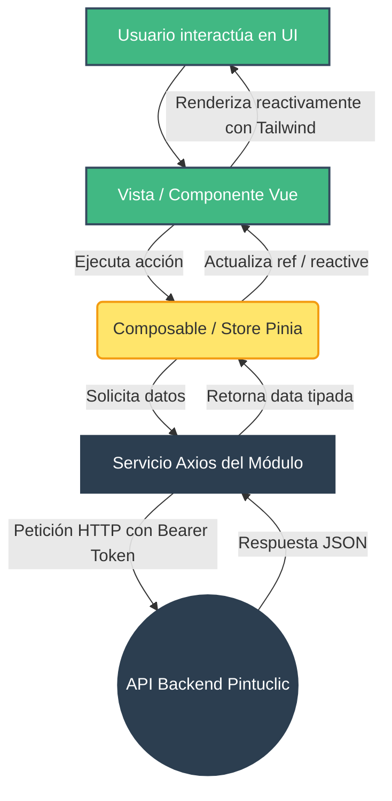

# Arquitectura Frontend - Proyecto Pintuclic

Este documento define la arquitectura y los estándares técnicos para el cliente web de Pintuclic. El proyecto está construido sobre el ecosistema **Vue 3 (Composition API), Vite, TypeScript, Tailwind CSS v4, Vue Router y Pinia (Gestor de estado)**.

El frontend replica la arquitectura modular y aislada del backend, permitiendo que el catálogo de productos, el carrito de compras, la autenticación y el panel de administración operen con desacoplamiento total.

---

## 1. Estructura de Directorios

```text
frontend/
 ├── src/
 │    ├── assets/            # Recursos estáticos (imágenes, logos SVG, iconos)
 │    ├── core/              # 🌍 ZONA GLOBAL (Transversal y compartida)
 │    │    ├── api/          # Instancia global de Axios configurada (baseURL, interceptores JWT)
 │    │    ├── components/   # UI Design System base reutilizable con Tailwind (Botones, Modales, Inputs, Badges)
 │    │    ├── router/       # Enrutador principal de Vue e integración de rutas por módulo
 │    │    └── utils/        # Funciones utilitarias globales (formateo de moneda COP, fechas, etc.)
 │    │
 │    ├── modules/           # 📦 MÓDULOS DE NEGOCIO (convención obligatoria: m[xx]-[nombre])
 │    │    ├── m02-productos/# Ej: Módulo M02 Catálogo de Pinturas
 │    │    │    ├── components/ # Piezas visuales con Tailwind (ej. ProductCard.vue, FilterSidebar.vue)
 │    │    │    ├── views/   # Páginas orquestadoras (ej. ProductGalleryView.vue)
 │    │    │    ├── services/# Peticiones HTTP exclusivas del módulo (.ts)
 │    │    │    ├── store/   # Estado local con Pinia (ej. filtros seleccionados activos)
 │    │    │    ├── interfaces/# Modelos y contratos TypeScript del módulo
 │    │    │    └── productos.routes.ts # Definición de rutas hijas del módulo
 │    │    │
 │    │    └── m07-carrito/  # Ej: Módulo M07 Carrito de Compras (Gestión de orden con Pinia)
 │    │
 │    ├── App.vue            # Componente raíz del layout (<router-view />)
 │    ├── main.ts            # Punto de entrada (Instancia Vue, montaje de Pinia, Router y CSS)
 │    └── style.css          # Punto de entrada de estilos globales con Tailwind CSS v4 (@import "tailwindcss"; @config "../tailwind.config.ts";)
 ├── tailwind.config.ts      # Configuración fuertemente tipada de temas, tokens y rutas de escaneo
 └── vite.config.ts          # Configuración de Vite con plugin oficial de Tailwind
```

---

## 2. Flujo de Datos y Reactividad

Vue 3 en Pintuclic funciona mediante reactividad basada en eventos y desacoplamiento por capas:

1. **Interacción:** El usuario interactúa con la UI (ej. clic en "Añadir al carrito" en un componente `ProductCard.vue`).
2. **Delegación:** El componente invoca un método de un Composable o Store de Pinia, o emite un evento fuertemente tipado.
3. **Lógica Asíncrona:** Si se requiere persistencia o consulta al servidor, el servicio del módulo (`m[xx]/services/`) consume la instancia centralizada `apiClient` (`src/core/api/axios.ts`).
4. **Estado (Pinia):** Al recibir la respuesta del backend, el Store actualiza sus estados reactivos (`ref` / `reactive`).
5. **Renderizado Reactivo:** Todas las vistas y componentes suscritos reflejan el nuevo estado de forma instantánea sin recarga de página.

### Diagrama de Flujo Frontend



---

## 3. Estándar de Estilos: Tailwind CSS v4

El proyecto utiliza **Tailwind CSS v4** integrado directamente con Vite mediante el plugin oficial `@tailwindcss/vite`.

### 3.1. Configuración del Motor
- **Plugin Vite:** Registrado en `frontend/vite.config.ts`:
  ```typescript
  import tailwindcss from '@tailwindcss/vite'
  import vue from '@vitejs/plugin-vue'
  import { defineConfig } from 'vite'

  export default defineConfig({
    plugins: [vue(), tailwindcss()],
  })
  ```
- **Punto de Entrada CSS:** Configurado en `frontend/src/style.css` e importado en `src/main.ts`:
  ```css
  @import "tailwindcss";
  @config "../tailwind.config.ts";

  @layer base {
    html, body {
      margin: 0;
      padding: 0;
      font-family: system-ui, -apple-system, BlinkMacSystemFont, 'Segoe UI', Roboto, sans-serif;
      background-color: #f8fafc;
      color: #0f172a;
    }
  }
  ```
- **Configuración Tipada (`tailwind.config.ts`):** Vinculada directamente mediante la directiva `@config "../tailwind.config.ts";`. Permite definir rutas de escaneo explícitas (`content`), autocompletado e IntelliSense con tipos nativos (`satisfies Config`), y extensiones de tema centralizadas (paleta corporativa `brand`, fuentes, etc.).


---

## 4. Guía Obligatoria de Implementación para Agentes de IA y Desarrolladores

Cualquier agente de IA o desarrollador que construya código para el frontend de Pintuclic **debe respetar estrictamente las siguientes reglas**:

### 4.1. Enfoque Utility-First Estricto
- **Prohibición de CSS Disperso:** No escribir hojas de estilo CSS separadas por módulo ni bloques `<style>` con clases personalizadas arbitrarias cuando puedan resolverse con Tailwind.
- **Uso directo en `<template>`:** Todos los estilos deben aplicarse directamente usando clases utilitarias de Tailwind (ej. `flex items-center justify-between p-4 bg-white rounded-xl shadow-sm border border-slate-200`).
- **Prohibición de estilos inline:** No usar atributos `style="..."` salvo para valores dinámicos calculados en tiempo de ejecución (ej. porcentajes dinámicos de barras de progreso).

### 4.2. Paleta de Colores y Tokens Semánticos
Para mantener coherencia en toda la plataforma:
- **Superficies y Fondos:** Escala neutra de Tailwind `slate` o `gray` (ej. `bg-slate-50`, `bg-white`, `border-slate-200`, `text-slate-900`, `text-slate-600`).
- **Color de Marca Primario (Pintuclic):** Gama naranja cálida (`orange-600` / `hover:bg-orange-700`, `focus:ring-orange-500`) para llamadas a la acción (CTA), botones principales y acentos de marca.
- **Acciones Secundarias:** Tonos neutros o neutros con borde (`bg-white border border-slate-300 text-slate-700 hover:bg-slate-50`).
- **Estados Semánticos:**
  - Éxito / Confirmación: `emerald-600` / `bg-emerald-50 text-emerald-700 border-emerald-200`.
  - Peligro / Error / Eliminación: `red-600` / `bg-red-50 text-red-700 border-red-200`.
  - Advertencia / Alerta: `amber-500` / `bg-amber-50 text-amber-800 border-amber-200`.
  - Información / Estado neutro: `blue-600` / `bg-blue-50 text-blue-700 border-blue-200`.

### 4.3. Diseño Responsivo Mobile-First
- Diseñar pensando primero en dispositivos móviles, agregando modificadores para pantallas más grandes:
  - Móvil: Clases por defecto (ej. `w-full flex-col p-4`).
  - Tablet (`sm:`, `md:`): Reorganización (ej. `sm:flex-row sm:items-center md:grid-cols-2`).
  - Desktop (`lg:`, `xl:`): Distribución completa (ej. `lg:grid-cols-3 xl:max-w-7xl`).

### 4.4. Estados Interactivos y Micro-interacciones
- Todo elemento clickeable (botones, tarjetas, enlaces) debe incluir feedback visual:
  - Estados `hover:`, `active:` y `focus-visible:`.
  - Micro-animaciones y transiciones: `transition-all duration-200 cursor-pointer active:scale-95`.
  - Anillos de foco accesibles: `focus-visible:outline-none focus-visible:ring-2 focus-visible:ring-orange-500`.

### 4.5. Componentización en `src/core/components/`
- Si un patrón visual con Tailwind se repite frecuentemente (por ejemplo, botones primarios, inputs con label y mensaje de error, badges de estado), **no se debe usar `@apply` masivo en CSS**.
- La solución aprobada es encapsular el patrón en un componente Vue reusable dentro de `src/core/components/` (ej. `PcButton.vue`, `PcInput.vue`, `PcModal.vue`, `PcBadge.vue`).

---

## 5. Convención de Módulos y Aislamiento

1. Cada módulo debe ubicarse en `src/modules/m[xx]-[nombre-modulo]` respetando la nomenclatura estándar (`m20-seguridad`, `m04-cuentas`, `m02-productos`, `m07-carrito`).
2. Los componentes propios de una funcionalidad de negocio viven dentro de la carpeta `components/` de ese módulo.
3. El módulo nunca debe modificar la configuración global de Tailwind ni tocar archivos pertenecientes a otros módulos.
