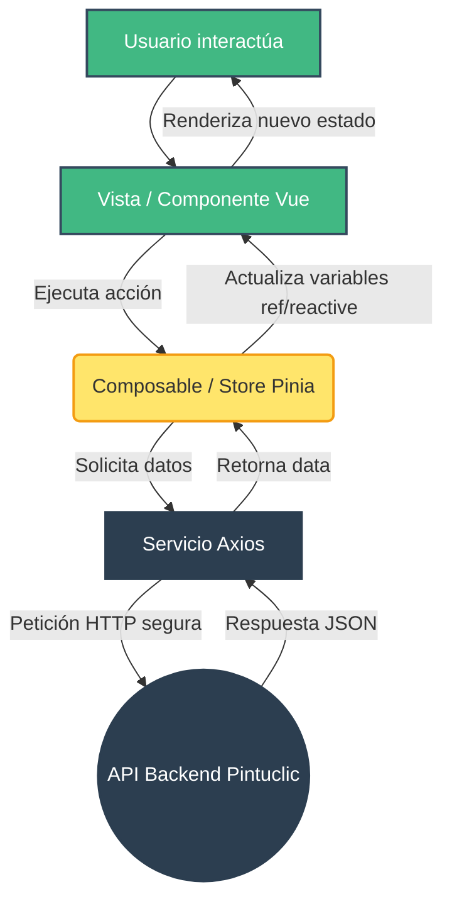

# Arquitectura Frontend - Proyecto Pintuclic

Este documento define la arquitectura para el cliente web de Pintuclic. El proyecto está construido con **Vue 3 (Composition API), Vite, TypeScript, Vue Router y Pinia (Gestor de estado)**.

El frontend replica la arquitectura modular del backend, permitiendo que el catálogo de productos, el carrito de compras y el panel de administración operen sin acoplarse.

---

## 1. Estructura de Directorios

```text
frontend/src/
 ├── core/                   # 🌍 ZONA GLOBAL 
 │    ├── api/               # Instancia global de Axios (baseURL, Tokens)
 │    ├── components/        # UI System genérico (Botones, Modales, Alertas)
 │    ├── router/            # Enrutador principal de Vue
 │    └── utils/             # Formateadores (ej. formatear precios en moneda local)
 │
 ├── modules/                # 📦 MÓDULOS DE NEGOCIO (convención obligatoria: m[xx]-[nombre])
 │    ├── m02-productos/     # Ej: Módulo M02 Catálogo de Pinturas
 │    │    ├── components/   # Piezas visuales (ej. ProductCard.vue, FilterSidebar.vue)
 │    │    ├── views/        # Páginas orquestadoras (ej. ProductGalleryView.vue)
 │    │    ├── services/     # Peticiones HTTP exclusivas del catálogo (.ts)
 │    │    ├── store/        # Estado local (ej. filtros seleccionados activos)
 │    │    ├── interfaces/   # Modelos TypeScript
 │    │    └── productos.routes.ts 
 │    │
 │    └── m07-carrito/       # Ej: Módulo M07 Carrito de Compras (Gestión global con Pinia)
 │
 ├── App.vue                 # Layout raíz (Navbar, Footer, <router-view />)
 └── main.ts                 # Instancia Vue, Pinia y Router
```

---

## 2. Flujo de Datos y Reactividad

Vue 3 en Pintuclic funciona mediante reactividad basada en eventos:

1. **Interacción:** El usuario hace clic en "Añadir al carrito" en un componente `ProductCard.vue`.
2. **Delegación:** El componente emite un evento `@add-to-cart` hacia la vista principal o interactúa directamente con el Store del carrito si es una acción global.
3. **Lógica Asíncrona:** Si se requiere, se invoca al método del servicio (`CartService.addItem()`), utilizando la instancia central de Axios.
4. **Estado (Pinia):** Al confirmar la acción, se actualiza el Store global de Pinia.
5. **Renderizado:** El componente del menú superior detecta el cambio en Pinia y actualiza el contador de artículos instantáneamente.

### Diagrama de Arquitectura Frontend


