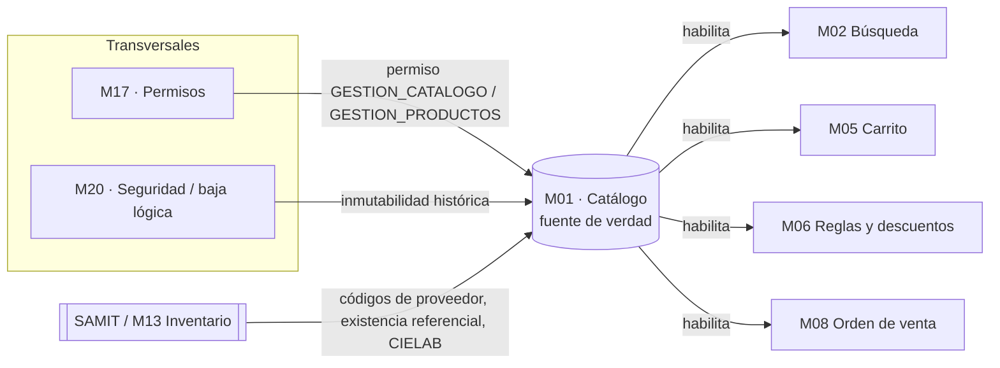
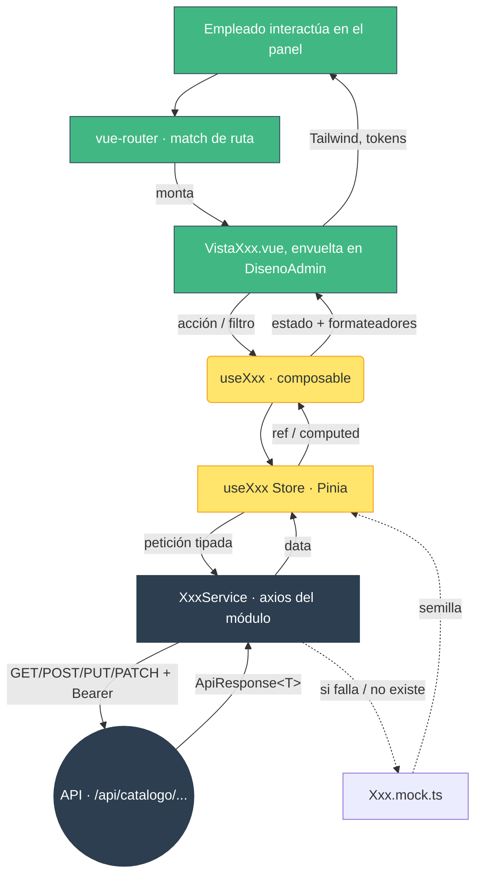
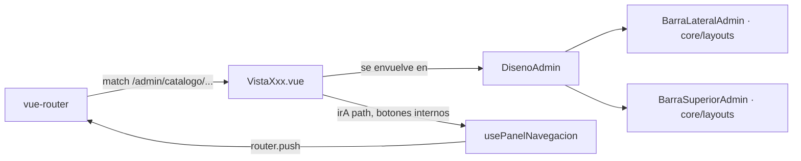

# Arquitectura del módulo M01 · Panel de catálogo (frontend)

Documento de **nivel de arquitectura** del módulo `src/modules/m01-dashboardcatalogo`.
Complementa el inventario archivo-por-archivo de [`README.md`](./README.md) y se
rige por:

- [`frontend/infraestructura.md`](../../../infraestructura.md) — arquitectura del cliente web.
- [`docs/00_SISTEMA/01_ARQUITECTURA/ARQUITECTURA_GENERAL.md`](../../../../docs/00_SISTEMA/01_ARQUITECTURA/ARQUITECTURA_GENERAL.md) — dominios y principios del sistema.
- [`docs/02_MODULOS_FUNCIONALES/M01_ESPECIFICACION_CATALOGO.md`](../../../../docs/02_MODULOS_FUNCIONALES/M01_ESPECIFICACION_CATALOGO.md) — historias y requisitos (prefijo `CAT`).
- Propuesta visual para Figma «Pintu Clic - Vistas Admin M01 y M02» (maquetas ADMIN 01…08).

---

## 1. Encuadre en el sistema

M01 es el **núcleo del catálogo** (dominio *Catálogo / Comercio*). Este módulo
frontend implementa únicamente el **panel administrativo** de ese núcleo: la
consola interna con la que un empleado con permisos gestiona productos,
variantes, categorías, marcas y colores, y revisa indicadores.



- **Alcance del panel:** administración. No maneja existencias en tiempo real ni
  descuentos dinámicos (eso es M13 y M06).
- **HU cubiertas (UI):** HU-CAT-01 (categorías/subcategorías), HU-CAT-02
  (productos), HU-CAT-03 (variantes), HU-CAT-04 (marcas), HU-CAT-05 (colores),
  HU-CAT-09 (estado y ciclo de vida). El reporte «Búsquedas sin resultado»
  (ADMIN 08) se alimenta de **M02**.
- **Transversales:** cada ruta declara en `meta.permiso` el permiso de M17
  (`GESTION_CATALOGO` o `GESTION_PRODUCTOS`), que **el backend revalida siempre**
  (Seguridad por Defecto, M20). El frontend nunca es la autoridad de acceso.

---

## 2. Cumplimiento de `frontend/infraestructura.md`

| Regla del estándar | Cómo la cumple M01 |
| :--- | :--- |
| Nomenclatura `m[xx]-[nombre]` | `m01-dashboardcatalogo` |
| Capas del módulo (`components/ views/ services/ store/ dtos/ interfaces/` + `*.routes.ts`) | Presentes las 6 + `dashboard-catalogo.routes.ts`. Se añade `composables/` (orquestación reactiva, ya usado en `m04-cuentas`). |
| `interfaces/` = 0 runtime, sin imports de validación | Solo `interface` / `type`. `ApiResponse<T>` en `interfaces/api.interface.ts`. |
| `dtos/` = Zod, fuente única de validación | 9 `*.dto.ts`. **Cero `z.object` inline** en `.vue` (Directiva 12). Reglas cruzadas en `.superRefine` (p. ej. `producto-formulario.dto.ts`). |
| Composición DRY de DTOs | Los filtros/paginación se definen localmente; cuando exista un DTO global de paginación en `core/dtos/`, se compondrá desde ahí. |
| Regla de Oro de color (solo tokens) | Únicamente `corporate / action / conversion / highlight / subaction / neutral-*`. Sin hex arbitrarios ni colores Tailwind ajenos. Los hex de **color de producto** son dato de catálogo (derivado de CIELAB) y van por `:style` — único uso permitido de estilo inline dinámico. |
| Utility-first, sin CSS por módulo | Sin hojas `.css` ni `<style>` con clases propias. |
| Estados interactivos y responsivo mobile-first | `hover:` / `focus-visible:` en todo clickeable; rejillas `grid-cols-1 … xl:grid-cols-*`. |
| Aislamiento del módulo | **No toca** `tailwind.config.ts`, `style.css`, `main.ts`, `App.vue` ni otros módulos. Lee de `@/core` (`api/axios`, tokens) y, desde la migración a `DisenoAdmin.vue` (§5), también **aporta** el chrome del panel a `core/layouts/` + `core/composables/` y registra sus rutas en `core/routes/index.ts` — es el único punto donde M01 escribe fuera de sí mismo, documentado aquí para no romper el aislamiento del resto. |
| Validar antes de delegar en el servicio | Formularios (`producto-formulario`, `marca`) validan con su DTO antes de llamar al service. |

---

## 3. Arquitectura por capas

Dirección de dependencias (una capa solo importa de las de su derecha):

```text
views/  ─►  composables/  ─►  store/  ─►  services/  ─►  @/core/api/axios
  │              │              │            │
  │              │              │            └─►  *.mock.ts   (respaldo local)
  │              │              └─────────────►  dtos/  ──►  interfaces/
  │              └────────────────────────────►  interfaces/
  └─►  components/  ──►  interfaces/            (componentes: props + emit, sin store)
```

| Capa | Responsabilidad | No hace |
| :--- | :--- | :--- |
| `interfaces/` | Contratos de datos frontend ↔ backend. | Lógica, runtime. |
| `dtos/` | Validar filtros y formularios (Zod). Normalizar parámetros antes de la petición. | Peticiones HTTP. |
| `services/` | Traducir método → endpoint REST tipado con `ApiResponse<T>`; adjuntar token vía interceptor. | Guardar estado, formatear para UI. |
| `services/*.mock.ts` | Semilla que refleja la maqueta + filtrado/orden/paginación en memoria. | Existir en producción (se retira, §7). |
| `store/` (Pinia setup) | Caché de sesión por vista, getters derivados, orquestación de carga con *fallback* al mock. | Formatear textos, conocer componentes. |
| `composables/` | Punto de entrada de la vista: desreferencia el store, decide `onMounted`, añade formateadores (`useFormatoCatalogo`) y la navegación (`usePanelNavegacion`). | Peticiones directas. |
| `components/` | UI reutilizable. Reciben `props`, emiten eventos. | Llamar al store/service (excepción: `FormularioProducto.vue`, *container* por tamaño). |
| `views/` | Pantalla con ruta: monta el *chrome*, consume su composable, compone componentes. | Contener reglas de negocio o validación inline. |

**Criterio de extracción a `components/`:** se saca un componente si (a) se
repite, (b) tiene lógica propia, o (c) su padre superaría ~150 líneas. Lo trivial
(un `<span>`/`<button>` de un solo uso) va inline.

---

## 4. Flujo de datos y reactividad

Instancia del diagrama de `infraestructura.md` §2 para este módulo:



- **Idempotencia:** los stores de listado no recargan si ya hay datos y no se
  fuerza; los filtros hacen `pagina = 1` y recargan.
- **`ApiResponse<T>`:** contrato único de éxito (`{ success, data, meta }`) y de
  error (`{ success:false, error:{ code, message, details } }`), idéntico a
  `m04-cuentas`. El parser de error del store proyecta `error.message`.

---

## 5. Modelo de navegación

`vue-router` **ya está montado** (`core/routes/index.ts` agrega
`...dashboardCatalogoRoutes`, una URL real por vista bajo `/admin/catalogo`).
Cada vista se envuelve a sí misma en `<DisenoAdmin>` — el layout compartido del
panel (barra lateral agrupada/colapsable + barra superior), en
`core/layouts/DisenoAdmin.vue` — con el mismo patrón que `DisenoTienda.vue`:
un `<slot>`, no `<router-view>` anidado.



- `BarraLateralAdmin` / `BarraSuperiorAdmin` viven en `core/layouts/` (no en el
  módulo): son el chrome compartido de todo el panel admin, no solo de M01.
  `core/layouts/DisenoAdmin.vue` los monta una sola vez y deriva la miga de la
  barra superior de `route.meta.titulo`.
- `usePanelNavegacion().irA()` sigue existiendo y se usa para la navegación
  **interna** de cada vista (botones «Cancelar», «Editar», filas de tabla…):
  delega en `router.push()`. El modo "shell / `inject`" (previo a montar
  `vue-router`) ya se retiró del composable — no quedaba código muerto que
  mantener.
- `dashboard-catalogo.routes.ts` declara `meta.titulo` en cada ruta,
  justo lo que `DisenoAdmin` lee para la miga.

---

## 6. Contrato con el backend

Endpoints previstos (aún no implementados por el backend de M01):

| Área | Método · Ruta | Permiso M17 |
| :--- | :--- | :--- |
| Dashboard | `GET /api/catalogo/dashboard/{resumen,actividad,estado}` | `GESTION_CATALOGO` |
| Productos | `GET /api/catalogo/productos` · `.../opciones-filtro` | `GESTION_PRODUCTOS` |
| Producto (form) | `GET .../opciones-formulario` · `GET/POST/PUT /api/catalogo/productos[/:id]` | `GESTION_PRODUCTOS` |
| Variantes | `GET /api/catalogo/variantes` · `.../opciones-filtro` · `.../resumen` | `GESTION_PRODUCTOS` |
| Categorías | `GET .../categorias/arbol` · `.../:id` · `POST .../[subcategorias]` · `PATCH .../:id/estado` | `GESTION_CATALOGO` |
| Marcas | `GET /api/catalogo/marcas` · `.../resumen` · `POST/PUT .../[:id]` | `GESTION_CATALOGO` |
| Colores | `GET /api/catalogo/colores` · `.../familias` · `.../opciones-filtro` · `.../resumen` | `GESTION_CATALOGO` |
| Búsquedas | `GET /api/catalogo/busquedas-sin-resultado` · `.../opciones-filtro` · `.../resumen` | `GESTION_CATALOGO` |

- **Paginación siempre del lado servidor** (RNF-CAT-06-01): el frontend nunca
  descarga el catálogo completo.
- **Baja lógica** (HU-CAT-09 / M20): no hay «eliminar»; las acciones de estado
  son `PATCH .../estado`, y el backend informa la cascada de afectados.

---

## 7. Fronteras, aislamiento y datos de ejemplo

**Lo que el módulo toca**

- Crea y modifica casi todo bajo `src/modules/m01-dashboardcatalogo/`.
- **Lee** de `@/core`: `api/axios` (instancia + interceptor JWT), `theme/colors.ts`
  (tokens, vía Tailwind), `assets/logo.png`.
- **Excepción documentada (desde la migración a `DisenoAdmin.vue`, §5, decisión #5):**
  `core/layouts/DisenoAdmin.vue`, `core/layouts/BarraLateralAdmin.vue`,
  `core/layouts/BarraSuperiorAdmin.vue`, `core/composables/useMenuMovil.ts` y la
  entrada de `dashboardCatalogoRoutes` en `core/routes/index.ts` son mantenidos
  por M01 porque hoy es el único módulo admin con vistas reales; otros módulos
  (M02/M04/M17) los reusan sin duplicarlos cuando tengan sus propias vistas.

**Lo que NO toca:** `tailwind.config.ts`, `style.css`, `main.ts`, `App.vue`, ni
archivos de otros módulos (`m02-productos`, `m04-cuentas`, `m17-permisos`).

**Datos de ejemplo (`*.mock.ts`)**

- Cada área tiene una semilla + `consultarXxxDemo()` que reproduce
  filtro/orden/paginación en memoria.
- El store la usa **solo como *fallback*** (catch de la petición) y marca
  `usandoDatosDemo = true`; la vista muestra el aviso «datos de ejemplo».
- **Retirada:** cuando el backend publique cada endpoint, la ruta feliz gana y el
  mock deja de usarse. Los `*.mock.ts` se conservan para pruebas/Storybook o se
  borran en un `refactor(M01)` posterior.

---

## 8. Decisiones de arquitectura (registro breve)

| # | Decisión | Motivo | Alternativa descartada |
| :-- | :--- | :--- | :--- |
| 1 | Añadir `composables/` a las capas del módulo | Aísla el manejo de errores de Axios y el estado de petición de los componentes (patrón de `m04-cuentas`). | Lógica de carga en cada vista. |
| 2 | Stores Pinia por vista, no uno global de catálogo | Caché de sesión acotada; menos acoplamiento; se libera al salir. | Store monolítico `useCatalogoStore`. |
| 3 | Mock con *fallback* en el store, no un flag de entorno | La UI es revisable hoy sin backend y sin build especial; la transición es automática. | `if (import.meta.env.DEV)` disperso. |
| 4 | `usePanelNavegacion` + shell, sin montar `vue-router` (superado: `vue-router` ya está montado, ver §5) | No tocar `main.ts`/`App.vue` → push del módulo 100 % aislado; las vistas no cambian al migrar. | Editar `App.vue` (rompe aislamiento). |
| 5 | `BarraLateralAdmin` / `BarraSuperiorAdmin` movidos a `core/layouts/`, con `DisenoAdmin.vue` como layout compartido | Dejaron de ser exclusivas de M01: el sidebar ahora agrupa "Gestión Administrativa" (M04/M17, enlaces aún sin conectar) y "Gestión de Catálogo". Se necesitaba un único punto para que otros módulos admin lo reusen. | Mantenerlas duplicadas por módulo. |
| 6 | Envoltorio `ApiResponse<T>` local en `interfaces/api.interface.ts` | Igual contrato que el resto del sistema sin depender de un tipo global inexistente. | Importar de un `core/interfaces` que no existe. |
| 7 | Inline de componentes triviales (badges, barra de acciones, tarjetas de un solo uso) | Coste/beneficio: menos archivos, misma legibilidad. Se extrae solo con reuso o lógica. | 33+ componentes, varios de 1 `<span>`. |

---

## 9. Puntos de integración pendientes

1. **Endpoints de M01** en el backend (`/api/catalogo/*`) → retirar mocks.
2. ~~`vue-router` montado + `dashboardCatalogoRoutes` registradas + `irA` → `router.push()`~~ — **hecho**.
3. ~~`core/layouts/DisenoAdmin.vue` compartido → mover `BarraLateralAdmin` / `BarraSuperiorAdmin`~~ — **hecho**.
4. **Acciones masivas reales** (`BarraAccionesMasivas.vue`, ya conectada en Productos/Variantes/Líneas/Categorías): "Activar"/"Desactivar" en lote son no-op hasta que exista el endpoint de baja lógica en lote; "Exportar" reutiliza rutas de exportación individuales que tampoco existen aún en el backend.
5. **Sesión (M04):** nombre y permisos reales desde el store de autenticación (hoy `Carlos Álvarez` fijo).
6. **Subida de imágenes/logos (HU-CAT-07):** endpoint propio; los componentes actuales son marcadores.
7. **Enlaces sin conectar en "Gestión Administrativa"** (Usuarios, Roles, Aprobación de Empresas): apuntan a rutas que M04/M17 aún no registran.
8. **`CHANGELOG.md` + walkthrough** de la versión (fuera del módulo; commit administrativo aparte).
